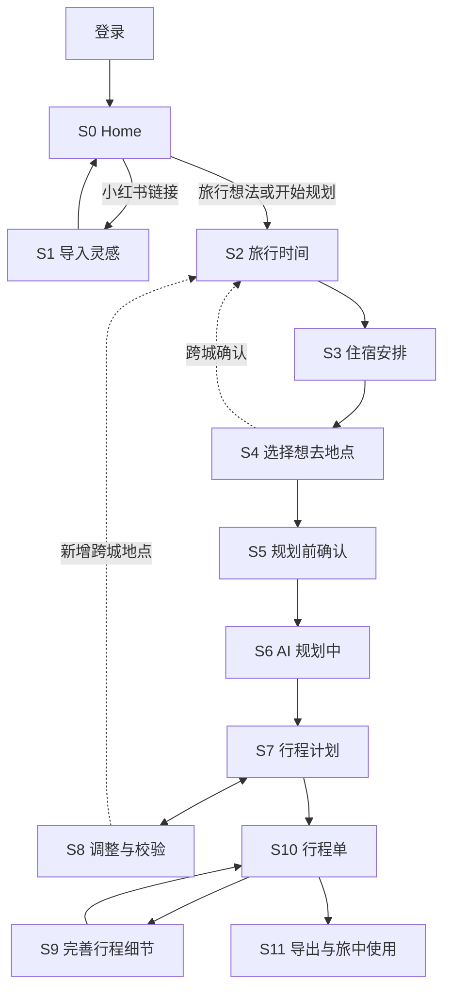

# Nomad MVP UI/UX Specification

## Document Status

- Version: 0.6
- Updated: 2026-09-15
- Status: Approved Correct Course UX contract
- Platforms: traveler mobile-first Web/PWA; operator desktop Web only; native-specific behavior only in an actual supported host
- Visual inventory: `docs/ux/prototype-coverage.md`

本规范覆盖旧 v0.1-v0.4 的 Confirm、固定 2h/4h、Quick/HQ 双版本、
`SmartPlanSwitch`、先摆骨架再 AI 填空槽，以及把“完善细节”作为初始规划完成页
CTA 的设计。旧图片和 delta 文档只用于版本沿革；若冲突，以 PRD、本规范、
`docs/ux/mobile-ia.md` 和获批 Correct Course 为准。

## Product Experience

### Experience Goal

用户从一句旅行想法或一组小红书链接出发，只确认真正影响编排的时间、住宿、
地点意图与节奏，然后由 AI 生成完整初始计划。计划直接进入可编辑时间轴；冲突
只在变更造成问题时出现，行程细节和引用在排期稳定后完善。

### Design Principles

1. **移动任务，不是桌面表单：** 每屏只处理一个紧密问题，主 CTA 固定、字段渐进展开。
2. **一个用户流程：** 内部 Provider、Quick、fallback 和重试不产生第二份待采用计划。
3. **事实诚实：** 不显示虚假百分比、实时免排队、已预约或编造的交通/距离。
4. **地图保留上下文：** L1/L2 帮用户理解区域，只有 L3 接收地点意图。
5. **结果可改可追溯：** 所有变更有 revision、全局 undo、冲突解释和来源状态。
6. **视觉服务重复操作：** 计划页安静、密度适中，避免营销式 Hero、卡片套卡片和装饰性渐变。

### Prompt Presentation (18 groups approved 2026-09-15)

当前主流程先呈现可用内容和主要操作，非阻断信息使用可读的次要行内文字；同一原因在同一
模块/版本只保留一个入口，不抢焦点、不反复Toast、不要求逐条确认。细节进入已有地点、路线、
来源、FixSheet或整体核查界面，返回保留上下文。弱提示不只靠颜色，不降低可访问对比度。

当前动作无法完成时，在受影响字段/操作处说明实际结果与恢复；必要确认在原最终预览集中
呈现。未保存、未提交、结果未知、hard conflict、权限、账号删除和生产发布等不能变成可忽略
建议。所有计数取当前模块/版本的真实集合，不把不同类别汇成一个模糊“全部已确认”指标。

| 组 | 当前呈现合同 | 保留的行为边界 |
| --- | --- | --- |
| 1 导入部分识别/成功 | 对应Dock/记录显示“已添加 N 个链接，部分内容未识别”或“部分内容已保存”；终止为“这条导入未完成”。 | 有效条目继续，错误片段可展开；媒体保存不等于地点验证完成。 |
| 2 重复导入 | 对应项显示“已在灵感库”或“正在导入”，提供查看入口。 | 复用已有记录/任务，保持owner隔离，不再建任务。 |
| 3 班次/酒店搜索 | 无匹配“未找到”，已有手工路径时可加“可手动填写”；请求失败“搜索暂不可用 · 重试”。 | 两种状态分开，歧义/过期采用前处理，原手工/留空/取消路径保留，不新增未批准的手工酒店能力。 |
| 4 路程未知 | 路线行显示“路程时间暂缺”，原因进详情。 | 不显示假分钟数或0分钟；依赖可达性的采用/发布仍执行原门禁。 |
| 5 负荷/普通天气 | “较满”“部分通勤待核对”“天气临近出发再核对”，详情按需展开。 | 数据缺失不算零；实际hard问题及时说明，季节提示不冒充预报。 |
| 6 地标代理 | 目标行“附近估算 · 以{地标}为参考”；详情“实际位置建议核对”。 | 预览保留代理身份；不继承地标的目标事实，不把位置未知变精确。 |
| 7 仅soft冲突 | 单一低强调入口“有 N 项建议核对 · 查看”，可跨日期到达现有FixSheet。 | 无hard才采用该层级；hard/mixed保留简短可达提示和原门禁，soft不能被说成clean。 |
| 8 无法预估住宿影响 | “暂时无法预估，保存后会检查”，原因进原影响详情。 | 实质变更仍需确认，无法预估不是无影响，结构错误不能先保存。 |
| 9 AI无安全调整 | “这次暂时无法调整”+一句具体原因+“当前计划未改动”。 | 保留手动/重述路径，不制造不安全方案或空revision。 |
| 10 细节尚未/部分完善 | 总览保留时间/细节两行摘要，细节行“还有 N 处细节可完善 · 去完善”。 | failed/暂未生成/建议核对仍在相应槽位分清，基础阅读与合法基础导出继续可用。 |
| 11 S9/S11 soft提醒 | “有 N 项建议核对 · 查看”与必要短摘要；原主按钮就是明确继续动作。 | 不新增我已读完/逐条确认；独立导出文件仍携带使用所需提醒和来源，不能仅留站内链接。 |
| 12 已完成旧图遇到行程变化 | 图片生成时间旁“行程已有更新，可重新生成”，沿用重新生成动作。 | 旧图仍可查看/下载/分享；未完成的过期预览仍须刷新后才生成，不自动重生成。 |
| 13 长行程分图 | 主显“将下载 N 张长图”，城市范围按需展开。 | 操作前张数清楚；完整城市边界/顺序/一次批次保持，不加二次核对。 |
| 14 定位降级 | 实际采用计划基准时主显“已按行程位置推荐”，保留真实前/后地点；过期/未授权/失败进推荐依据，无基准沿静态池/手动路径如实呈现。 | 位置基准不可隐藏为“离我最近”；定位恢复为次要动作，不反复要权限。 |
| 15 候选/列表/模块读失败 | 对应模块“候选暂未更新”或“暂未更新 · 重试”，保留仍可合法显示内容。 | 请求失败不等于空结果/任务失败；截至时间真实，撤权立即清数据。 |
| 16 AI清单重复/生成失败 | 重复项“清单中已有”；生成失败“建议暂未生成，可直接添加”。 | 不覆盖原记录；真实保存失败仍“暂未保存”，不伪报已保存。 |
| 17 数据副本/反馈回执 | 生成前简述范围和“副本含个人数据，请妥善保管”；普通已发起下载用“已开始下载，请确认”；反馈成功突出编号/时间，说明小号一次呈现。 | 去留关键后果在操作前可读；未知保存不说已保存，收到反馈不等于处理完成。 |
| 18 运营解释 | 金额/状态旁保留“暂估”“待核对”“等待使用”“数据截至…”；长定义进入查看来源。 | 生产影响/费用/权限/关键未知不后置，不重绘成熟工具，不新增运营移动适配。 |

该表落实主报告18组综合建议；其余125类审查中的候选文案不能借此次批准任意替换。
原图未随文字修改，冲突的旧文案按本表及更新GWT覆盖；实施仍提交相应浏览器证据。

### Visual System

- 44x44pt 最小触控区域；图标按钮使用 Lucide 或现有图标库并提供 accessibility label。
- 默认动效 120-200ms；Sheet 240-300ms；尊重 reduced motion。
- 页面背景白/近白，主强调为深绿，橙色只用于待处理/变更，红色只用于破坏或硬冲突。
- 卡片圆角不超过 8px；页面 Section 不做漂浮卡片，真正可重复条目或 Sheet 可用边框容器。
- 字号不随 viewport 宽度缩放；日期 Tabs、时间轴、图标 rail 和 CTA 使用稳定尺寸约束。
- 规划主流程文案不暴露 `skeleton`、Quick、HQ、seed、must_go、内部 JSON 或 Provider 名称；
  Story 7.4 的 `ZIP（内含 JSON）` 是用户下载文件格式，不属于内部实现术语展示。

## Canonical Stages

| Id | User-facing name | Entry and exit |
| --- | --- | --- |
| S0 | 输入旅行想法 | Home 输入自然语言或粘贴链接；自然语言进入 S2。 |
| S1 | 导入灵感 | 仅小红书分支；完成后留在 Home/Library，可继续 S2。 |
| S2 | 旅行时间 | 日期、天数、每天出门时间、可选到达/离开。 |
| S3 | 住宿安排 | 按住宿晚确认酒店、早餐和行李；酒店可留空。 |
| S4 | 选择想去地点 | 全城检查与 L3 必去/顺路；CTA 为下一步。 |
| S5 | 规划前确认 | 选择悠闲/从容/充实，可选补充其他要求；唯一 `开始规划`。 |
| S6 | AI 规划中 | 在稳定时间轴 shell 展示事实进度。 |
| S7 | 行程计划 | 完整可编辑计划、酒店、候选、餐饮与清单。 |
| S8 | 调整与校验 | 编辑、AI 局部调整、冲突修复与 undo 循环。 |
| S9 | 完善行程细节 | 补充做什么/准备/注意、why 与引用，不改排期。 |
| S10 | 行程单 | 阅读基础行程、整体核查、逐条轻编辑并按需查看引用。 |
| S11 | 导出与旅中使用 | 既有行程图片预览/生成、保存分享、最近行程与前台位置上下文；打卡和照片类产物不在 MVP。 |

S1 是分支，不是每次规划必经页。S8 是 S7 周围的循环，不是单向向导。跨城
选择从 S4/S8 返回 S2/S3 补齐城市日期、交通、住宿与行李。

## Information Architecture

### Global Navigation

- Home/Library 顶部使用 `计划 | 灵感` segmented control；菜单进入最近行程、设置和反馈。
- S2-S5 使用返回、阶段标题和自动保存状态，不显示品牌 badge 或冗余“我的计划 vN”。
- S6/S7/S8 共用计划路由与 Header：返回、`{城市链} · {天数}天`、全局历史/undo；
  通向 S10 的计划级入口不得占用时间轴纵向空间，也不在编辑态显示细节完成状态。
- 日期 Tabs 横向滚动；右侧固定紧凑清单图标，不阻止日期继续滚动。
- S9-S11 使用计划标题和明确返回路径，保持当前 Trip revision。

## Core Flows

### Home Input and Import Queue

底部始终是一个 `HomeImportDock`：长输入框靠近一个强调按钮。空输入显示 `+`，
有内容时过渡为纸飞机。占位文案固定为：

`粘贴分享链接或输入想去的地点，如：厦门 3天`

- 多链接创建多个独立 job；状态面板显示当前 `N/X`，输入仍可继续创建后续 job。
- 展开态向下箭头/下滑收起；简态向上箭头展开。
- 来源标题安全截断；副标题只写事实动作，如“已提取 12 张图片，正在理解内容”。
- 不显示橙色百分比进度条。完成结果逐项 FIFO 展示完整 10 秒。
- 识别旅行文案为 `识别 厦门 3天 7月14日出发`；节奏留到 S5。
- Library 导入记录可查看解析 POI，并通过小复制图标复制 owner 的原始链接。

### Recent Trips and Resume (Story 7.1)

- Home 最近一趟入口和 `全部`/菜单共享 owner 列表；不阻塞原有 Dock。独立 Plan 或整趟
  Trip 只占一项，城市子计划/一日游不重复；长城市链、缺图占位及分页保持可达。
- 主状态为真实 `草稿 / 规划中 / 已生成 / 生成失败`。已生成不表示旅行结束，也不代表
  无冲突或细节已完善。排序只跟随用户打开/成功保存，而非异步任务心跳。
- 已发布行程的附属修改入口必须存在真实保存的待处理草稿/任务。半途离开为中性
  `有未完成的修改 / 继续填写`；实际排队/运行为 `修改规划中 / 查看进度`；当前任务
  终止失败为 `本次修改生成失败 / 查看原因`。原行程继续可用，旧失败不得污染新输入。
- 继续恢复已保存输入阶段、原任务或最近 S7/S10 视图、scope、日期与滚动位置；S9/S11
  复用既有恢复流程。按服务端 current revision 检查过期位置；不重放未确认弹窗、
  过期撤销或自动重新编排。普通编辑请求失败不自动生成“未完成修改”。
- 加载骨架、真实空态、刷新错误各自独立；账号切换清空私有缓存并重新鉴权，目标
  不可用时返回列表。错误不隐藏输入；不承诺离线写入。状态有文字，不只依赖颜色。
- 当前原型为 Recent Trips Resume R1 / Recovery R1；后者 D 仅示意真实失败，未完成和
  运行中的附属行按上述文字合同使用中性/进行中样式。
- Story 7.2 已确认移出 MVP：行程单不增加逐项打卡按钮，沿用 Story 5.2 紧凑总览。
  相册照片/已存地理数据自动标记，以及相册视频、九宫格和 AI 美化属于 FR40.1 后续设计；
  原手动打卡原型不作为当前视觉依据。初始编排和旅中受控重编排仍是本期重心。

### Time and Accommodation

S2 只显示目的地链、整体日期/天数、`每天几点出门` 和边界交通。到达/离开
分别支持：

1. `具体时间`：航班/火车查询或手工交通方式、日期、时间和地点。
2. `大概时段（2小时）`：用户选择一个连续 120 分钟窗口。
3. `交给 AI 安排`：AI 只决定可用首尾日时间，不编造班次或票务。

S3 按住宿晚纵向呈现。每晚都有酒店、早餐、行李；酒店名称调用 AMap 匹配并
允许留空。第二晚起有独立 `同上` 按钮，不提供“一键应用到剩余晚”。`同上`
复制住宿/早餐后重新计算行李默认，不盲目复制上一段 transition。首晚显示
`带到首晚住宿 / 车站机场寄存 / 其他方式`，不显示不存在的“原酒店”；连住默认
留原酒店，换住默认带到新酒店，末日离开仍需明确行李去向。

S2/S3 的下一步只在相关行被主动处理后启用。`交给 AI`、酒店 `留空`、早餐
`未知`、行李 `未决定` 和 `同上` 都是有效的显式确认； untouched 初始态不是。

### Picker and Pace Review

S4 主界面是 `全城检查`，不可展开。它以地图/L1 和 L2 行帮助用户确认覆盖区域；
点击 L2 进入批注名为 `选择 L3` 的页面。

- L2 行使用由子 L3 派生的非交互状态点和分项计数，不显示 checkbox；混合态不只靠颜色表达。
- L3 页默认展开 `附近 | 全城` 互斥视角；全城检查不显示该展开控件。
- 点击/选中 L3 后地图聚焦该 POI 与附近地点；split 展示当前及相邻 L2，完全地图展示 L1 全城。
- 每行右侧仅有 check-circle（必去）与 Route（顺路）图标，两者互斥。
- L3 页 footer 显示 `已选必去 X`、`顺路去 Y` 和 `返回全览`。
- 返回后 required/along_route 同时映射到 L3 缩略图、L2 分项汇总和全局计数。
- POI Sheet 是通用信息 Sheet，标题直接使用 POI 名称，不显示“详情栏”等泛化标题；
  `需预约` 只是带证据的 metadata badge。
- 全城检查 CTA 为 `下一步`。S5 再选择悠闲/从容/充实并 `开始规划`；节奏下方有
  默认折叠的 `还有其他需要注意的吗？`，可选填写同行人、行动能力、饮食、步行和
  不能接受的条件，不重复时间或住宿。

玩法不形成另一组必填选项。系统从自然语言、导入证据和 L3 行为推断经典、吃喝、
自然、拍照、古建、小众、逛街、展览等软偏好；推断只在来源/置信度可靠时参与排序，
存疑不显示成用户确认，也不覆盖 required、pace 或其他要求。

### Planning, Timeline, and Validation

S5 接受后立即进入时间轴 shell。规划中使用稳定日期 Tabs、行/酒店占位与事实
阶段，不跳独立完成页。完成后同一 shell 原地显示计划；提示
`计划已完成，可直接调整` 保留到首次 insert/replace/move/retime/delete。

时间轴为连续瀑布：普通 POI、MealSlot 和 transfer 使用一致行结构；hotel 固定
在当日底部。条目 Sheet 信息层级为地点/日期、前后通勤、替换/移日/调时/删除。
服务端未知的通勤显示未知，不由前端估算。

每个日期显示紧凑负荷摘要；点击后展示主要安排数、步数范围、通勤、最早/最晚、
留白、原因和自然语言估算边界，不制造精确步数，也不显示内部置信分或质量枚举。候选入口一级按
`未安排的必去 / 顺路候选 / 其他候选` 分组；地点行再标注 `来自灵感 / 城市热门 /
附近推荐 / 我添加的`，不把来源与 intent 混成同级，也不使用泛化 `AI` 标签。
MVP 补全阶段依次使用已有灵感、AnchorPool/城市 Top-50 和 AMap 附近。
不确定结果进入候选区而不打断 PlanningJob，仍不足时允许明确的自由活动，不出现要求
用户先摆满的空白 `待安排` 槽。XHS 关键词搜索不在 MVP 中展示。

`添加地点` 使用同一移动端 Sheet 完成 AMap Top-5 搜索与候选保存。没有准确结果时，
用户可输入目标名称并选择同城、经验证的附近地标；确认页同时展示目标名、`附近估算`
状态、所用地标和“实际地点可能有偏差”。路线/距离使用地标坐标，目标不得继承地标的
地址、营业、评分、电话或预约事实。没有地标时只能保存为 `待定位`，不展示估算路线。
Epic 2 保存到 `其他候选` 并在行内标注 `我添加的`，不改动时间轴；直接落位或替换由 S8 的显式命令、预览、
校验和全局 undo 负责。

编辑后触发增量校验，无冲突不常驻卡片。只有soft时使用低强调“有 N 项建议核对 · 查看”；
hard或mixed保留简短可达提示和原动作门禁。用户点开原FixSheet选择可预览方案，不自动弹出
或逐条确认；应用后显示 `做了以下调整`，生成新revision并接入全局undo。

S7/S8 右下角可提供一个有 accessibility label 的 `AI 调整` 图标按钮。自然语言和
快捷项先识别最小影响范围；范围不唯一或存在关键风险时，AI 构造一次一个的受控
`AdjustmentAsk`，只显示可修改的紧凑范围或一个澄清/风险问题，不显示“我理解为”或
推理过程。澄清后再显示 `选择一个调整方向`；快捷项和 ask 都不直接写入计划。
无安全方案或 stale plan 使用已批准的恢复 Sheet。可靠天气可生成雨天调整方向，
陈旧或远期天气只显示季节性/无数据降级。Linked Trip 中的 AI 调整始终绑定当前城市
Plan；`整趟` 只指当前城市，不得跨 segment 修改城市链、交通或另一城市计划。

### Linked Trip

跨城 L3 的确认 Sheet 显示地点所在城市、当前城市，并先区分“同日往返”与
“新增住宿城市”：

- 标题：`西街在泉州`
- 正文：`当前是厦门行程，选择一种加入方式`
- 路线：一日游为 `厦门 → 泉州 → 厦门`；新增主城市为 `厦门 → 泉州` + 独立反转图标，
  不使用语义含混的 `⇄`
- 互斥选择：`安排泉州一日游 / 当天往返，住宿仍在厦门` 与
  `增加泉州行程 / 在泉州停留，并单独设置住宿`
- 操作：跟随选择显示 `安排泉州一日游` 或 `增加泉州行程`，次操作为 `暂不加入`

选择新增主城市后回到 S2/S3。每新增一个城市都复用同一确认、时间与住宿流程，城市数量不设
产品上限。多城时间页以可滚动的有序城市链显示整体日期/天数；例如
`厦门-泉州-福州` 对应 `到达厦门 / 前往泉州 / 前往福州 / 离开福州`，继续新增时按
同一规则增加边界行。交接日时间轴以 transfer 区间分隔两个相邻城市，酒店和行李
跟随目标 segment。主城市链不创建重复城市，不得把跨城 L3 放入另一个城市的普通时间段。

选择一日游后进入聚焦设置页，显示宿主 `厦门 · D2 7月15日`、一日游日期、独立的
`前往泉州` 与 `返回厦门` 交通行，以及只读摘要 `住宿：返回厦门海景酒店 / 行李：留在厦门酒店`。
任一交通未确认时保留草稿并禁用 `确认一日游`，不得自动捏造返程。发布后的 D2 只有一个
日期 Tab，按时间顺序展示 `厦门可安排至…`、去程、`泉州一日游`、返程、
`已回到厦门`、返厦后的安排和厦门酒店，不创建第二个厦门 Tab。

一日游段的溢出菜单提供 `调整泉州安排 / 修改往返交通 / 更换一日游日期 / 删除一日游`。
AI 调整在泉州段显示 `当前范围 · 泉州一日游`，只改子 Plan 地点；在返厦前后则只改
厦门主 Plan。两种范围都冻结去返交通及另一 Plan。跨时区、跨夜 A-B-A、嵌套一日游、
同日 A-B-C-A、与主链交接同日的一日游和任意整链重排仍不提供入口。

### Meals and Checklist

- 餐饮是独立时间槽，但和普通 POI 同视觉；只对可靠预约证据加小 badge。
- choice pool 显示一主、最多两备；更换 icon 打开候选；不足时首个空位为 `+ 添加更多`。
- `暂不决定` 按定位和下一 POI 刷新，不显示固定 90 分钟承诺。
- Story 6.2允许打开App/回到前台且存在当前旅中餐饮上下文时，在历史授权仍有效或本次
  授权后单次刷新；打开餐饮候选/主动刷新仍可触发，同轮前台事件合并请求。系统撤权或
  权限无法确认时不能只凭历史记录取位置；未授权时不因打开App弹窗，沿计划基准继续，
  用户需要附近候选时再说明用途并选择授权。转后台/退出账号/撤权后丢弃迟到响应；原始
  fix在本次处理后清除，只短时保留当前owner/scope的候选及粗粒度依据。拒绝、陈旧、低精度或无fix
  时主显示 `已按行程位置推荐`，使用同scope的上一计划POI与下一计划POI，具体权限/新鲜度/失败原因在推荐依据中查看；本期不提供到访
  标记，前序地点显示 `上一计划地点` 而非已完成。无任何基准则保留静态池与 `+ 添加更多`。
- App打开刷新只更新当前scope的只读候选状态，不抢占页面或覆盖已打开Sheet的选择草稿；
  Sheet自身的请求随关闭失效，全部响应校验owner/前台会话/request/revision/MealSlot/日期/scope。
  用户确认后才复用Story 6.1的预览、校验、版本和撤销。
  权限恢复是次要动作，图中的 `去开启定位` 仅按真实设备能力提供；免排队只说明证据来源。
  `story-6-2-meal-location-recall-fallback-r1.png`为授权与降级基础原型，新增App打开触发以
  2026-09-14文字修订为准，仍需对应权限/生命周期/草稿保护实施证据。
- `附近吃什么` 是商场/小吃街/市场条目后的可点击子提示，不占时间轴节点。
- Story 6.3 仅查询 owner 已导入并验证、与该地点共享可靠规范化商圈的美食，按实际分店
  去重；点击餐厅复用通用 POI Sheet，点击来源进入自己的导入记录。无可靠归属/有效结果
  时隐藏入口；打开后结果失效则清空旧条目并允许返回，加载失败保留重试，不冒充零结果。
  此入口按计划地点商圈查询，不申请实时定位、不自动加入行程，不显示核验质量标识。
  原型 `story-6-3-area-food-context-r2.png` 已批准并替代旧 Area Food Suggestions R1。
- 酒店早餐、普通小吃、咖啡和现场随性餐饮默认不创建 MealSlot；只有 fixed anchor、
  choice pool 或用户明确添加才占时间。
- 清单图标固定于日期 Tabs 右侧；完整页底部只有 `+ 添加记录`。
- Add Sheet 空输入强调直接添加并禁用 AI；输入后启用并强调 AI 提示，结果仍需确认。
- Story 6.4 的直接添加先进入文字/分类/日期编辑页，禁止保存空白记录；有效输入只有点击
  AI 后才生成，建议可逐条编辑/取消选择、重复建议默认不选，确认后才加入。失败或停止
  保留原文并允许直接添加。普通备注归按需出现的 `其他记录`，支持独立编辑/删除/完成/
  取消完成；清单版本不推进排期版本，清单修改不触发时间轴 `撤销 8`。
  `story-6-4-checklist-record-workflow-r1.png` 已批准，补充原固定入口和双动作图。
- Story 6.5 的购物记录使用单个多行输入框；灰色占位示例为想买的东西、款式、数量、预算。
  下方 `款式 / 数量 / 预算 / 品牌 / 尺码` 快捷操作在正文末尾换行插入标签并定位光标，
  已存在标签时定位原行而不覆盖值；不要求填齐属性、购物日期或关联门店。占位不持久化，
  有效购买描述可独立保存，保存复用 6.4 文本/版本规则。视觉由
  `story-6-5-shopping-text-shortcuts-r2.png` 说明，原多字段 Shopping Target/Stores R1 已取代。
- 多门店关联、找店、自动购物编排与顺路购物提示延期；销售证据、实际到达触发及自动
  应用授权/撤销方式留后续设计。清单返程事项转换为时间安排也已延期；本期仅提供记录、
  编辑和完成状态，不显示清单 `预留时间` 入口。此前酒店、行李和交通的必要缓冲继续
  遵守既有规划/校验合同，不要求从清单重复添加。

### Account and Available Actions

设置只展示账号及真实可用的账户/数据/隐私/反馈/退出操作，不显示 `AI 与用量`、
`使用情况`、全局生成状态或额度面板。未部署能力不伪装可执行，暂时不可用的已部署
操作保留诚实恢复路径；不增加个人资料编辑。用户资料缺失时用 `已登录 / 当前账号`。

后台额度、并发和预算继续控制请求，但不展示计数、余额、上限、重置时间、token 或
`low` 等额度分级。操作受限只提供实际可用的 `稍后重试 / 查看进度 / 返回手动编辑`；
只有真实入队才显示排队，不展示模型/Provider、Key 引导或虚构故障。
任务阶段和链接/城市/槽位/图片份数等真实进度继续在原工作页展示，不移入设置。

Story 7.3 已批准：账号区域只读，不显示原始 user/device/session id 或伪造资料；可用
数据/隐私/反馈项只进入各自流程，设置打开本身不触发导出或删除。退出使用当前会话
确认 Sheet，成功后清理私有缓存和挂起响应并回登录；不删行程、不撤销其他设备，
不取消已受理任务。未保存内容与失败/不确定退出复用既有保护和核实流程。
`story-7-3-account-actions-r2.png` 是当前参考；用量 R1 已作废。

Story 7.4 账号数据导出已批准：申请页列出当前结构化数据范围、排除项和
`ZIP（内含 JSON）`，只在点击生成后申请。生成中显示真实阶段，离开后恢复同一任务；
退出登录不取消已受理任务。完成页展示文件名/大小、`数据截至`、`下载有效至`、下载与
重新生成。技术重试沿用已封存快照，重新生成才取新内容；已有有效旧副本不因新生成失败
被提前销毁或改标为最新。生成失败、过期、下载失败分开处理：仅下载失败不重新打包。
数据仅供本人鉴权下载，不提供公开分享/相册保存/恢复导入/邮件推送。现有资料与计划
不因导出到期而删除，期限与大小使用实际值，不显示额度。参考
`story-7-4-account-export-core-r1.png` 和 `story-7-4-account-export-recovery-r1.png`；
读取失败/登录过期/空账号/旧副本仍有效等剩余状态按 GWT 补实施截图，不能误报任务失败。

Story 7.5 删除流程已批准：范围/可选先导出 -> 最终确认 -> 停止账号访问/清理中 ->
核验结果。仅最终受理后不可撤销，确认前返回不删数据，不增加挽留问卷；真正需要时
复用已有身份核验方式，不强制新增手机号。返回登录不取消删除，已停用账号不再提供
返回行程/继续导出/恢复账号操作。状态仅通过本次受限回执读取，重试需要独立限定授权。
`部分数据尚未清理完成` 与 `暂时无法查看进度` 分开；后者只重新读取、不重新提交删除。
在线清理完成与隔离备份/最小保留记录分别说明，实际政策不由原型猜定。参考
`story-7-5-account-delete-core-r1.png` 与 `story-7-5-account-delete-recovery-r1.png`；
身份核验、受理结果不明、回执失效/跨设备恢复及保留详情仍需实施截图与验证。

### Feedback (Approved Story 7.6)

设置、侧边栏与结果页异常二级入口复用 `反馈与建议` 并恢复来源页。保留真实配置的
腾讯反馈入口，同时始终可直接填写。Web/PWA 由用户打开外部页面；只有已有实际
WebView 宿主使用对应配置，不伪装浏览器可检测第三方提交。默认不传 Nomad 登录信息，
不承诺外部免登录，原生/网页模式分别验收；打开邮件或网页不能出现提交成功。

内置填写仅一段文字、最多一张可选截图；不要求分类或联系方式。`附带诊断信息` 默认
关闭，只允许已说明的来源类别/应用版本/安全错误代码。截图仅本地选择预览，提交才
上传。上传不可用仅置灰上传控件，不显示失败文案/独立重试行/特殊文字提交 CTA；
保留预览 X，明确移图后用普通提交。未完成附件不能静默丢弃或伪装成功。

上传、提交与有界回执核实期间只显示实际状态，无底部 `重新查看 / 返回` 或替代操作；
顶部导航仍保留上下文，真实失败/等待耗尽才退出进行中并开放恢复。重复请求复用同一
申请，服务器完整落库且维护者可读取后才显示 `反馈已收到` 与编号/时间，不承诺已处理。
草稿/回执按账号隔离并有 TTL；身份切换、退出和删除清理，附件丢失明确重选。
当前批准参考为 `story-7-6-feedback-entry-submit-r1.png` 和
`story-7-6-feedback-recovery-r2.png`；Recovery R1 已作废。剩余原生加载、已知保存失败、
登录过期及超时恢复须按 GWT 做实施截图，不新增客服对话/回复通知/反馈历史页面。

### Detail, Result Sheet, and Export

交付责任（IR-09，2026-09-15）：5.1先提供同一S10路由的最小基础宿主页，用户从S7既有且
不占时间轴纵向空间的计划级入口进入，再选择完善进入S9；无FillRun也可读基础行程。5.1
负责完成/部分完成/失败/主动返回后的原S10日期、城市/一日游范围、滚动与焦点，以及合法
深链无父视图时建立返回上下文。S9当期就有实际鉴权的最小来源展开，不等未来CitationSheet。
5.2在同一路由/读模型上增强下述完整双行核查、槽位内容与引用呈现，不另建结果页或校验真相。
导航与来源展开不启动FillRun/ValidationRun或改排期；未知检查不冒充通过，hard/soft门禁保持。

S10 始终先展示 current revision 的紧凑基础行程，并在日期 Tabs 下使用一个非卡片式
`整体核查` 区域分开呈现 `时间安排` 与 `行程细节`。时间安排读取同一 revision 的
ValidationRun；hard conflict 在 S7/S8 自动出现 banner，在 S10 同步显示并链接
FixSheet/手工编辑，同时禁用细节完善但不隐藏基础行程。无 hard conflict 时，从 S10
进入 S9；S9 只完善现有槽位内容，完成、部分完成或失败后返回原 S10 日期、scope 与
滚动位置。

槽位内容页展示 `做什么 / 准备 / 注意`、why 和真实引用，不显示技术质量、新鲜度或
置信度枚举。无可靠来源但可安全表达的通用内容，在S9对应内容旁、S10槽位详情中用
次要行内文字 `建议核对`，不占计划级警告、不弹窗或要求逐条确认；用户可先使用基础行程，
再从详情/来源查看依据。提示仍可读且不只靠颜色，不能隐藏事实不足或伪造引用；无法安全
表达仍显示 `暂未生成`，现有时间安排硬冲突门禁保持。轻编辑按具体行标记 `我的修改`；再次完善保留用户新增、改写、删除和可选
栏显式留空，过滤相同或近似 AI 建议，只在剩余容量补充不重复内容。用户文字不继承
AI 引用，不提供恢复 AI 内容。S11 导出前继续检查 hard conflict 和 Trip revision，
只允许选择 1080/1242 宽度，图片数量由 current revision 推导：独立单城一张，linked Trip
的每个主城市段与每个一日游子计划各一张，每个城市单元的全部日期合并为一张长图，不提供
按日切片。基础行程始终必选，行程细节仅包含当前 revision 已有内容且允许关闭；细节未完善
不阻止基础导出。最终文件默认 WebP，尺寸或兼容失败时降级 JPEG，界面统一称 `导出图片`，
不承诺 PNG。背景使用抽象路线底纹与自有/已授权城市页头页尾素材的版本化混合模板；无城市
素材时使用通用背景，不在导出时临时调用 AI 生成。

预览和 ExportJob 绑定精确 current revision。hard conflict、无效主链交通、缺失一日游
返程或不完整原子引用禁用生成并返回现有修复路径；soft warning 可继续但必须展示。任务
只报告已处理城市行程单元/真实阶段，不显示伪百分比；断线恢复同一任务，失败保留设置并可重试。
计划更新后旧预览不可继续生成，必须刷新。Story 5.4 至少提供受鉴权城市文件下载；Story 5.5
在现有 Web/PWA 客户端上提供 `下载整趟长图`：单城复用城市图，多城从同一快照按时间顺序
确定性合成；一日游嵌入宿主日期。正常长度一次下载一张，超过实测并版本化的安全上限时，
只在完整城市边界拆成 `N/总数` 编号图片，并由一次用户操作启动有序下载批次。预览必须先
展示 part 数量；不使用 ZIP、不从城市或日期中间拆分。支持目录写入的浏览器一次授权保存
全部part并核验结果；其他浏览器按下述已批准文案与保存未知语义处理。系统分享经能力检测后使用有序城市图片组，
不承诺直接写入相册，也不引入原生权限流程。初始规划完成时间轴不放置细节完成卡片或底部完善 CTA。

### Browser Download Result Semantics (Approved CE-03, 2026-09-14)

单文件与多文件使用同一能力分支：有授权目录写入且写入/关闭完成回执时才显示已保存。
普通浏览器下载实际交出请求且没有可观察拒绝时，精确显示 `已开始下载，请确认`；此为
已发起请求的用户提示，内部保存结果仍未知，不加逐文件确认步骤或宣称全部文件落盘。
明确可观察的取消/拒绝/失败照实展示；有确定结果才只补明确未完成文件，未知文件重试
由用户明确触发并提示可能重复保存。复用同一manifest与文件，不重新渲染/扣生成次数。
保持一批有序编号图片、无ZIP和城市边界分段；下载不改变行程或原文件。

### Added Day Excursion Scope (Approved CE-02, 2026-09-14)

已有S8行程新增一日游，预览只包含目标宿主日及child Plan的允许变化，其他日期/城市
不变。当天放不下的非冻结地点保留未解决/候选及原意图/来源，冻结冲突阻止发布。
需要跨日调整时进入另一次已有编辑/AI调整；4.7明确换日的旧/新宿主日流程保持独立。

## Component Contracts

| Component | Contract |
| --- | --- |
| `HomeImportDock` | 单一 composer + 可展开队列状态；输入与队列是同一 surface。 |
| `TripBoundaryRow` | exact/window_2h/ai_decide 三态摘要与编辑。 |
| `StayNightRow` | 每晚酒店、早餐、行李与独立同上操作。 |
| `PickerOverview` | L1/L2 全城检查，不直接选择 L2。 |
| `L2IntentSummary` | 非交互状态点、required/along_route 分项计数与 L3 缩略图。 |
| `PickerL3Row` | icon-only required/along_route/unselected 状态。 |
| `PoiInfoSheet` | 通用 POI 事实、来源、可理解的更新时间和预约 evidence；不显示技术质量/新鲜度枚举。 |
| `PaceSelector` | 悠闲/从容/充实及具体后果，必选但可改。 |
| `PlanningTimelineShell` | S6/S7 共用稳定布局和事实状态。 |
| `DayLoadSummary` | 项目数、步数范围、通勤、留白、原因和自然语言估算边界；内部置信度不直接展示。 |
| `CandidateDrawer` | 未解决/候选来源、补全阶段、用户确认与自由活动。 |
| `PlanGlobalHistoryControl` | history -> undo countdown -> latest eligible undo。 |
| `TimelineEditSheet` | 地点/日期、nullable 通勤、替换/移日/调时/删除。 |
| `TimePickerSheet` | 1 分钟精度，快滑调灵敏度，开始/结束日期标签。 |
| `FixSheet` | 冲突、类型化方案、diff 预览、应用与失败。 |
| `AiAdjustmentLauncher` | 右下角图标、上下文范围、快捷意图和安全方向预览；通常两个，仅一个安全方向则展示一个，无安全方向进入恢复。 |
| `MealChoiceSheet` | 一主两备、短缺、暂不决定与换店校验。 |
| `TripChecklist` | 固定 rail、分类列表、AI/直接添加及 provenance。 |
| `ResultSheetOverallCheck` | 绑定 current revision，分开显示时间安排校验和细节完整度；hard conflict 可读但阻止完善/导出。 |
| `ResultSheet` | POI-only 总览、槽位内容、真实引用、逐条用户修改与导出入口；不显示技术质量/新鲜度状态。 |

## States and Error Handling

| Surface | Required states |
| --- | --- |
| Home/Import | empty, typing, recognized trip, queued, running expanded/compact, FIFO success, reconnecting, retryable failure, terminal failure, duplicate owner record |
| Time | exact lookup, multiple match, no match/manual, 2h window, AI decide, invalid city date chain |
| Accommodation | first-night luggage, matched, blank, same-as-previous pending/confirmed, changed hotel, checkout/final-departure luggage, storage unavailable |
| Picker | loading, no inspirations, nearby/full-city, both intent types, weak-map list fallback, cross-city confirm |
| Planning | accepted, stages, reconnect, internal fallback disclosed generically, unresolved required, candidate provenance, load confidence, failed/retry |
| Timeline | completion hint, normal, editing, undo countdown, latest-eligible history, conflict, stale revision, AI adjustment scope/failure, weather unavailable/stale |
| Meal | fixed, choice pool, shortage, undecided, location denied/stale, no business-area match |
| Detail/Result/Export | base itinerary, no/partial/complete detail, generation/reconnect/failure/stale, user-line protection, hard-conflict blocked, export retry/complete city-unit manifest |

## Accessibility and Interaction Safety

- Icon-only controls require visible selected state, accessibility label, role and disabled reason.
- required 与 along_route 不只靠颜色区分；使用不同 glyph、填充和读屏文本。
- 地图不可用时所有核心选择在列表完成，焦点不被隐藏地图捕获。
- Bottom Sheet 打开后焦点进入标题，关闭返回触发控件；键盘不遮挡输入和 CTA。
- 倒计时不作为唯一撤销机会；动画减少模式可取消数字跳动但保留文本变化。
- 危险删除与跨城扩展需要确认；普通替换/移动用 preview + undo，避免重复确认。

## Analytics

事件使用 S0-S11 stage id，并至少覆盖：

- `home_input_classified`, `ingest_job_created`, `ingest_presented`, `import_record_opened`
- `time_mode_selected`, `stay_night_confirmed`, `pace_selected`
- `picker_intent_changed`, `picker_overview_returned`, `cross_city_confirmed`
- `planning_job_stage`, `planning_fallback`, `plan_hydrated`, `completion_hint_dismissed`
- `timeline_mutation`, `undo_applied`, `validation_conflict_shown`, `fix_applied`
- `meal_pool_opened`, `meal_recall_degraded`, `checklist_item_added`
- `day_load_opened`, `candidate_stage_opened`, `post_plan_search_result`, `manual_candidate_location_mode`,
  `candidate_saved`, `adjustment_scope_selected`, `weather_context_degraded`
- `result_sheet_check_opened`, `detail_enriched`, `citation_opened`, `override_saved`, `override_preserved`, `export_completed`

不得发送原始链接、搜索词/手动地点名称、完整自然语言输入、精确定位轨迹、手机号、Provider secret 或
未脱敏证据文本。必要的 job/plan/Trip 事件携带安全不透明关联引用和 revision；不把关联 ID
称为自动匿名，也不将其作为权限或高基数指标标签。

Story 8.1 已批准复用 Sentry/Langfuse 运维界面，以安全任务/attempt 引用关联，AI tracing
显式隔离且独立有界采样。用户不新增监控/额度页面；关闭 Replay、表单/完整输入输出采集，
浏览器错误与 source maps 走私有授权诊断。按 `docs/ops/analytics.md` 发送前允许字段和值级
规则处理；监控故障不改变页面状态或重试业务。Walkthrough R1 是批准的排障示意，不是上线截图。

## Brand Rule Maintenance (Approved CE-01, Story 1.11)

生产身份由前置1.0提供，运营权限由服务端授予且可撤销；不因知道入口或前台角色字段就授权。

最小桌面Web运营入口查看、新增、修改和停用连锁品牌抑制规则，服务端验证真实权限。
草稿与生效版本分开，保存不影响当前规则；检查后按预期版本发布并保留幂等回执、操作者
和差异审计。冲突/失败保留草稿，未知结果查询原操作。热更新展示实际加载/使用证据，
进行中的同一ingest/geo attempt固定规则版本，不自动重处理已完成导入。
该入口随1.11交付，不依赖8.3/8.6，也不扩大为通用后台。新增维护/冲突/发布状态以
本次批准的文字合同为准，实施时补相应桌面原型/浏览器验收证据；现有POI消歧原型
不被视为已覆盖运营维护。

手工纠错地点（FR4.2，2026-09-15确认）也随1.11交付最小桌面Web入口。选择已有标准地点，
对照原始高德快照与人工覆盖，只编辑显示名称、地址、同城坐标并说明理由/依据。检查差异后
明确发布，保存草稿不生效；成功/失败/并发冲突/结果未知与撤销覆盖均有真实回执和恢复。
不能改地点身份、合并门店或跨城改绑；Provider刷新不覆盖人工修改，字段来源与时间在详情
按需可查，普通卡不加质量徽章。新事实作用于新读取/任务；既有行程和固定快照不被静默修改。
额外别名/近邻/通用黑名单/批量重跑后台延期；既有品牌规则及8.3–8.6运营页保留。
当前PNG不证明新纠错表单已画出；1.11 UI实现时补桌面编辑/预览/回执/失败与权限证据。

## Operator Evaluation Workspace

Story 8.2 已于 2026-09-08 批准复用 Langfuse，而不在旅行者 S0-S11/Settings 中新增运营页面。
操作链为选择版本化样本/提示/模型、授权比较、逐例查看、人工评分/评语和保存评价。
人评队列与实验对比使用已有工具；自动评分、人评进度、最终结论与同步状态分开呈现，
规则按计分/提醒/人工复核处理，不用统一硬失败覆盖具体判断。

Playground 用于单 prompt 探索，完整 Nomad 回归通过私有 CI 固定任务入口运行并回传同一
份结果，不为展示重复调用模型。实际入口可跨工具打开，无需 fork Langfuse 复制导航。
无样本、访问被拒、无模型连接、待人工、同步失败和中断均需真实状态；不能用示意图
代替已接入能力。量表与评价绑定具体版本，变更不覆盖已封存结果。

线上样本可去直接标识后进入专用评测空间，必要旅行上下文不因间接推测身份删除；
与 8.1 生产遥测采集隔离。生产路由/预算操作归 8.3/8.4，8.6 仅统一已有入口。
Human Workspace R2 为已批准操作示意，不是厂商精确截图或部署/数据上传授权。

## Operator Route Configuration

Story 8.3 已于 2026-09-08 批准小型受限模型路由页，复用现有 React/Fastify，不新建通用后台。
只有已授权运营者可进入；与用户 Settings 隔离，模型连接不提供明文 secret/任意 URL 输入。

列表按已交付任务显示主用/备用与当前版本，编辑保留未发布草稿。检查、评价查看、发布差异
和确认分开；修改后旧检查失效，静态检查不自动发起付费调用。生产环境、任务与影响范围
在发布前始终可见。发布后区分“已确认发布”“尚未加载/等待使用”“已观察到实际使用”，
没有新任务不能虚构已验证。已接收及排队任务继续原版本，新接受任务才使用新发布配置。

配置错误保留草稿且不可发布；版本冲突需重新核对。网络中断/结果未知时查询原操作，
不能盲目再发发布命令。“暂停新调用”独立确认，只阻止未来请求，不保证撤回已发出调用；
恢复另行确认。回滚预览历史设置并创建新版本，不解除暂停、不重跑任务或回滚用户行程。
所有动作保留真实回执，提供无数据/无权限/失联/禁用/键盘与焦点恢复状态。

Route Config Release R1 与 Recovery Rollback R1 是批准的行为示意；连接、时间、数量均
为合成例子，不是配置默认值或已部署界面。预算中心/Telegram/总览留给 8.4-8.6。

## Operator Budget Management

Story 8.4 的修订26条GWT、采用方向和金额来源补充于2026-09-13获批。运营管理仅用
桌面Web，不要求运营页移动适配；保留桌面布局、鼠标/键盘、焦点、无数据/无权限/
陈旧/冲突/结果未知状态。用户Settings和旅行工作页面不增加额度入口。

复用受限运营身份，提供预算及已核验资费的最小登记/检查/发布链和用量明细。草稿
不影响调用，确认显示环境/范围/差异/影响，未知结果查询原操作。预算不修改8.3
既有路线/暂停或用户行程，收紧可阻止后续外发但不声称撤回已发送请求。

分开显示Nomad上限、按报告用量和资费计算的估算成本、上游已核对扣费、未发出
预留及在途/未知占用。可新预留量是当前上限减互斥费用/占用，不是上游账号余额。
实际收费方的资费需有来源/版本；缺少账单源显示未接入/暂无已核对金额，汇总账单
不伪造逐笔费用，账号余额单独列出。预览带时间，发布后重读最新账本。

Budget Policy Usage R1 / Budget Recovery R1 作为基础示意获批，数字均为合成示例。
新增资费登记、金额来源、无账单源等未绘出状态以批准文字合同为准，在实施时补
桌面浏览器证据，不伪称视觉完整。未知费用没有无依据清零按钮。8.5/8.6另行定义。

## Operator Alert Management

Story 8.5于2026-09-13批准24条GWT和两张基础R1。只有桌面Web运营要求；复用真实
环境权限提供策略草稿/检查/发布、当前事件与投递明细、有期限静默、配置修复及重试。
静态检查不发消息；合成TEST消息要明确确认环境、目标与内容。无需8.6或Bot入站命令。

事件状态、通知静默与投递状态分开。成功回执不显示已读/已处理，超时保留未知及重发
可能重复，401/403/topic拒绝显示需修复且不换未登记会话。静默仍记录故障/恢复，到期
按当前状态处理；修复通知渠道不标服务恢复，缺数据/过期心跳/工具issue关闭也不算恢复。

Telegram Lifecycle R1展示首发/聚合更新/真实恢复，Operator Delivery Recovery R1展示
策略/静默/未知发送/拒绝。均为合成示例，未绘出状态仍需实施桌面证据。短消息只含
获准运营字段和需登录的只读事件链接，不承载修复命令或私人行程。通知失败不改业务状态。

## Read-only Operator Overview

Story 8.6于2026-09-13批准20条GWT、中文验收说明及Overview / Source States R1。
使用现有Node/React桌面运营表面汇总固定摘要并进入原工具；无需移动适配、Grafana部署、
通用widget编辑器、iframe或公开snapshot。页面只读，操作进入8.3-8.5原有确认流程。

任务/降级、观测耗时、封存质量报告、预算金额、当前事件/投递及配置使用各自显示来源、
范围和时间。任务不按attempt重复计数，分母为0时无完成率；采样/外推不冒充全量，
P95不平均。账本金额保持已核对/估算/预留/未知及原币种，上游余额独立。无事件或无数据
不显示全局健康，配置发布不代表所有旧任务已换版本。

各源的加载/未接入/空/无权/限流/失败/陈旧独立呈现，旧值带截至时间，其他可用源保留。
快速切换范围时拒绝迟到旧响应，退出/换账号/撤权清掉不可见内容。刷新有界、合并及缓存，
不将缓存读取时间伪装成数据更新时间；图宽/粒度不改变权威数字。链接说明实际带入筛选，
目标独立鉴权，不返回URL密钥/免登录分享。只取聚合，不拉私人行程/反馈/模型正文。

两张批准图为合成示例，未绘出长表分页、全部来源无权、缓存撤权竞态、工具登录/保留
失效等分支仍需实施桌面证据。运营总览本身不会启动评测、重跑、发消息或修改线上状态。

## Accepted Visual References

权威清单与 superseded 标记见 `docs/ux/prototype-coverage.md`。关键当前候选包括：

- Home/import: `story-1-4-home-import-queue-r4.png`
- Time/accommodation: `story-2-0-time-transport-r3.png`, `story-2-0-accommodation-per-night-r3.png`
- Picker: `story-2-0-picker-overview-l3-r2.png`
- Planning transition: `story-2-1-ai-planning-transition-r1.png`
- Timeline edit: `story-2-2-timeline-editing-direction-b.png`
- Feasibility: `story-2-3-post-edit-feasibility-r2.png`
- Meals/checklist: latest R2/R3 images listed in prototype coverage
- Post-plan search/manual fallback: `post-plan-add-place-entry-search-r2.png`, `post-plan-add-place-landmark-fallback-r1.png`
- Candidate placement: `story-3-2-candidate-placement-core-r3.png`,
  `story-3-2-candidate-location-modes-r2.png`, `story-3-2-candidate-placement-outcomes-r2.png`
- AI adjustment: `story-2-0-pace-ai-adjust-r4.png`,
  `story-3-5-ai-adjust-scope-clarification-r1.png`,
  `story-3-5-ai-adjust-no-safe-stale-r1.png`, `story-2-0-ai-adjust-applied-r1.png`
- Cross-city day excursion: `story-4-5-day-excursion-entry-transport-concept-r1.png`,
  `story-4-6-day-excursion-timeline-concept-r1.png`
- ResultSheet: `story-5-2-result-sheet-overall-check-r1.png`,
  `story-5-2-result-sheet-citations-r3.png`, `story-5-2-result-sheet-states-r2.png`
- Detail overrides: `story-5-3-line-edit-ai-preserve-r2.png`
- Operator evaluation: `story-8-2-evaluation-human-workspace-r2.png` (approved conceptual reuse)
- Operator routing: `story-8-3-route-config-release-r1.png`,
  `story-8-3-route-recovery-rollback-r1.png` (approved narrow configuration surface)

图片是行为候选，不覆盖文本合同；缺失状态必须在对应 story 开发前补充或由 story
明确接受文本规格与浏览器截图作为验收依据。

## Out of Scope

- 2026-09-15确认：账号合并/自助解绑/新设备中心、专用腾讯等内容审核接入、额外通用地点后台（手工纠错除外）、地图可达圈/拍照热度层延期。

- BYOK MVP 设置、Quick/HQ 用户选择、任意历史时间轴、自动返程前 48 小时提醒。
- 跨时区、夜间跨日城际交通、跨夜重复主城市、嵌套/多目的地一日游、多段任意重排、后台连续定位。
- 自动订票/订餐、无证据“免排队”、用 L2/行政区伪造商圈、自动购买或库存承诺。
