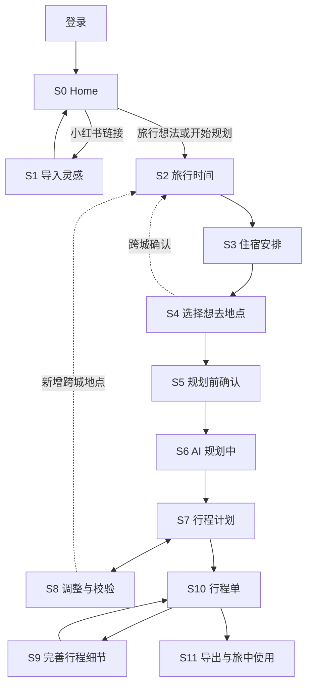

# Nomad MVP UX Input Package

Generated: 2026-09-19
Status: Approved Correct Course sources

Visual inventory refreshed: 2026-09-15; IR resolutions and all 18 prompt-presentation groups approved and applied to text contracts. Implementation images/evidence remain scoped to owning Stories.

Historical v0.2/v0.3 delta files are intentionally excluded from this authoritative packet.

---

Capacitor amendment approved 2026-09-19; source packet regenerated from current source files.

## Source: `docs/front-end-spec.md`

# Nomad MVP UI/UX Specification

## Document Status

- Version: 0.6
- Updated: 2026-09-15
- Status: Approved Correct Course UX contract
- Platforms: traveler Web/PWA + Capacitor Android/iOS (Android10+/iOS16+ phones); operator desktop Web only
- Visual inventory: `docs/ux/prototype-coverage.md`

本规范覆盖旧 v0.1-v0.4 的 Confirm、固定 2h/4h、Quick/HQ 双版本、
`SmartPlanSwitch`、先摆骨架再 AI 填空槽，以及把“完善细节”作为初始规划完成页
CTA 的设计。旧图片和 delta 文档只用于版本沿革；若冲突，以 PRD、本规范、
`docs/ux/mobile-ia.md` 和获批 Correct Course 为准。

## Product Experience

### Experience Goal

用户从一句旅行想法或一组小红书链接出发，只确认真正影响编排的时间、住宿、
地点意图与节奏，然后由 AI 生成完整初始计划。计划直接进入可编辑时间轴；冲突
只在变更造成问题时出现，行程细节和引用在排期稳定后完善。

### Design Principles

1. **移动任务，不是桌面表单：** 每屏只处理一个紧密问题，主 CTA 固定、字段渐进展开。
2. **一个用户流程：** 内部 Provider、Quick、fallback 和重试不产生第二份待采用计划。
3. **事实诚实：** 不显示虚假百分比、实时免排队、已预约或编造的交通/距离。
4. **地图保留上下文：** L1/L2 帮用户理解区域，只有 L3 接收地点意图。
5. **结果可改可追溯：** 所有变更有 revision、全局 undo、冲突解释和来源状态。
6. **视觉服务重复操作：** 计划页安静、密度适中，避免营销式 Hero、卡片套卡片和装饰性渐变。

### Prompt Presentation (18 groups approved 2026-09-15)

当前主流程先呈现可用内容和主要操作，非阻断信息使用可读的次要行内文字；同一原因在同一
模块/版本只保留一个入口，不抢焦点、不反复Toast、不要求逐条确认。细节进入已有地点、路线、
来源、FixSheet或整体核查界面，返回保留上下文。弱提示不只靠颜色，不降低可访问对比度。

当前动作无法完成时，在受影响字段/操作处说明实际结果与恢复；必要确认在原最终预览集中
呈现。未保存、未提交、结果未知、hard conflict、权限、账号删除和生产发布等不能变成可忽略
建议。所有计数取当前模块/版本的真实集合，不把不同类别汇成一个模糊“全部已确认”指标。

| 组 | 当前呈现合同 | 保留的行为边界 |
| --- | --- | --- |
| 1 导入部分识别/成功 | 对应Dock/记录显示“已添加 N 个链接，部分内容未识别”或“部分内容已保存”；终止为“这条导入未完成”。 | 有效条目继续，错误片段可展开；媒体保存不等于地点验证完成。 |
| 2 重复导入 | 对应项显示“已在灵感库”或“正在导入”，提供查看入口。 | 复用已有记录/任务，保持owner隔离，不再建任务。 |
| 3 班次/酒店搜索 | 无匹配“未找到”，已有手工路径时可加“可手动填写”；请求失败“搜索暂不可用 · 重试”。 | 两种状态分开，歧义/过期采用前处理，原手工/留空/取消路径保留，不新增未批准的手工酒店能力。 |
| 4 路程未知 | 路线行显示“路程时间暂缺”，原因进详情。 | 不显示假分钟数或0分钟；依赖可达性的采用/发布仍执行原门禁。 |
| 5 负荷/普通天气 | “较满”“部分通勤待核对”“天气临近出发再核对”，详情按需展开。 | 数据缺失不算零；实际hard问题及时说明，季节提示不冒充预报。 |
| 6 地标代理 | 目标行“附近估算 · 以{地标}为参考”；详情“实际位置建议核对”。 | 预览保留代理身份；不继承地标的目标事实，不把位置未知变精确。 |
| 7 仅soft冲突 | 单一低强调入口“有 N 项建议核对 · 查看”，可跨日期到达现有FixSheet。 | 无hard才采用该层级；hard/mixed保留简短可达提示和原门禁，soft不能被说成clean。 |
| 8 无法预估住宿影响 | “暂时无法预估，保存后会检查”，原因进原影响详情。 | 实质变更仍需确认，无法预估不是无影响，结构错误不能先保存。 |
| 9 AI无安全调整 | “这次暂时无法调整”+一句具体原因+“当前计划未改动”。 | 保留手动/重述路径，不制造不安全方案或空revision。 |
| 10 细节尚未/部分完善 | 总览保留时间/细节两行摘要，细节行“还有 N 处细节可完善 · 去完善”。 | failed/暂未生成/建议核对仍在相应槽位分清，基础阅读与合法基础导出继续可用。 |
| 11 S9/S11 soft提醒 | “有 N 项建议核对 · 查看”与必要短摘要；原主按钮就是明确继续动作。 | 不新增我已读完/逐条确认；独立导出文件仍携带使用所需提醒和来源，不能仅留站内链接。 |
| 12 已完成旧图遇到行程变化 | 图片生成时间旁“行程已有更新，可重新生成”，沿用重新生成动作。 | 旧图仍可查看/下载/分享；未完成的过期预览仍须刷新后才生成，不自动重生成。 |
| 13 长行程分图 | 主显“将下载 N 张长图”，城市范围按需展开。 | 操作前张数清楚；完整城市边界/顺序/一次批次保持，不加二次核对。 |
| 14 定位降级 | 实际采用计划基准时主显“已按行程位置推荐”，保留真实前/后地点；过期/未授权/失败进推荐依据，无基准沿静态池/手动路径如实呈现。 | 位置基准不可隐藏为“离我最近”；定位恢复为次要动作，不反复要权限。 |
| 15 候选/列表/模块读失败 | 对应模块“候选暂未更新”或“暂未更新 · 重试”，保留仍可合法显示内容。 | 请求失败不等于空结果/任务失败；截至时间真实，撤权立即清数据。 |
| 16 AI清单重复/生成失败 | 重复项“清单中已有”；生成失败“建议暂未生成，可直接添加”。 | 不覆盖原记录；真实保存失败仍“暂未保存”，不伪报已保存。 |
| 17 数据副本/反馈回执 | 生成前简述范围和“副本含个人数据，请妥善保管”；普通已发起下载用“已开始下载，请确认”；反馈成功突出编号/时间，说明小号一次呈现。 | 去留关键后果在操作前可读；未知保存不说已保存，收到反馈不等于处理完成。 |
| 18 运营解释 | 金额/状态旁保留“暂估”“待核对”“等待使用”“数据截至…”；长定义进入查看来源。 | 生产影响/费用/权限/关键未知不后置，不重绘成熟工具，不新增运营移动适配。 |

该表落实主报告18组综合建议；其余125类审查中的候选文案不能借此次批准任意替换。
原图未随文字修改，冲突的旧文案按本表及更新GWT覆盖；实施仍提交相应浏览器证据。

### Visual System

- 44x44pt 最小触控区域；图标按钮使用 Lucide 或现有图标库并提供 accessibility label。
- 默认动效 120-200ms；Sheet 240-300ms；尊重 reduced motion。
- 页面背景白/近白，主强调为深绿，橙色只用于待处理/变更，红色只用于破坏或硬冲突。
- 卡片圆角不超过 8px；页面 Section 不做漂浮卡片，真正可重复条目或 Sheet 可用边框容器。
- 字号不随 viewport 宽度缩放；日期 Tabs、时间轴、图标 rail 和 CTA 使用稳定尺寸约束。
- 规划主流程文案不暴露 `skeleton`、Quick、HQ、seed、must_go、内部 JSON 或 Provider 名称；
  Story 7.4 的 `ZIP（内含 JSON）` 是用户下载文件格式，不属于内部实现术语展示。

## Canonical Stages

| Id | User-facing name | Entry and exit |
| --- | --- | --- |
| S0 | 输入旅行想法 | Home 输入自然语言或粘贴链接；自然语言进入 S2。 |
| S1 | 导入灵感 | 仅小红书分支；完成后留在 Home/Library，可继续 S2。 |
| S2 | 旅行时间 | 日期、天数、每天出门时间、可选到达/离开。 |
| S3 | 住宿安排 | 按住宿晚确认酒店、早餐和行李；酒店可留空。 |
| S4 | 选择想去地点 | 全城检查与 L3 必去/顺路；CTA 为下一步。 |
| S5 | 规划前确认 | 选择悠闲/从容/充实，可选补充其他要求；唯一 `开始规划`。 |
| S6 | AI 规划中 | 在稳定时间轴 shell 展示事实进度。 |
| S7 | 行程计划 | 完整可编辑计划、酒店、候选、餐饮与清单。 |
| S8 | 调整与校验 | 编辑、AI 局部调整、冲突修复与 undo 循环。 |
| S9 | 完善行程细节 | 补充做什么/准备/注意、why 与引用，不改排期。 |
| S10 | 行程单 | 阅读基础行程、整体核查、逐条轻编辑并按需查看引用。 |
| S11 | 导出与旅中使用 | 既有行程图片预览/生成、保存分享、最近行程与前台位置上下文；打卡和照片类产物不在 MVP。 |

S1 是分支，不是每次规划必经页。S8 是 S7 周围的循环，不是单向向导。跨城
选择从 S4/S8 返回 S2/S3 补齐城市日期、交通、住宿与行李。

## Information Architecture



### Global Navigation

- Home/Library 顶部使用 `计划 | 灵感` segmented control；菜单进入最近行程、设置和反馈。
- S2-S5 使用返回、阶段标题和自动保存状态，不显示品牌 badge 或冗余“我的计划 vN”。
- S6/S7/S8 共用计划路由与 Header：返回、`{城市链} · {天数}天`、全局历史/undo；
  通向 S10 的计划级入口不得占用时间轴纵向空间，也不在编辑态显示细节完成状态。
- 日期 Tabs 横向滚动；右侧固定紧凑清单图标，不阻止日期继续滚动。
- S9-S11 使用计划标题和明确返回路径，保持当前 Trip revision。

## Core Flows

### Home Input and Import Queue

底部始终是一个 `HomeImportDock`：长输入框靠近一个强调按钮。空输入显示 `+`，
有内容时过渡为纸飞机。占位文案固定为：

`粘贴分享链接或输入想去的地点，如：厦门 3天`

- 多链接创建多个独立 job；状态面板显示当前 `N/X`，输入仍可继续创建后续 job。
- 展开态向下箭头/下滑收起；简态向上箭头展开。
- 来源标题安全截断；副标题只写事实动作，如“已提取 12 张图片，正在理解内容”。
- 不显示橙色百分比进度条。完成结果逐项 FIFO 展示完整 10 秒。
- 识别旅行文案为 `识别 厦门 3天 7月14日出发`；节奏留到 S5。
- Library 导入记录可查看解析 POI，并通过小复制图标复制 owner 的原始链接。

### Recent Trips and Resume (Story 7.1)

- Home 最近一趟入口和 `全部`/菜单共享 owner 列表；不阻塞原有 Dock。独立 Plan 或整趟
  Trip 只占一项，城市子计划/一日游不重复；长城市链、缺图占位及分页保持可达。
- 主状态为真实 `草稿 / 规划中 / 已生成 / 生成失败`。已生成不表示旅行结束，也不代表
  无冲突或细节已完善。排序只跟随用户打开/成功保存，而非异步任务心跳。
- 已发布行程的附属修改入口必须存在真实保存的待处理草稿/任务。半途离开为中性
  `有未完成的修改 / 继续填写`；实际排队/运行为 `修改规划中 / 查看进度`；当前任务
  终止失败为 `本次修改生成失败 / 查看原因`。原行程继续可用，旧失败不得污染新输入。
- 继续恢复已保存输入阶段、原任务或最近 S7/S10 视图、scope、日期与滚动位置；S9/S11
  复用既有恢复流程。按服务端 current revision 检查过期位置；不重放未确认弹窗、
  过期撤销或自动重新编排。普通编辑请求失败不自动生成“未完成修改”。
- 加载骨架、真实空态、刷新错误各自独立；账号切换清空私有缓存并重新鉴权，目标
  不可用时返回列表。错误不隐藏输入；不承诺离线写入。状态有文字，不只依赖颜色。
- 当前原型为 Recent Trips Resume R1 / Recovery R1；后者 D 仅示意真实失败，未完成和
  运行中的附属行按上述文字合同使用中性/进行中样式。
- Story 7.2 已确认移出 MVP：行程单不增加逐项打卡按钮，沿用 Story 5.2 紧凑总览。
  相册照片/已存地理数据自动标记，以及相册视频、九宫格和 AI 美化属于 FR40.1 后续设计；
  原手动打卡原型不作为当前视觉依据。初始编排和旅中受控重编排仍是本期重心。

### Time and Accommodation

S2 只显示目的地链、整体日期/天数、`每天几点出门` 和边界交通。到达/离开
分别支持：

1. `具体时间`：航班/火车查询或手工交通方式、日期、时间和地点。
2. `大概时段（2小时）`：用户选择一个连续 120 分钟窗口。
3. `交给 AI 安排`：AI 只决定可用首尾日时间，不编造班次或票务。

S3 按住宿晚纵向呈现。每晚都有酒店、早餐、行李；酒店名称调用 AMap 匹配并
允许留空。第二晚起有独立 `同上` 按钮，不提供“一键应用到剩余晚”。`同上`
复制住宿/早餐后重新计算行李默认，不盲目复制上一段 transition。首晚显示
`带到首晚住宿 / 车站机场寄存 / 其他方式`，不显示不存在的“原酒店”；连住默认
留原酒店，换住默认带到新酒店，末日离开仍需明确行李去向。

S2/S3 的下一步只在相关行被主动处理后启用。`交给 AI`、酒店 `留空`、早餐
`未知`、行李 `未决定` 和 `同上` 都是有效的显式确认； untouched 初始态不是。

### Picker and Pace Review

S4 主界面是 `全城检查`，不可展开。它以地图/L1 和 L2 行帮助用户确认覆盖区域；
点击 L2 进入批注名为 `选择 L3` 的页面。

- L2 行使用由子 L3 派生的非交互状态点和分项计数，不显示 checkbox；混合态不只靠颜色表达。
- L3 页默认展开 `附近 | 全城` 互斥视角；全城检查不显示该展开控件。
- 点击/选中 L3 后地图聚焦该 POI 与附近地点；split 展示当前及相邻 L2，完全地图展示 L1 全城。
- 每行右侧仅有 check-circle（必去）与 Route（顺路）图标，两者互斥。
- L3 页 footer 显示 `已选必去 X`、`顺路去 Y` 和 `返回全览`。
- 返回后 required/along_route 同时映射到 L3 缩略图、L2 分项汇总和全局计数。
- POI Sheet 是通用信息 Sheet，标题直接使用 POI 名称，不显示“详情栏”等泛化标题；
  `需预约` 只是带证据的 metadata badge。
- 全城检查 CTA 为 `下一步`。S5 再选择悠闲/从容/充实并 `开始规划`；节奏下方有
  默认折叠的 `还有其他需要注意的吗？`，可选填写同行人、行动能力、饮食、步行和
  不能接受的条件，不重复时间或住宿。

玩法不形成另一组必填选项。系统从自然语言、导入证据和 L3 行为推断经典、吃喝、
自然、拍照、古建、小众、逛街、展览等软偏好；推断只在来源/置信度可靠时参与排序，
存疑不显示成用户确认，也不覆盖 required、pace 或其他要求。

### Planning, Timeline, and Validation

S5 接受后立即进入时间轴 shell。规划中使用稳定日期 Tabs、行/酒店占位与事实
阶段，不跳独立完成页。完成后同一 shell 原地显示计划；提示
`计划已完成，可直接调整` 保留到首次 insert/replace/move/retime/delete。

时间轴为连续瀑布：普通 POI、MealSlot 和 transfer 使用一致行结构；hotel 固定
在当日底部。条目 Sheet 信息层级为地点/日期、前后通勤、替换/移日/调时/删除。
服务端未知的通勤显示未知，不由前端估算。

每个日期显示紧凑负荷摘要；点击后展示主要安排数、步数范围、通勤、最早/最晚、
留白、原因和自然语言估算边界，不制造精确步数，也不显示内部置信分或质量枚举。候选入口一级按
`未安排的必去 / 顺路候选 / 其他候选` 分组；地点行再标注 `来自灵感 / 城市热门 /
附近推荐 / 我添加的`，不把来源与 intent 混成同级，也不使用泛化 `AI` 标签。
MVP 补全阶段依次使用已有灵感、AnchorPool/城市 Top-50 和 AMap 附近。
不确定结果进入候选区而不打断 PlanningJob，仍不足时允许明确的自由活动，不出现要求
用户先摆满的空白 `待安排` 槽。XHS 关键词搜索不在 MVP 中展示。

`添加地点` 使用同一移动端 Sheet 完成 AMap Top-5 搜索与候选保存。没有准确结果时，
用户可输入目标名称并选择同城、经验证的附近地标；确认页同时展示目标名、`附近估算`
状态、所用地标和“实际地点可能有偏差”。路线/距离使用地标坐标，目标不得继承地标的
地址、营业、评分、电话或预约事实。没有地标时只能保存为 `待定位`，不展示估算路线。
Epic 2 保存到 `其他候选` 并在行内标注 `我添加的`，不改动时间轴；直接落位或替换由 S8 的显式命令、预览、
校验和全局 undo 负责。

编辑后触发增量校验，无冲突不常驻卡片。只有soft时使用低强调“有 N 项建议核对 · 查看”；
hard或mixed保留简短可达提示和原动作门禁。用户点开原FixSheet选择可预览方案，不自动弹出
或逐条确认；应用后显示 `做了以下调整`，生成新revision并接入全局undo。

S7/S8 右下角可提供一个有 accessibility label 的 `AI 调整` 图标按钮。自然语言和
快捷项先识别最小影响范围；范围不唯一或存在关键风险时，AI 构造一次一个的受控
`AdjustmentAsk`，只显示可修改的紧凑范围或一个澄清/风险问题，不显示“我理解为”或
推理过程。澄清后再显示 `选择一个调整方向`；快捷项和 ask 都不直接写入计划。
无安全方案或 stale plan 使用已批准的恢复 Sheet。可靠天气可生成雨天调整方向，
陈旧或远期天气只显示季节性/无数据降级。Linked Trip 中的 AI 调整始终绑定当前城市
Plan；`整趟` 只指当前城市，不得跨 segment 修改城市链、交通或另一城市计划。

### Linked Trip

跨城 L3 的确认 Sheet 显示地点所在城市、当前城市，并先区分“同日往返”与
“新增住宿城市”：

- 标题：`西街在泉州`
- 正文：`当前是厦门行程，选择一种加入方式`
- 路线：一日游为 `厦门 → 泉州 → 厦门`；新增主城市为 `厦门 → 泉州` + 独立反转图标，
  不使用语义含混的 `⇄`
- 互斥选择：`安排泉州一日游 / 当天往返，住宿仍在厦门` 与
  `增加泉州行程 / 在泉州停留，并单独设置住宿`
- 操作：跟随选择显示 `安排泉州一日游` 或 `增加泉州行程`，次操作为 `暂不加入`

选择新增主城市后回到 S2/S3。每新增一个城市都复用同一确认、时间与住宿流程，城市数量不设
产品上限。多城时间页以可滚动的有序城市链显示整体日期/天数；例如
`厦门-泉州-福州` 对应 `到达厦门 / 前往泉州 / 前往福州 / 离开福州`，继续新增时按
同一规则增加边界行。交接日时间轴以 transfer 区间分隔两个相邻城市，酒店和行李
跟随目标 segment。主城市链不创建重复城市，不得把跨城 L3 放入另一个城市的普通时间段。

选择一日游后进入聚焦设置页，显示宿主 `厦门 · D2 7月15日`、一日游日期、独立的
`前往泉州` 与 `返回厦门` 交通行，以及只读摘要 `住宿：返回厦门海景酒店 / 行李：留在厦门酒店`。
任一交通未确认时保留草稿并禁用 `确认一日游`，不得自动捏造返程。发布后的 D2 只有一个
日期 Tab，按时间顺序展示 `厦门可安排至…`、去程、`泉州一日游`、返程、
`已回到厦门`、返厦后的安排和厦门酒店，不创建第二个厦门 Tab。

一日游段的溢出菜单提供 `调整泉州安排 / 修改往返交通 / 更换一日游日期 / 删除一日游`。
AI 调整在泉州段显示 `当前范围 · 泉州一日游`，只改子 Plan 地点；在返厦前后则只改
厦门主 Plan。两种范围都冻结去返交通及另一 Plan。跨时区、跨夜 A-B-A、嵌套一日游、
同日 A-B-C-A、与主链交接同日的一日游和任意整链重排仍不提供入口。

### Meals and Checklist

- 餐饮是独立时间槽，但和普通 POI 同视觉；只对可靠预约证据加小 badge。
- choice pool 显示一主、最多两备；更换 icon 打开候选；不足时首个空位为 `+ 添加更多`。
- `暂不决定` 按定位和下一 POI 刷新，不显示固定 90 分钟承诺。
- Story 6.2允许打开App/回到前台且存在当前旅中餐饮上下文时，在历史授权仍有效或本次
  授权后单次刷新；打开餐饮候选/主动刷新仍可触发，同轮前台事件合并请求。系统撤权或
  权限无法确认时不能只凭历史记录取位置；未授权时不因打开App弹窗，沿计划基准继续，
  用户需要附近候选时再说明用途并选择授权。转后台/退出账号/撤权后丢弃迟到响应；原始
  fix在本次处理后清除，只短时保留当前owner/scope的候选及粗粒度依据。拒绝、陈旧、低精度或无fix
  时主显示 `已按行程位置推荐`，使用同scope的上一计划POI与下一计划POI，具体权限/新鲜度/失败原因在推荐依据中查看；本期不提供到访
  标记，前序地点显示 `上一计划地点` 而非已完成。无任何基准则保留静态池与 `+ 添加更多`。
- App打开刷新只更新当前scope的只读候选状态，不抢占页面或覆盖已打开Sheet的选择草稿；
  Sheet自身的请求随关闭失效，全部响应校验owner/前台会话/request/revision/MealSlot/日期/scope。
  用户确认后才复用Story 6.1的预览、校验、版本和撤销。
  权限恢复是次要动作，图中的 `去开启定位` 仅按真实设备能力提供；免排队只说明证据来源。
  `story-6-2-meal-location-recall-fallback-r1.png`为授权与降级基础原型，新增App打开触发以
  2026-09-14文字修订为准，仍需对应权限/生命周期/草稿保护实施证据。
- `附近吃什么` 是商场/小吃街/市场条目后的可点击子提示，不占时间轴节点。
- Story 6.3 仅查询 owner 已导入并验证、与该地点共享可靠规范化商圈的美食，按实际分店
  去重；点击餐厅复用通用 POI Sheet，点击来源进入自己的导入记录。无可靠归属/有效结果
  时隐藏入口；打开后结果失效则清空旧条目并允许返回，加载失败保留重试，不冒充零结果。
  此入口按计划地点商圈查询，不申请实时定位、不自动加入行程，不显示核验质量标识。
  原型 `story-6-3-area-food-context-r2.png` 已批准并替代旧 Area Food Suggestions R1。
- 酒店早餐、普通小吃、咖啡和现场随性餐饮默认不创建 MealSlot；只有 fixed anchor、
  choice pool 或用户明确添加才占时间。
- 清单图标固定于日期 Tabs 右侧；完整页底部只有 `+ 添加记录`。
- Add Sheet 空输入强调直接添加并禁用 AI；输入后启用并强调 AI 提示，结果仍需确认。
- Story 6.4 的直接添加先进入文字/分类/日期编辑页，禁止保存空白记录；有效输入只有点击
  AI 后才生成，建议可逐条编辑/取消选择、重复建议默认不选，确认后才加入。失败或停止
  保留原文并允许直接添加。普通备注归按需出现的 `其他记录`，支持独立编辑/删除/完成/
  取消完成；清单版本不推进排期版本，清单修改不触发时间轴 `撤销 8`。
  `story-6-4-checklist-record-workflow-r1.png` 已批准，补充原固定入口和双动作图。
- Story 6.5 的购物记录使用单个多行输入框；灰色占位示例为想买的东西、款式、数量、预算。
  下方 `款式 / 数量 / 预算 / 品牌 / 尺码` 快捷操作在正文末尾换行插入标签并定位光标，
  已存在标签时定位原行而不覆盖值；不要求填齐属性、购物日期或关联门店。占位不持久化，
  有效购买描述可独立保存，保存复用 6.4 文本/版本规则。视觉由
  `story-6-5-shopping-text-shortcuts-r2.png` 说明，原多字段 Shopping Target/Stores R1 已取代。
- 多门店关联、找店、自动购物编排与顺路购物提示延期；销售证据、实际到达触发及自动
  应用授权/撤销方式留后续设计。清单返程事项转换为时间安排也已延期；本期仅提供记录、
  编辑和完成状态，不显示清单 `预留时间` 入口。此前酒店、行李和交通的必要缓冲继续
  遵守既有规划/校验合同，不要求从清单重复添加。

### Account and Available Actions

设置只展示账号及真实可用的账户/数据/隐私/反馈/退出操作，不显示 `AI 与用量`、
`使用情况`、全局生成状态或额度面板。未部署能力不伪装可执行，暂时不可用的已部署
操作保留诚实恢复路径；不增加个人资料编辑。用户资料缺失时用 `已登录 / 当前账号`。

后台额度、并发和预算继续控制请求，但不展示计数、余额、上限、重置时间、token 或
`low` 等额度分级。操作受限只提供实际可用的 `稍后重试 / 查看进度 / 返回手动编辑`；
只有真实入队才显示排队，不展示模型/Provider、Key 引导或虚构故障。
任务阶段和链接/城市/槽位/图片份数等真实进度继续在原工作页展示，不移入设置。

Story 7.3 已批准：账号区域只读，不显示原始 user/device/session id 或伪造资料；可用
数据/隐私/反馈项只进入各自流程，设置打开本身不触发导出或删除。退出使用当前会话
确认 Sheet，成功后清理私有缓存和挂起响应并回登录；不删行程、不撤销其他设备，
不取消已受理任务。未保存内容与失败/不确定退出复用既有保护和核实流程。
`story-7-3-account-actions-r2.png` 是当前参考；用量 R1 已作废。

Story 7.4 账号数据导出已批准：申请页列出当前结构化数据范围、排除项和
`ZIP（内含 JSON）`，只在点击生成后申请。生成中显示真实阶段，离开后恢复同一任务；
退出登录不取消已受理任务。完成页展示文件名/大小、`数据截至`、`下载有效至`、下载与
重新生成。技术重试沿用已封存快照，重新生成才取新内容；已有有效旧副本不因新生成失败
被提前销毁或改标为最新。生成失败、过期、下载失败分开处理：仅下载失败不重新打包。
数据仅供本人鉴权下载，不提供公开分享/相册保存/恢复导入/邮件推送。现有资料与计划
不因导出到期而删除，期限与大小使用实际值，不显示额度。参考
`story-7-4-account-export-core-r1.png` 和 `story-7-4-account-export-recovery-r1.png`；
读取失败/登录过期/空账号/旧副本仍有效等剩余状态按 GWT 补实施截图，不能误报任务失败。

Story 7.5 删除流程已批准：范围/可选先导出 -> 最终确认 -> 停止账号访问/清理中 ->
核验结果。仅最终受理后不可撤销，确认前返回不删数据，不增加挽留问卷；真正需要时
复用已有身份核验方式，不强制新增手机号。返回登录不取消删除，已停用账号不再提供
返回行程/继续导出/恢复账号操作。状态仅通过本次受限回执读取，重试需要独立限定授权。
`部分数据尚未清理完成` 与 `暂时无法查看进度` 分开；后者只重新读取、不重新提交删除。
在线清理完成与隔离备份/最小保留记录分别说明，实际政策不由原型猜定。参考
`story-7-5-account-delete-core-r1.png` 与 `story-7-5-account-delete-recovery-r1.png`；
身份核验、受理结果不明、回执失效/跨设备恢复及保留详情仍需实施截图与验证。

### Feedback (Approved Story 7.6)

设置、侧边栏与结果页异常二级入口复用 `反馈与建议` 并恢复来源页。保留真实配置的
腾讯反馈入口，同时始终可直接填写。Web/PWA 由用户打开外部页面；本期 Android/iOS Capacitor App 使用9.1的受限外链能力，外部页面无Nomad桥接/会话，不伪装浏览器可检测第三方提交。默认不传 Nomad 登录信息，
不承诺外部免登录，原生/网页模式分别验收；打开邮件或网页不能出现提交成功。

内置填写仅一段文字、最多一张可选截图；不要求分类或联系方式。`附带诊断信息` 默认
关闭，只允许已说明的来源类别/应用版本/安全错误代码。截图仅本地选择预览，提交才
上传。上传不可用仅置灰上传控件，不显示失败文案/独立重试行/特殊文字提交 CTA；
保留预览 X，明确移图后用普通提交。未完成附件不能静默丢弃或伪装成功。

上传、提交与有界回执核实期间只显示实际状态，无底部 `重新查看 / 返回` 或替代操作；
顶部导航仍保留上下文，真实失败/等待耗尽才退出进行中并开放恢复。重复请求复用同一
申请，服务器完整落库且维护者可读取后才显示 `反馈已收到` 与编号/时间，不承诺已处理。
草稿/回执按账号隔离并有 TTL；身份切换、退出和删除清理，附件丢失明确重选。
当前批准参考为 `story-7-6-feedback-entry-submit-r1.png` 和
`story-7-6-feedback-recovery-r2.png`；Recovery R1 已作废。剩余原生加载、已知保存失败、
登录过期及超时恢复须按 GWT 做实施截图，不新增客服对话/回复通知/反馈历史页面。

### Detail, Result Sheet, and Export

交付责任（IR-09，2026-09-15）：5.1先提供同一S10路由的最小基础宿主页，用户从S7既有且
不占时间轴纵向空间的计划级入口进入，再选择完善进入S9；无FillRun也可读基础行程。5.1
负责完成/部分完成/失败/主动返回后的原S10日期、城市/一日游范围、滚动与焦点，以及合法
深链无父视图时建立返回上下文。S9当期就有实际鉴权的最小来源展开，不等未来CitationSheet。
5.2在同一路由/读模型上增强下述完整双行核查、槽位内容与引用呈现，不另建结果页或校验真相。
导航与来源展开不启动FillRun/ValidationRun或改排期；未知检查不冒充通过，hard/soft门禁保持。

S10 始终先展示 current revision 的紧凑基础行程，并在日期 Tabs 下使用一个非卡片式
`整体核查` 区域分开呈现 `时间安排` 与 `行程细节`。时间安排读取同一 revision 的
ValidationRun；hard conflict 在 S7/S8 自动出现 banner，在 S10 同步显示并链接
FixSheet/手工编辑，同时禁用细节完善但不隐藏基础行程。无 hard conflict 时，从 S10
进入 S9；S9 只完善现有槽位内容，完成、部分完成或失败后返回原 S10 日期、scope 与
滚动位置。

槽位内容页展示 `做什么 / 准备 / 注意`、why 和真实引用，不显示技术质量、新鲜度或
置信度枚举。无可靠来源但可安全表达的通用内容，在S9对应内容旁、S10槽位详情中用
次要行内文字 `建议核对`，不占计划级警告、不弹窗或要求逐条确认；用户可先使用基础行程，
再从详情/来源查看依据。提示仍可读且不只靠颜色，不能隐藏事实不足或伪造引用；无法安全
表达仍显示 `暂未生成`，现有时间安排硬冲突门禁保持。轻编辑按具体行标记 `我的修改`；再次完善保留用户新增、改写、删除和可选
栏显式留空，过滤相同或近似 AI 建议，只在剩余容量补充不重复内容。用户文字不继承
AI 引用，不提供恢复 AI 内容。S11 导出前继续检查 hard conflict 和 Trip revision，
只允许选择 1080/1242 宽度，图片数量由 current revision 推导：独立单城一张，linked Trip
的每个主城市段与每个一日游子计划各一张，每个城市单元的全部日期合并为一张长图，不提供
按日切片。基础行程始终必选，行程细节仅包含当前 revision 已有内容且允许关闭；细节未完善
不阻止基础导出。最终文件默认 WebP，尺寸或兼容失败时降级 JPEG，界面统一称 `导出图片`，
不承诺 PNG。背景使用抽象路线底纹与自有/已授权城市页头页尾素材的版本化混合模板；无城市
素材时使用通用背景，不在导出时临时调用 AI 生成。

预览和 ExportJob 绑定精确 current revision。hard conflict、无效主链交通、缺失一日游
返程或不完整原子引用禁用生成并返回现有修复路径；soft warning 可继续但必须展示。任务
只报告已处理城市行程单元/真实阶段，不显示伪百分比；断线恢复同一任务，失败保留设置并可重试。
计划更新后旧预览不可继续生成，必须刷新。Story 5.4 至少提供受鉴权城市文件下载；Story 5.5
在现有 Web/PWA 客户端上提供 `下载整趟长图`：单城复用城市图，多城从同一快照按时间顺序
确定性合成；一日游嵌入宿主日期。正常长度一次下载一张，超过实测并版本化的安全上限时，
只在完整城市边界拆成 `N/总数` 编号图片，并由一次用户操作启动有序下载批次。预览必须先
展示 part 数量；不使用 ZIP、不从城市或日期中间拆分。支持目录写入的浏览器一次授权保存
全部part并核验结果；其他浏览器按下述已批准文案与保存未知语义处理。系统分享经能力检测后使用有序城市图片组，
此 Web/PWA 分支不承诺直接写入相册；App 分支按新增宿主合同进行真实相册保存/系统分享。初始规划完成时间轴不放置细节完成卡片或底部完善 CTA。

### Browser Download Result Semantics (Approved CE-03, 2026-09-14)

单文件与多文件使用同一能力分支：有授权目录写入且写入/关闭完成回执时才显示已保存。
普通浏览器下载实际交出请求且没有可观察拒绝时，精确显示 `已开始下载，请确认`；此为
已发起请求的用户提示，内部保存结果仍未知，不加逐文件确认步骤或宣称全部文件落盘。
明确可观察的取消/拒绝/失败照实展示；有确定结果才只补明确未完成文件，未知文件重试
由用户明确触发并提示可能重复保存。复用同一manifest与文件，不重新渲染/扣生成次数。
保持一批有序编号图片、无ZIP和城市边界分段；下载不改变行程或原文件。

### Added Day Excursion Scope (Approved CE-02, 2026-09-14)

已有S8行程新增一日游，预览只包含目标宿主日及child Plan的允许变化，其他日期/城市
不变。当天放不下的非冻结地点保留未解决/候选及原意图/来源，冻结冲突阻止发布。
需要跨日调整时进入另一次已有编辑/AI调整；4.7明确换日的旧/新宿主日流程保持独立。

## Component Contracts

| Component | Contract |
| --- | --- |
| `HomeImportDock` | 单一 composer + 可展开队列状态；输入与队列是同一 surface。 |
| `TripBoundaryRow` | exact/window_2h/ai_decide 三态摘要与编辑。 |
| `StayNightRow` | 每晚酒店、早餐、行李与独立同上操作。 |
| `PickerOverview` | L1/L2 全城检查，不直接选择 L2。 |
| `L2IntentSummary` | 非交互状态点、required/along_route 分项计数与 L3 缩略图。 |
| `PickerL3Row` | icon-only required/along_route/unselected 状态。 |
| `PoiInfoSheet` | 通用 POI 事实、来源、可理解的更新时间和预约 evidence；不显示技术质量/新鲜度枚举。 |
| `PaceSelector` | 悠闲/从容/充实及具体后果，必选但可改。 |
| `PlanningTimelineShell` | S6/S7 共用稳定布局和事实状态。 |
| `DayLoadSummary` | 项目数、步数范围、通勤、留白、原因和自然语言估算边界；内部置信度不直接展示。 |
| `CandidateDrawer` | 未解决/候选来源、补全阶段、用户确认与自由活动。 |
| `PlanGlobalHistoryControl` | history -> undo countdown -> latest eligible undo。 |
| `TimelineEditSheet` | 地点/日期、nullable 通勤、替换/移日/调时/删除。 |
| `TimePickerSheet` | 1 分钟精度，快滑调灵敏度，开始/结束日期标签。 |
| `FixSheet` | 冲突、类型化方案、diff 预览、应用与失败。 |
| `AiAdjustmentLauncher` | 右下角图标、上下文范围、快捷意图和安全方向预览；通常两个，仅一个安全方向则展示一个，无安全方向进入恢复。 |
| `MealChoiceSheet` | 一主两备、短缺、暂不决定与换店校验。 |
| `TripChecklist` | 固定 rail、分类列表、AI/直接添加及 provenance。 |
| `ResultSheetOverallCheck` | 绑定 current revision，分开显示时间安排校验和细节完整度；hard conflict 可读但阻止完善/导出。 |
| `ResultSheet` | POI-only 总览、槽位内容、真实引用、逐条用户修改与导出入口；不显示技术质量/新鲜度状态。 |

## States and Error Handling

| Surface | Required states |
| --- | --- |
| Home/Import | empty, typing, recognized trip, queued, running expanded/compact, FIFO success, reconnecting, retryable failure, terminal failure, duplicate owner record |
| Time | exact lookup, multiple match, no match/manual, 2h window, AI decide, invalid city date chain |
| Accommodation | first-night luggage, matched, blank, same-as-previous pending/confirmed, changed hotel, checkout/final-departure luggage, storage unavailable |
| Picker | loading, no inspirations, nearby/full-city, both intent types, weak-map list fallback, cross-city confirm |
| Planning | accepted, stages, reconnect, internal fallback disclosed generically, unresolved required, candidate provenance, load confidence, failed/retry |
| Timeline | completion hint, normal, editing, undo countdown, latest-eligible history, conflict, stale revision, AI adjustment scope/failure, weather unavailable/stale |
| Meal | fixed, choice pool, shortage, undecided, location denied/stale, no business-area match |
| Detail/Result/Export | base itinerary, no/partial/complete detail, generation/reconnect/failure/stale, user-line protection, hard-conflict blocked, export retry/complete city-unit manifest |

## Accessibility and Interaction Safety

- Icon-only controls require visible selected state, accessibility label, role and disabled reason.
- required 与 along_route 不只靠颜色区分；使用不同 glyph、填充和读屏文本。
- 地图不可用时所有核心选择在列表完成，焦点不被隐藏地图捕获。
- Bottom Sheet 打开后焦点进入标题，关闭返回触发控件；键盘不遮挡输入和 CTA。
- 倒计时不作为唯一撤销机会；动画减少模式可取消数字跳动但保留文本变化。
- 危险删除与跨城扩展需要确认；普通替换/移动用 preview + undo，避免重复确认。

## Analytics

事件使用 S0-S11 stage id，并至少覆盖：

- `home_input_classified`, `ingest_job_created`, `ingest_presented`, `import_record_opened`
- `time_mode_selected`, `stay_night_confirmed`, `pace_selected`
- `picker_intent_changed`, `picker_overview_returned`, `cross_city_confirmed`
- `planning_job_stage`, `planning_fallback`, `plan_hydrated`, `completion_hint_dismissed`
- `timeline_mutation`, `undo_applied`, `validation_conflict_shown`, `fix_applied`
- `meal_pool_opened`, `meal_recall_degraded`, `checklist_item_added`
- `day_load_opened`, `candidate_stage_opened`, `post_plan_search_result`, `manual_candidate_location_mode`,
  `candidate_saved`, `adjustment_scope_selected`, `weather_context_degraded`
- `result_sheet_check_opened`, `detail_enriched`, `citation_opened`, `override_saved`, `override_preserved`, `export_completed`

不得发送原始链接、搜索词/手动地点名称、完整自然语言输入、精确定位轨迹、手机号、Provider secret 或
未脱敏证据文本。必要的 job/plan/Trip 事件携带安全不透明关联引用和 revision；不把关联 ID
称为自动匿名，也不将其作为权限或高基数指标标签。

Story 8.1 已批准复用 Sentry/Langfuse 运维界面，以安全任务/attempt 引用关联，AI tracing
显式隔离且独立有界采样。用户不新增监控/额度页面；关闭 Replay、表单/完整输入输出采集，
浏览器错误与 source maps 走私有授权诊断。按 `docs/ops/analytics.md` 发送前允许字段和值级
规则处理；监控故障不改变页面状态或重试业务。Walkthrough R1 是批准的排障示意，不是上线截图。

## Brand Rule Maintenance (Approved CE-01, Story 1.11)

生产身份由前置1.0提供，运营权限由服务端授予且可撤销；不因知道入口或前台角色字段就授权。

最小桌面Web运营入口查看、新增、修改和停用连锁品牌抑制规则，服务端验证真实权限。
草稿与生效版本分开，保存不影响当前规则；检查后按预期版本发布并保留幂等回执、操作者
和差异审计。冲突/失败保留草稿，未知结果查询原操作。热更新展示实际加载/使用证据，
进行中的同一ingest/geo attempt固定规则版本，不自动重处理已完成导入。
该入口随1.11交付，不依赖8.3/8.6，也不扩大为通用后台。新增维护/冲突/发布状态以
本次批准的文字合同为准，实施时补相应桌面原型/浏览器验收证据；现有POI消歧原型
不被视为已覆盖运营维护。

手工纠错地点（FR4.2，2026-09-15确认）也随1.11交付最小桌面Web入口。选择已有标准地点，
对照原始高德快照与人工覆盖，只编辑显示名称、地址、同城坐标并说明理由/依据。检查差异后
明确发布，保存草稿不生效；成功/失败/并发冲突/结果未知与撤销覆盖均有真实回执和恢复。
不能改地点身份、合并门店或跨城改绑；Provider刷新不覆盖人工修改，字段来源与时间在详情
按需可查，普通卡不加质量徽章。新事实作用于新读取/任务；既有行程和固定快照不被静默修改。
额外别名/近邻/通用黑名单/批量重跑后台延期；既有品牌规则及8.3–8.6运营页保留。
当前PNG不证明新纠错表单已画出；1.11 UI实现时补桌面编辑/预览/回执/失败与权限证据。

## Operator Evaluation Workspace

Story 8.2 已于 2026-09-08 批准复用 Langfuse，而不在旅行者 S0-S11/Settings 中新增运营页面。
操作链为选择版本化样本/提示/模型、授权比较、逐例查看、人工评分/评语和保存评价。
人评队列与实验对比使用已有工具；自动评分、人评进度、最终结论与同步状态分开呈现，
规则按计分/提醒/人工复核处理，不用统一硬失败覆盖具体判断。

Playground 用于单 prompt 探索，完整 Nomad 回归通过私有 CI 固定任务入口运行并回传同一
份结果，不为展示重复调用模型。实际入口可跨工具打开，无需 fork Langfuse 复制导航。
无样本、访问被拒、无模型连接、待人工、同步失败和中断均需真实状态；不能用示意图
代替已接入能力。量表与评价绑定具体版本，变更不覆盖已封存结果。

线上样本可去直接标识后进入专用评测空间，必要旅行上下文不因间接推测身份删除；
与 8.1 生产遥测采集隔离。生产路由/预算操作归 8.3/8.4，8.6 仅统一已有入口。
Human Workspace R2 为已批准操作示意，不是厂商精确截图或部署/数据上传授权。

## Operator Route Configuration

Story 8.3 已于 2026-09-08 批准小型受限模型路由页，复用现有 React/Fastify，不新建通用后台。
只有已授权运营者可进入；与用户 Settings 隔离，模型连接不提供明文 secret/任意 URL 输入。

列表按已交付任务显示主用/备用与当前版本，编辑保留未发布草稿。检查、评价查看、发布差异
和确认分开；修改后旧检查失效，静态检查不自动发起付费调用。生产环境、任务与影响范围
在发布前始终可见。发布后区分“已确认发布”“尚未加载/等待使用”“已观察到实际使用”，
没有新任务不能虚构已验证。已接收及排队任务继续原版本，新接受任务才使用新发布配置。

配置错误保留草稿且不可发布；版本冲突需重新核对。网络中断/结果未知时查询原操作，
不能盲目再发发布命令。“暂停新调用”独立确认，只阻止未来请求，不保证撤回已发出调用；
恢复另行确认。回滚预览历史设置并创建新版本，不解除暂停、不重跑任务或回滚用户行程。
所有动作保留真实回执，提供无数据/无权限/失联/禁用/键盘与焦点恢复状态。

Route Config Release R1 与 Recovery Rollback R1 是批准的行为示意；连接、时间、数量均
为合成例子，不是配置默认值或已部署界面。预算中心/Telegram/总览留给 8.4-8.6。

## Operator Budget Management

Story 8.4 的修订26条GWT、采用方向和金额来源补充于2026-09-13获批。运营管理仅用
桌面Web，不要求运营页移动适配；保留桌面布局、鼠标/键盘、焦点、无数据/无权限/
陈旧/冲突/结果未知状态。用户Settings和旅行工作页面不增加额度入口。

复用受限运营身份，提供预算及已核验资费的最小登记/检查/发布链和用量明细。草稿
不影响调用，确认显示环境/范围/差异/影响，未知结果查询原操作。预算不修改8.3
既有路线/暂停或用户行程，收紧可阻止后续外发但不声称撤回已发送请求。

分开显示Nomad上限、按报告用量和资费计算的估算成本、上游已核对扣费、未发出
预留及在途/未知占用。可新预留量是当前上限减互斥费用/占用，不是上游账号余额。
实际收费方的资费需有来源/版本；缺少账单源显示未接入/暂无已核对金额，汇总账单
不伪造逐笔费用，账号余额单独列出。预览带时间，发布后重读最新账本。

Budget Policy Usage R1 / Budget Recovery R1 作为基础示意获批，数字均为合成示例。
新增资费登记、金额来源、无账单源等未绘出状态以批准文字合同为准，在实施时补
桌面浏览器证据，不伪称视觉完整。未知费用没有无依据清零按钮。8.5/8.6另行定义。

## Operator Alert Management

Story 8.5于2026-09-13批准24条GWT和两张基础R1。只有桌面Web运营要求；复用真实
环境权限提供策略草稿/检查/发布、当前事件与投递明细、有期限静默、配置修复及重试。
静态检查不发消息；合成TEST消息要明确确认环境、目标与内容。无需8.6或Bot入站命令。

事件状态、通知静默与投递状态分开。成功回执不显示已读/已处理，超时保留未知及重发
可能重复，401/403/topic拒绝显示需修复且不换未登记会话。静默仍记录故障/恢复，到期
按当前状态处理；修复通知渠道不标服务恢复，缺数据/过期心跳/工具issue关闭也不算恢复。

Telegram Lifecycle R1展示首发/聚合更新/真实恢复，Operator Delivery Recovery R1展示
策略/静默/未知发送/拒绝。均为合成示例，未绘出状态仍需实施桌面证据。短消息只含
获准运营字段和需登录的只读事件链接，不承载修复命令或私人行程。通知失败不改业务状态。

## Read-only Operator Overview

Story 8.6于2026-09-13批准20条GWT、中文验收说明及Overview / Source States R1。
使用现有Node/React桌面运营表面汇总固定摘要并进入原工具；无需移动适配、Grafana部署、
通用widget编辑器、iframe或公开snapshot。页面只读，操作进入8.3-8.5原有确认流程。

任务/降级、观测耗时、封存质量报告、预算金额、当前事件/投递及配置使用各自显示来源、
范围和时间。任务不按attempt重复计数，分母为0时无完成率；采样/外推不冒充全量，
P95不平均。账本金额保持已核对/估算/预留/未知及原币种，上游余额独立。无事件或无数据
不显示全局健康，配置发布不代表所有旧任务已换版本。

各源的加载/未接入/空/无权/限流/失败/陈旧独立呈现，旧值带截至时间，其他可用源保留。
快速切换范围时拒绝迟到旧响应，退出/换账号/撤权清掉不可见内容。刷新有界、合并及缓存，
不将缓存读取时间伪装成数据更新时间；图宽/粒度不改变权威数字。链接说明实际带入筛选，
目标独立鉴权，不返回URL密钥/免登录分享。只取聚合，不拉私人行程/反馈/模型正文。

两张批准图为合成示例，未绘出长表分页、全部来源无权、缓存撤权竞态、工具登录/保留
失效等分支仍需实施桌面证据。运营总览本身不会启动评测、重跑、发消息或修改线上状态。

## Accepted Visual References

权威清单与 superseded 标记见 `docs/ux/prototype-coverage.md`。关键当前候选包括：

- Home/import: `story-1-4-home-import-queue-r4.png`
- Time/accommodation: `story-2-0-time-transport-r3.png`, `story-2-0-accommodation-per-night-r3.png`
- Picker: `story-2-0-picker-overview-l3-r2.png`
- Planning transition: `story-2-1-ai-planning-transition-r1.png`
- Timeline edit: `story-2-2-timeline-editing-direction-b.png`
- Feasibility: `story-2-3-post-edit-feasibility-r2.png`
- Meals/checklist: latest R2/R3 images listed in prototype coverage
- Post-plan search/manual fallback: `post-plan-add-place-entry-search-r2.png`, `post-plan-add-place-landmark-fallback-r1.png`
- Candidate placement: `story-3-2-candidate-placement-core-r3.png`,
  `story-3-2-candidate-location-modes-r2.png`, `story-3-2-candidate-placement-outcomes-r2.png`
- AI adjustment: `story-2-0-pace-ai-adjust-r4.png`,
  `story-3-5-ai-adjust-scope-clarification-r1.png`,
  `story-3-5-ai-adjust-no-safe-stale-r1.png`, `story-2-0-ai-adjust-applied-r1.png`
- Cross-city day excursion: `story-4-5-day-excursion-entry-transport-concept-r1.png`,
  `story-4-6-day-excursion-timeline-concept-r1.png`
- ResultSheet: `story-5-2-result-sheet-overall-check-r1.png`,
  `story-5-2-result-sheet-citations-r3.png`, `story-5-2-result-sheet-states-r2.png`
- Detail overrides: `story-5-3-line-edit-ai-preserve-r2.png`
- Operator evaluation: `story-8-2-evaluation-human-workspace-r2.png` (approved conceptual reuse)
- Operator routing: `story-8-3-route-config-release-r1.png`,
  `story-8-3-route-recovery-rollback-r1.png` (approved narrow configuration surface)

图片是行为候选，不覆盖文本合同；缺失状态必须在对应 story 开发前补充或由 story
明确接受文本规格与浏览器截图作为验收依据。

## Out of Scope

- 2026-09-15确认：账号合并/自助解绑/新设备中心、专用腾讯等内容审核接入、额外通用地点后台（手工纠错除外）、地图可达圈/拍照热度层延期。

- BYOK MVP 设置、Quick/HQ 用户选择、任意历史时间轴、自动返程前 48 小时提醒。
- 跨时区、夜间跨日城际交通、跨夜重复主城市、嵌套/多目的地一日游、多段任意重排、后台连续定位。
- 自动订票/订餐、无证据“免排队”、用 L2/行政区伪造商圈、自动购买或库存承诺。

## Capacitor Host UX / UX-DR36 (Approved 2026-09-19)

适用 Web/PWA、Android10+/iOS16+ 手机；复用原 S0-S11、18组提示与页面。Android 返回先处理键盘/临时层/页面历史，根层按平台行为退出到后台；iOS 返回手势遵守同一草稿边界，不自动保存或提交。共同布局处理 safe-area，键盘/系统栏/大字号不遮挡主要动作，焦点/读屏与44pt要求保持。

后台恢复先遮蔽未核实私有内容，核验身份/资格后恢复精确 job/revision/scope；进程终止不取消后台任务，不承诺未持久化草稿已保存。权限说明按用途出现，拒绝/撤回保留计划位置/手动路径；无授权时不因启动反复弹窗。外链、认证、权限或分享返回不等于业务完成。

App 的5.5使用`保存整趟图片`/`保存 N 张图片`，真实系统写入全部完成才显示`已保存到相册`；部分、取消、失败、未知分别处理，未知重试说明可能重复。网页继续`已开始下载，请确认`。系统分享只交有序城市文件，接收者是否收到不代报。7.4账号副本使用系统文件保存，不写相册/自动公开分享；7.6外部页面不持有Nomad桥接，单图由用户明确选择且实际提交后上传。

仅补登录回调/恢复、返回键盘安全区、权限拒绝/设置返回、保存分享文件结果四组高风险宿主状态。旧 native-save-share-r1 是已废弃探索，不自动恢复为原型权威。真实 App 截图和设备/构建记录由责任 Story 补证。

---

## Source: `docs/ux/mobile-ia.md`

# nomad-mvp Mobile IA and Text Wireframes

Updated: 2026-09-06
Status: Approved Correct Course companion to `docs/front-end-spec.md`

## 1. Navigation Model

```text
登录
└─ Home
   ├─ 计划
   │  ├─ 最近行程
   │  └─ S0 输入旅行想法
   │     ├─ S1 导入灵感（小红书分支）
   │     └─ S2 旅行时间
   │        └─ S3 住宿安排
   │           └─ S4 选择想去地点
   │              └─ S5 规划前确认
   │                 └─ S6/S7 同一计划时间轴
   │                    ├─ S8 调整与校验（循环）
   │                    ├─ 餐饮与行程清单
   │                    └─ S10 行程单整体核查
   │                       ├─ S9 完善行程细节 ─┐
   │                       │                   └─ 返回 S10
   │                       └─ S11 导出与旅中使用
   └─ 灵感
      ├─ 城市目的地
      ├─ 导入记录
      └─ 待定位
```

### Header Rules

- Home/Library：菜单 + `计划 | 灵感`；不重复显示 Nomad badge。
- S2-S5：返回 + 页面标题 + `已自动保存`，不显示“我的计划 vN”。
- S6-S8：返回 + `{城市链} · {天数}天` + 全计划历史/undo 控件；长城市链可滚动浏览，
  但当前时间轴和 AI 调整始终只属于一个 active city Plan。进入 S10 的计划级动作不占
  时间轴纵向空间；S7/S8 不显示细节待完善/已完善状态。
- S9-S11：返回 + 阶段标题 + 当前计划上下文。
- 右上历史控件开放给全部日期，不随当前 D tab 改变。

## 2. Global Components

### HomeImportDock

```text
┌──────────────────────────────────┐
│ 来源标题安全截断              N/X⌄│  optional queue status
│ 已提取 12 张图片，正在理解内容    │
├──────────────────────────────┬───┤
│ 粘贴分享链接或输入想去的地点… │ + │
└──────────────────────────────┴───┘
```

- 输入有内容时 `+` 过渡为 paper-plane。
- 状态与输入共用一个 surface；输入不因前景 job 运行而消失。
- 展开态 chevron 向下，简态向上；完成项 FIFO 展示 10 秒。

### Plan Header and Day Tabs

```text
‹              厦门 · 3天            [◷]
D1 7/14       [D2 7/15]       D3 7/16   [清单]
```

- 日期横向滚动，清单 icon 固定在右侧窄 rail。
- 默认只显示有 accessibility label 的历史图标，不显示“历史”文字。mutation 后图标
  变为 `[撤销 8]`；倒计时后恢复历史图标。

### Bottom Sheets

- 顶部 drag handle、清晰标题、右上关闭。
- 单一 primary action 固定底部；键盘出现时 CTA 保持可达。
- Sheet 只嵌套列表/字段，不在卡片中再放卡片。

## 3. Screen Wireframes

### 3.1 Login

```text
Nomad

[ 使用 Apple 登录 ]
[ 手机号登录      ]
[ 微信登录        ]

登录即代表同意 用户协议 / 隐私政策
```

入口等权、同尺寸。风险命中或短信重试时才插入行为验证。

### 3.2 S0 Home

```text
☰        [计划 | 灵感]

最近行程
[厦门 · 7/14-7/16 · 继续编辑]

灵感目的地
鼓浪屿 12 个想去              ›
曾厝垵 8 个想去               ›

                 optional import queue
[长输入框........................][+]
```

- 自然语言识别在 Dock 内显示 `识别 厦门 3天 7月14日出发`，发送后进入 S2。
- 多链接在同一 Dock 中形成 `N/X` 队列，不跳导入详情页。
- 无法判定时显示半高二选一 Sheet：导入链接 / 创建旅行计划。

最近行程（Story 7.1）：

```text
首页最近一趟 ── 继续查看/继续编辑
全部 / 菜单 → 最近行程列表
  ├─ 草稿 → 继续填写 → 有效 S2-S5
  ├─ 规划中 → 查看进度 → 原 S6 任务
  ├─ 已生成 → 上次 S7 或 S10 的城市/日期/浏览位置
  └─ 生成失败 → 查看原因 → 原失败恢复流程
```

- 每个独立 Plan 或 Trip 一项，子城市和一日游不重复；城市名不是身份。
- 已生成只表示当前行程可读，不表示旅行结束或细节/冲突已核查。
- 已发布行程只有存在真实保存的变更草稿/任务才显示附属行：
  `有未完成的修改 · 继续填写` / `修改规划中 · 查看进度` /
  `本次修改生成失败 · 查看原因`。主入口仍可用；半途离开、断线不是失败。
- 当前服务端版本优先于缓存位置；过期日期/scope 回有效父位置，任务恢复不重新生成。
- 空态不遮挡输入；失败不是空态；分页和返回保留位置，账号切换清除私有结果。
- Story 7.2 打卡已移出 MVP，不增加打卡入口；照片自动标记/相册视频/九宫格/AI 美化
  为 FR40.1 的后续设计，不更改当前 S10 查看与 Epic 5 行程长图导出。

### 3.3 S1 Import and Library Record

运行展开态显示来源标题、四个离散阶段和当前事实动作；不显示百分比。

Library：

```text
☰        [计划 | 灵感]

厦门灵感
[L2 行 + 子 L3 摘要]

导入记录
[来源标题] 已保存 6 个地点          ›
```

记录详情列出解析 L3、待定位状态和来源；右上小 copy icon 复制原始链接。

### 3.4 S2 Travel Time

```text
‹                厦门              已自动保存

旅行日期
[ 7月14日-16日 · 共3天             › ]

每天几点出门
[ clock wheel: 08:00 ]

到达与离开
[ 到达厦门   具体时间 / 大概时段 / AI安排 › ]
[ 离开厦门   具体时间 / 大概时段 / AI安排 › ]

1 / 2
[ 下一步：住宿 ]
```

Boundary Sheet 先选 `具体时间 | 大概时段（2小时） | 交给 AI 安排`。
具体时间再输入航班/车次并选择结果；没找到时进入手动交通方式、时间和地点。
边界行必须被主动选择一种模式；`交给 AI 安排` 是有效确认，untouched 初始态不是。

多城标题使用可滚动的有序城市链；`厦门-泉州-福州` 只是示例。边界行依次是到达
首城、前往每个后续城市、离开末城；整体日期和天数由全部城市段计算。新增第四个及
以后城市仍复用同一结构，不出现固定数量字段或另一套向导。

### 3.5 S3 Accommodation

```text
‹              住宿安排            已自动保存
厦门 · 7月14日-16日 · 2晚

按住宿晚安排
● 7月14日晚
  [酒店/民宿/地址，可留空          ›]
  [早餐：未知                      ›]
  [行李：带到首晚住宿 / 需确认      ›]

● 7月15日晚                  [同上]
  [酒店/民宿/地址，可留空          ›]
  [早餐：未知                      ›]
  [行李：带到新酒店                ›]

住宿晚数不对？修改旅行日期
[ 去选择想去地点 ]
```

- `同上` 是按钮；点击后复制上一晚的住宿和早餐，行李按“连住”重新默认为
  `留在原酒店`，而不是复制上一段 transition；用户仍可修改每个子项。
- 酒店为空不阻塞，不由 AI 静默选酒店。
- 车站/机场寄存需在详情中显示放下和取回约束；其他方式渐进展开。
- 首晚没有“原酒店”；末日 checkout 到离开边界仍显示行李确认。单向离开不能把
  行李留在旧酒店，除非计划存在返程取回。
- 每晚酒店 `留空`、早餐 `未知`、行李 `未决定` 或后续晚 `同上` 都可主动确认；
  未触碰的初始态不满足下一步门禁。

### 3.6 S4 Full-City Overview

```text
‹              全城检查
[地图：当前 L1 全城视角]

[●] 鼓浪屿             必去 2 · 顺路 1   ›
[L3 thumb✓] [L3 thumb route] [L3 thumb]

[●] 中山路             必去 1 · 顺路 2   ›
[...]

已选必去 3   顺路去 3
[ 下一步 ]
```

- 顶部标题无展开箭头。
- required/along_route 都必须回映到缩略图、L2 分项汇总和全局 totals。
- L2 只用于进入 L3，不可标记必去或顺路。
- L2 左侧状态点不可点击，由子 L3 派生未选/required/along_route/混合态；精确语义
  同时由图标和分项计数表达，不只靠颜色。

### 3.7 S4 Select L3

```text
‹               鼓浪屿
[附近 | 全城]                  default: 附近
[地图：当前 L2 与附近 L3]

日光岩                         [✓] [route]
菽庄花园                       [✓] [route]
龙头路                         [✓] [route]

已选必去 2   顺路去 1
[ 返回全览 ]
```

- 两个 action 位于行右侧且互斥，纯 icon；active 再点清除。
- 点击行或地图 marker 打开通用 POI Sheet；Sheet 标题直接使用 POI 名称，不出现
  “详情栏”等泛化标题；预约 evidence 仅作为 badge/来源行。
- 点击或选中 L3 时地图自动聚焦该 POI 与附近地点；向下拉至 split 显示当前 L2
  与附近 L2，完全地图视角展示 L1 全城。

### 3.8 Cross-City Confirmation

```text
西街在泉州
当前是厦门行程，选择一种加入方式

厦门  →  泉州  →  厦门

[● 安排泉州一日游]
   当天往返，住宿仍在厦门
[○ 增加泉州行程]
   在泉州停留，并单独设置住宿

[ 安排泉州一日游 ]
[ 暂不加入       ]
```

选择 `增加泉州行程` 才进入 S2/S3，不把地点立即提交给当前城市 Plan。接受后保留原
required/along_route 意图并绑定新 segment；取消保持原 Trip。城市数量不设产品上限，
每次新增都复用同一确认与 S2/S3 流程。两城主链可反转；更长城市链在 S2 明确本次新增
城市的插入位置，主链不允许重复城市。

选择 `安排泉州一日游` 进入同日往返设置：绑定宿主日期，分别确认去程与返程；住宿与
行李继续显示宿主城市状态。返程未确认时按钮禁用但草稿可恢复。发布后日期栏仍只有一个
D2，时间轴依次显示宿主城市前段、去程、目的地一日游、返程、`已回到宿主城市`、
宿主城市后段和宿主酒店。目的地一日游用 child Plan identity，不创建第二个同名宿主 Tab。
同日往返之外的跨夜 A-B-A、跨时区、夜间跨日、嵌套/多目的地一日游或既有整条链任意
复杂重排仍不开放。

### 3.9 S5 Planning Review

```text
‹              规划前确认

厦门 · 3天
7月14日-16日

已选地点  必去 4 · 顺路 3             调整
[L3 thumbnails]

这次想怎么玩？
[悠闲] 每天1-3个，较晚出发，留更多自由时间
[从容] 每天2-4个，兼顾游览和休息          selected
[充实] 覆盖更多地点，接受早出晚归和更多换乘

[ 还有其他需要注意的吗？             › ]  default collapsed
  同行人、行动能力、饮食、步行或其他不能接受的条件（可选）

[ 开始规划 ]
```

不重复 S2/S3 全量字段，不显示智能规划开关。玩法从自然语言、导入证据和选择行为
推断为软偏好，不在这里增加第二套玩法问卷。

### 3.10 S6 Planning in Timeline Shell

```text
‹              厦门 · 3天             [◷]
D1 7/14       [D2 7/15]       D3 7/16   [清单]

09:00 [stable skeleton row]
      正在安排必去地点
11:30 [stable skeleton row]
      正在核对营业时间和交通
...
[酒店 footer skeleton]
```

accepted/context/constraints/arranging/validating/persisting 是事实阶段。重连、
排队、内部降级或失败在同一 shell 给出动作，不显示 Quick/HQ 或第二份计划。

### 3.11 S7 Plan Timeline

```text
计划已完成，可直接调整

D2 较满 · 3个主要安排 · 约1.2-1.5万步 · 通勤1小时20分  ›

● 09:00 [image] 日光岩             …
          30分钟 · 公交
● 11:30 [image] 菽庄花园           …
          25分钟 · 步行
● 14:00 [image] 中山路             …
● 18:00 [image] 晚餐               swap …

[hotel] 厦门海景酒店 · 含早餐        ›

                                      [AI调整 icon]
```

- 完成提示在首次 mutation 后消失。
- MealSlot 与 POI 同视觉；hotel 置底。
- 未解决 required 和其他候选在候选入口，不用空白“待安排”要求用户先摆满。
- 负荷详情展示项目数、步数范围、通勤、留白、原因和自然语言估算边界；步数不显示假精度，内部置信分或质量枚举不直接展示。
- 候选入口一级按 `未安排的必去 / 顺路候选 / 其他候选` 分组；每个地点行再标注
  `来自灵感 / 城市热门 / 附近推荐 / 我添加的`。intent 与来源正交，不重复展示同一地点，
  也不使用泛化 `AI` 来源标签。当前 MVP 补全仍依次使用已有灵感、AnchorPool/城市
  Top-50 和 AMap 附近；不确定项进入候选区而不暂停 PlanningJob。XHS 关键词搜索延期，
  用户仍可从 Home 主动导入具体链接。
- `添加地点` 先展示 AMap Top-5 列表。没有准确结果时进入 `手动添加地点`，填写目标名称
  并选择同城、经验证的附近地标。确认状态显示 `附近估算`、地标名称/地址和偏差提示；
  路线与距离按地标计算，但目标不继承地标事实。未选地标时只保存 `待定位` 且路线未知。
- 本阶段的 CTA 是 `保存到候选`；结果进入 `其他候选` 并在行内标注 `我添加的`，不改变时间轴。候选到时间轴的
  落位、替换或自由时段填充属于 S8 的版本化编辑流程。

### 3.12 Timeline Edit Sheet

```text
日光岩 · D2

上一站：30分钟 · 公交
下一站：25分钟 · 步行

[ 替换                         › ]
[ 移至 D1 ][ 移至其他 ][ 移至 D3 ]
[ 调整时间                     › ]
[ 删除                           ]
```

第一/最后一天禁用越界；三天 D2 禁用“移至其他”。通勤 unknown 时显示
`路程时间暂缺`。`移至其他` 只列当前单城市 segment 内的非相邻日期。调时 Sheet
使用时钟/闹钟式滚轮，1 分钟精度，开始/结束
分别标 D2/D3；快滑改变灵敏度，不显示吸附文案。

### 3.13 S8 Conflict and AI Adjustment

冲突只在出现时显示；仅soft时为低强调“有 N 项建议核对 · 查看”，hard/mixed保持当前问题与原门禁。用户点开才进入FixSheet，不自动弹出。以下为存在hard问题时的详情示意：

```text
这次调整产生 1 个冲突
日光岩结束后无法按时到达已预约晚餐

方案 A  提前 20 分钟离开
方案 B  更换附近景点

[ 查看并应用方案 A ]
```

自然语言调整先识别 slot、segment、day、later-days 或 whole-trip 范围并优先最小范围。
范围不唯一或请求触碰关键风险时，AI 先返回一个受控 `AdjustmentAsk`：一次只显示一个
范围选择或风险问题，范围可修改，未回答前禁用继续；不显示“我理解为”或推理过程。
澄清后才显示 `选择一个调整方向`，再进入 diff；完成 Sheet 标题为 `做了以下调整`。
右下角 AI 图标使用当前 slot/day 作为默认上下文，快捷项只提交意图，不能直接重排。
失败、stale revision、天气陈旧或无安全方案都保留当前计划。

### 3.14 Meal States

实际采用计划基准的定位降级主显“已按行程位置推荐”并保留前/后计划地点，过期/未授权/失败原因在原推荐依据查看；餐厅选择主流程继续，恢复定位保持次要动作。

- fixed anchor：普通 POI 行 + 紧凑 `需预约` badge。
- choice pool：一主两备；swap icon 打开候选。
- shortage：第一个缺口 `+ 添加更多`。
- undecided：绿色 `暂不决定`，无固定时长；召回显示位置依据/降级来源。
- 6.2在App打开/回到前台且存在当前旅中餐饮用途时，允许凭仍有效的历史授权或本次授权
  单次刷新；餐饮入口/主动刷新继续可用，同轮事件去重。未授权不在App打开时弹窗，先用
  计划基准，用户选择附近候选时再说明用途并请求权限；旧许可不能越过系统撤权。
  刷新不抢占页面、不改变餐厅/行程或覆盖Sheet草稿；结果绑定owner/前台会话及当前餐次
  scope，关闭Sheet仅取消该Sheet请求，后台/登出/撤权或scope失效取消关联请求并清除上下文。
  原始fix处理后清除，不持续监听或定时刷新。
  无可用位置时展示同 scope 的上一计划地点与饭后地点，不声称已完成；MVP 不提供打卡
  或照片到访记录。无基准时保留静态池/手动添加，恢复定位不是继续选择的前置条件。
- area food：`附近吃什么` 放在商场/小吃街条目的信息行后，不生成时间点。
- area food 只列该 owner 的验证导入，并要求宿主与餐厅共享可靠 BusinessArea；无归属或
  无有效结果隐藏入口。行与来源分别打开通用 POI Sheet、导入记录；失效结果清空，网络
  失败保留重试。使用 `story-6-3-area-food-context-r2.png`，不显示技术质量标签。

### 3.15 Trip Checklist

```text
行程清单
必买目标
[ ] 指定型号相机电池
顺路门店
[ ] 中山路伴手礼
返程事项
[ ] 机场退税
其他记录
[ ] 记得带充电宝

[ + 添加记录 ]
```

Add Sheet 有输入框与 `AI 提示 | 直接添加`。空输入强调直接添加；输入后 AI 提示
可用并强调，但 AI 结果必须确认。

`其他记录` 仅有普通备注时显示。直接添加进入文字、分类与整趟/具体日期填写页，不能
保存空白。AI 仅点击后调用，结果支持逐条编辑/选择、重复提示和确认，失败保留原文。
点击记录编辑或删除，右侧勾选完成/取消完成；更新清单自己的版本与数量，既不代表
实际到访/购买，也不触发时间轴撤销。相关 AI 上下文变更需重新核对；返回保留原行程
日期和滚动位置。补充视觉使用 `story-6-4-checklist-record-workflow-r1.png`。

购物记录使用 Story 6.5 的轻量路径：直接在单个文本框描述购买想法，灰色示例标签
`款式： / 数量： / 预算：` 只作占位。框底快捷行提供款式/数量/预算/品牌/尺码，点击
换行插入对应标签并继续输入，已有标签则定位而不覆盖；属性都可留空，不要求购物日期
或门店。只保存原文，复用清单 CRUD。用 `story-6-5-shopping-text-shortcuts-r2.png`
说明该交互，旧属性/日期/门店表单不作为本路径依据。

找店、多门店、购物自动排期及顺路提示留待后续版本；库存证据、实际经过与位置触发、
自动应用授权/撤销方式届时定义。清单返程事项转换为时间安排已明确延期，本期仅保存
记录和完成状态，不显示 `预留时间`；已有交通、酒店与行李所需缓冲继续由原规划与校验
流程处理，不要求用户在清单里再次安排。

### 3.16 S9-S11 Detail, Result, Export

提示层级按front-end-spec的18组已批准合同：细节汇总简短、soft按需查看；图片变化显示“行程已有更新，可重新生成”，分图主显“将下载 N 张长图”。正式失败/未知/硬冲突与必要确认不隐藏，离开App的导出文件保留必要说明。

5.1先交付同一路由的最小S10基础宿主页、S7计划级入口→S10→S9→原S10链，以及S9真实来源
按需展开；S7/S8不增加细节卡/底部完善按钮。只读基础行程不依赖细节已生成，深链/恢复可建立
合法父上下文，返回保留当前有效日期/scope/锚点，不自动生成或重复校验。5.2在此基础上增强
完整双行核查、槽位阅读与CitationSheet，复用身份、版本和来源读取；下文描述最终整合形态。

S10 先展示完整基础行程。在日期 Tabs 下的 `整体核查` 中，`时间安排` 绑定 current
revision 的 ValidationRun，`行程细节` 绑定该 revision 的 FillRun/SlotDetail 完整度。
hard conflict 不阻止阅读，但显示修复入口并禁用完善；无 hard conflict 时从细节行进入
S9。S9 预览每个槽位的做什么/准备/注意和 citation 状态，不提供重排操作，完成、部分
完成、失败或恢复后返回原 S10 上下文。

无来源但可安全表达的通用建议，在S9对应内容旁/S10槽位详情内使用次要行内文字
`建议核对`，不弹窗、不反复Toast、不要求逐条确认。总览仍先给基础行程，细分依据从
详情/来源按需查看；无安全内容仍为 `暂未生成`，不以弱提示代替事实引用或时间安排门禁。

S10 槽位页逐条显示用户新增或改写内容的 `我的修改` 标记；重新完善保留用户原文、删除
与可选栏显式留空，只补充不重复 AI 内容，不提供恢复 AI。S11 从 S10 导出入口进入，
基础行程必选，行程细节可选；细节未完善仍可导出基础行程。用户只选择 1080/1242，
系统从精确 current revision 推导有序城市图片：单城一张，linked Trip 每个主城市段与
一日游子计划各一张，每个单元合并全部日期且不按日拆分。最终文件默认 WebP、尺寸或兼容
失败时降级 JPEG；背景使用版本化抽象路线底纹和可用的自有/授权城市页头页尾素材。

hard conflict 或不完整联程原子引用禁用预览并返回现有修复路径；soft warning 可继续但需
展示。ExportJob 按已处理城市行程单元展示真实进度，断线恢复同一任务，失败保留设置可重试；
计划更新后旧预览必须刷新。Story 5.4 提供鉴权城市文件下载；Story 5.5 在 Web/PWA
客户端把同一导出快照确定性合成为整趟长图。正常长度为一个文件；超过版本化实测上限时
只按完整城市边界生成带 `N/总数` 角标的有序 part，并由一次操作启动下载批次。始终不使用
ZIP 或城市内拆分；系统分享在能力检测后使用有序城市图片组，Web/PWA不承诺直接写入系统相册，App按第7节新增合同执行。

普通下载已发起且没有可观察拒绝时，显示 `已开始下载，请确认`，内部保存结果保持未知；
只有可验证的目录写入/关闭成功才显示已保存。明确失败照实处理，未知文件重试由用户
触发并说明可能重复，复用原批次/文件而不重新生成或扣次数，不增加逐文件确认步骤。

### 3.17 Settings Account and Actions

设置只显示只读账号与实际可用操作：数据导出、删除账号、隐私政策、反馈和当前会话
退出。未部署功能不伪装可执行，已部署但暂不可用的操作保留恢复路径；完整流程由
各自 Story 负责。没有账号展示资料时显示 `已登录 / 当前账号`，不加资料编辑箭头。

没有 AI 与用量、使用情况或全局任务状态页，不暴露额度/次数/余额/上限/重置信息。
后台保护保留，受限时只提供真实的稍后重试、查看原任务或手动编辑等动作；不展示
BYOK、模型或 Provider。真实任务进度仍在工作页，浏览和手动编辑不被设置额外阻断。

退出登录：打开当前会话确认 Sheet；取消保持会话，确认后调用服务端撤销并清理本账号
私有缓存/迟到响应，返回登录。仅承诺已保存行程保留，不删除账号或取消已受理任务；
失败不能假报撤销成功，未保存输入按既有保护处理。Story 7.3 / Account Actions R2 已批准。

### 3.18 Account Data Copy (Story 7.4)

设置 -> 导出账号数据 -> 确认范围后生成 -> 真实任务阶段 -> 可下载副本。
范围为安全账号资料、当前自有行程/草稿、灵感索引/批注、清单和行程文字；一个 ZIP
包含 JSON 与说明，不含历史版本、原图/视频、凭据或内部调用信息。不增加类别勾选表单。
这不是行程长图导出，也不提供恢复导入。Core/Recovery R1 已获批，文本合同优先。

任务离开可恢复，重复提交不重复生成；退出当前会话不取消已受理任务。完成页以真实
数据截至时间、有效期和文件大小标识副本。生成失败重试固定快照；过期后主动重新生成；
下载失败重试同一有效文件。不把断网读取失败当作任务失败，不宣称浏览器已保存完成。
已失效账号不能通过旧链接下载，当前账号切换会丢弃迟到响应。原型期限不是固定策略。

### 3.19 Account Deletion (Story 7.5)

设置 -> 删除范围/可选先导出 -> 最终确认 -> 删除进度 -> 返回登录。
Core/Recovery R1 已获批：仅最终受理后停用所有普通会话并不可撤销；清理异步继续。
先导出不强制，需要副本应先下载。普通退出与删除不同，删除后不能继续读取行程或导出。
回执只查本次安全进度，重试另行核验限定权限；丢失/过期核验身份不能恢复普通账号。

已知清理失败保留停用与续做路径；状态读失败只重读，不重发删除。在线数据清理核验
完成后，保留备份/记录的范围与期限另列，不声称所有副本立刻消失。返回登录不取消清理，
重新注册不能复活旧 owner；离线设备与外部下载副本不承诺远程即时擦除。

### 3.20 Feedback (Story 7.6)

设置/侧边栏/结果异常 -> 反馈入口 -> 真实外部打开或直接填写 -> 提交/核实 -> 回执 -> 原页面。
Entry R1/Recovery R2 已获批；不传 Nomad 登录信息，不保证第三方页面匿名，也不把
Web/PWA 冒充原生 WebView。缺失外部配置仍可内置填写，不使用占位链接。

内置表单：文字必填、最多一张截图可选，诊断默认关闭；不需额外分类/联系方式。
上传不可用只有 disabled 控件，预览 X 可移除后正常提交文字；没有失败提示/重试行/
专用文字提交按钮。进行中没有底部按钮，真实失败或有界核实超时后才显示恢复。
同一申请幂等查询，原文与有效附件真实保存后才显示回执，不宣称问题已处理。
恢复仅限原账号有效临时内容；离开不自动重发，已删除账号无普通反馈写入权限。

## 4. State Preservation

- Back from S3 to S2 retains every nightly draft after date reconciliation.
- Picker view changes never mutate intent; overview/L3/map derive from one store.
- Cross-city confirm stores a pending intent until S2/S3 succeeds; cancel restores prior chain.
- S6 reconnect uses job id and current revision; no duplicate planning run on app resume.
- Day scroll positions are per day; opening checklist or Sheet restores the previous position.
- Global undo operates on the Trip/Plan current revision, not only the active day.

## 5. Deep Links and Recovery

- Auth completion resumes pending Home input/import/plan route.
- Historical `/planner/pick` deep links first reconcile missing S2/S3 data.
- Opening a plan during S6 reconnects the existing job; during S7 loads current revision.
- Deleted/unauthorized/expired records show a neutral unavailable state and return Home.

## 6. UX Guardrails

- No visible `骨架`, Quick, HQ, seed, smart-planning toggle or version-adoption screen.
- No extra completion page between S6 and S7.
- No bottom recent-operation row, permanent validation card or automatic 48-hour reminder.
- No L2 must-go checkbox; no silent cross-city mixing; no unverified real-time queue claim.
- No background location tracking, fake percent, fake commute, fake booking or fake business area.

## 7. Capacitor 宿主交互（2026-09-19 已批准）

适用 Web/PWA、Android10+/iOS16+ 手机；复用原 S0-S11、18组提示与页面。Android 返回先处理键盘/临时层/页面历史，根层按平台行为退出到后台；iOS 返回手势遵守同一草稿边界，不自动保存或提交。共同布局处理 safe-area，键盘/系统栏/大字号不遮挡主要动作，焦点/读屏与44pt要求保持。

后台恢复先遮蔽未核实私有内容，核验身份/资格后恢复精确 job/revision/scope；进程终止不取消后台任务，不承诺未持久化草稿已保存。权限说明按用途出现，拒绝/撤回保留计划位置/手动路径；无授权时不因启动反复弹窗。外链、认证、权限或分享返回不等于业务完成。

App 的5.5使用`保存整趟图片`/`保存 N 张图片`，真实系统写入全部完成才显示`已保存到相册`；部分、取消、失败、未知分别处理，未知重试说明可能重复。网页继续`已开始下载，请确认`。系统分享只交有序城市文件，接收者是否收到不代报。7.4账号副本使用系统文件保存，不写相册/自动公开分享；7.6外部页面不持有Nomad桥接，单图由用户明确选择且实际提交后上传。

仅补登录回调/恢复、返回键盘安全区、权限拒绝/设置返回、保存分享文件结果四组高风险宿主状态。旧 native-save-share-r1 是已废弃探索，不自动恢复为原型权威。真实 App 截图和设备/构建记录由责任 Story 补证。

---

## Source: `docs/ux/home-import-dock.md`

# Home Import Dock UX Contract

Status: Approved Correct Course
Updated: 2026-08-12
Primary visual: `story-1-4-home-import-queue-r4.png`
Earlier visual baseline: `story-1-4-home-hybrid-r3.png`

This contract scopes future Story 1.6. It refines the completed Story 1.4 Home
surface and does not belong to active Story 2.2. Text behavior and OpenAPI win
when a generated image implies unsupported data.

## Component Model

Import state and unified input form one bottom `HomeImportDock`, not two cards.
The queue panel, compact status, stage line, input, and action button share one
width, edge, elevation, and visual hierarchy.

- Input placeholder: `粘贴分享链接或输入想去的地点，如：厦门 3天`.
- Empty input uses a `+` icon button; non-empty input transitions to paper-plane.
- Input remains available while existing jobs run, subject to abuse/rate limits.
- Expanded queue uses a down chevron and downward drag to collapse.
- Compact queue uses an up chevron to expand; only expanded state has a handle.
- A source title is the primary line and truncates safely without hiding `N/X`.
- The secondary line is one current factual action, never an invented percentage.

## Queue Semantics

- One paste may contain multiple supported links; every valid URL creates an
  owner-scoped single-link ingest job. Invalid fragments do not discard valid URLs.
- `N/X` identifies the currently presented job within the submission batch.
- Processing jobs may overlap. Presentation is serialized independently from
  processing so completion order cannot replace the visible completion result.
- Every completed job receives an uninterrupted ten-second compact success
  window. Later completions wait FIFO and then receive their own ten seconds.
- New submissions append jobs without creating another input or modal queue.
- Duplicate `user_id + normalized_url` returns the owner's existing record as an
  explicit duplicate result; it never exposes another user's record.

## Server-State Mapping

| Ingest event | User-facing stage |
| --- | --- |
| `created`, `fetching` | 获取内容 |
| `parsing` | 理解图文 |
| `geo` | 验证地点 |
| `storing` | 保存灵感 |
| `done` | 已导入 N 个灵感到{城市} |
| `failed` | 导入失败 |

The UI may expose stage order but not percent. Counts must come from persisted
event fields. Current parsing diagnostics are `media_prep`, `speech_detect`,
`frame_extract`, `asr` and `multimodal`; skipped stages remain honest. Legacy
`text/ocr/vision` events are read-only compatibility input, not the current extraction pipeline.

## Required States

1. Default empty composer.
2. Natural-language recognition: `识别 厦门 3天 7月14日出发`.
3. Multi-link queue running expanded and compact.
4. Per-item FIFO success with `查看` action.
5. Reconnecting with last durable stage retained.
6. Retriable failure with source title and retry action.
7. Terminal failure with acknowledgement and editable composer.
8. Owner duplicate record and mixed valid/invalid paste.

`查看` opens the authenticated Library import detail. It lists parsed POIs and
exposes the owner's original URL through a compact copy icon. There is no cancel
button until a real cancel endpoint and cancellation semantics exist.

## Accessibility and Motion

- `+`, send, chevron, retry, copy, and view controls have 44pt targets and labels.
- `N/X`, stage, and failure are announced as one concise live-region update;
  image-count churn is not announced continuously.
- The plus-to-send transition is 120-180ms; reduced motion swaps icons directly.
- Completion timers do not remove access to the durable Library record.

## Visual Coverage

Import Queue R4 covers the main queue, compact and completion behavior. The
error, reconnect, duplicate, mixed-input and accessibility states remain text
contracts and must be exercised in Story 1.6 tests or added as focused mockups.

---

## Source: `docs/ux/prototype-coverage.md`

# Prototype Coverage

Updated: 2026-09-13

This inventory separates visual coverage, behavior decisions, and
implementation status. A text specification or passing implementation does
not count as a high-fidelity prototype. Generated images are advisory when
they conflict with the latest behavior decision or active story.

## Canonical Planning Stages

These ids and names match the approved Correct Course contract.

| Id | User-facing name | Current visual coverage | Assessment |
| --- | --- | --- | --- |
| S0 | 输入旅行想法 | [`Home Hybrid R3`](../../_bmad-output/implementation-artifacts/visual/story-1-4-home-hybrid-r3.png), [`Import Queue R4`](../../_bmad-output/implementation-artifacts/visual/story-1-4-home-import-queue-r4.png), [`Recent Trips Resume R1`](../../_bmad-output/implementation-artifacts/visual/story-7-1-recent-trips-resume-r1.png), [`Recent Trips Recovery R1`](../../_bmad-output/implementation-artifacts/visual/story-7-1-recent-trips-recovery-r1.png) | Story 7.1 recent/resume coverage is approved; import coverage remains partial: default, natural-language, link queue, and completion are shown; unknown input and failures are not. |
| S1 | 导入灵感 | [`Import Queue R4`](../../_bmad-output/implementation-artifacts/visual/story-1-4-home-import-queue-r4.png), [`Library Import Records R1`](../../_bmad-output/implementation-artifacts/visual/story-1-4-library-import-records-r1.png) | Partial: happy-path queue and records exist; retry, terminal failure, reconnect, and dedup behavior are missing. |
| S2 | 旅行时间 | [`Time + Transport R3`](../../_bmad-output/implementation-artifacts/visual/story-2-0-time-transport-r3.png), [`Manual Entry R1`](../../_bmad-output/implementation-artifacts/visual/story-2-0-transport-manual-entry-r1.png), [`Multi-city Time R1`](../../_bmad-output/implementation-artifacts/visual/story-2-0-multicity-time-r1.png) | Partial: exact lookup/manual and an illustrative three-city summary exist; 2-hour windows, `交给 AI 安排`, long unbounded city-chain navigation and repeated add-city states do not. |
| S3 | 住宿安排 | [`Accommodation Per Night R3`](../../_bmad-output/implementation-artifacts/visual/story-2-0-accommodation-per-night-r3.png) | Partial: nightly hotel/breakfast/luggage summaries exist; their choice sheets, AMap failures, and blank-stay consequences do not. |
| S4 | 选择想去地点 | [`Picker Overview/L3 R2`](../../_bmad-output/implementation-artifacts/visual/story-2-0-picker-overview-l3-r2.png), [`Cross-city Triggers R2`](../../_bmad-output/implementation-artifacts/visual/story-2-0-cross-city-triggers-r2.png), [`Day-excursion Entry/Transport R1`](../../_bmad-output/implementation-artifacts/visual/story-4-5-day-excursion-entry-transport-concept-r1.png) | Current candidates cover `全城检查 -> 选择 L3`, icon-only `必去 / 顺路`, generic POI information, reservation evidence, `下一步`, and the approved branch between a same-day excursion and a new stay city. Requirement additionally mandates that both intent states map back to L3 thumbnails, split L2 summaries, and global totals in `全城检查`; the current Picker image does not fully visualize that mapping. |
| S5 | 规划前确认 | [`Pace + AI Adjust R4`](../../_bmad-output/implementation-artifacts/visual/story-2-0-pace-ai-adjust-r4.png), left screen | Partial: three-pace choice is current; the default-collapsed optional constraints row and inferred-interest/no-questionnaire state are not shown. |
| S6 | AI 规划中 | [`Planning Transition R1`](../../_bmad-output/implementation-artifacts/visual/story-2-1-ai-planning-transition-r1.png) | Happy path only: timeout, generic internal fallback, reconnect, and partial failure are missing. No degraded state may expose Quick/HQ as user choices. |
| S7 | 行程计划 | [`Planning Transition R1`](../../_bmad-output/implementation-artifacts/visual/story-2-1-ai-planning-transition-r1.png), [`Day-excursion Timeline R1`](../../_bmad-output/implementation-artifacts/visual/story-4-6-day-excursion-timeline-concept-r1.png), [`Post-plan Search R2`](../../_bmad-output/implementation-artifacts/visual/post-plan-add-place-entry-search-r2.png), [`Landmark Fallback R1`](../../_bmad-output/implementation-artifacts/visual/post-plan-add-place-landmark-fallback-r1.png), [`Meal Alternatives R3`](../../_bmad-output/implementation-artifacts/visual/story-2-1-meal-slot-alternatives-r3.png), [`Meal Recall R2`](../../_bmad-output/implementation-artifacts/visual/story-2-1-meal-flex-recall-r2.png), [`Meal Location/Fallback R1`](../../_bmad-output/implementation-artifacts/visual/story-6-2-meal-location-recall-fallback-r1.png), [`Area Food Context R2`](../../_bmad-output/implementation-artifacts/visual/story-6-3-area-food-context-r2.png), [`Shopping Checklist R2`](../../_bmad-output/implementation-artifacts/visual/story-2-1-shopping-checklist-r2.png), [`Shopping Add Record R1`](../../_bmad-output/implementation-artifacts/visual/story-2-1-shopping-add-record-r1.png), [`Checklist Record Workflow R1`](../../_bmad-output/implementation-artifacts/visual/story-6-4-checklist-record-workflow-r1.png), [`Shopping Text + Shortcuts R2`](../../_bmad-output/implementation-artifacts/visual/story-6-5-shopping-text-shortcuts-r2.png) | Partial: the approved one-day excursion board now covers a single Dn timeline across host, outbound, child plan, return and host hotel without duplicate city tabs. Text search, no-exact-result and nearby-landmark candidate fallback also have a visual contract; load-details and dense candidate states remain incomplete. Story 6.2 now covers first location permission, live/stale/no-fix or denied location, plan-context fallback and first-shortage add; an unavailable previous/next basis uses the saved pool/manual-add contract. |
| S8 | 调整与校验 | [`Timeline Editing B`](../../_bmad-output/implementation-artifacts/visual/story-2-2-timeline-editing-direction-b.png), [`Day-excursion Timeline R1`](../../_bmad-output/implementation-artifacts/visual/story-4-6-day-excursion-timeline-concept-r1.png), [`Candidate Placement Core R3`](../../_bmad-output/implementation-artifacts/visual/story-3-2-candidate-placement-core-r3.png), [`Candidate Location Modes R2`](../../_bmad-output/implementation-artifacts/visual/story-3-2-candidate-location-modes-r2.png), [`Candidate Placement Outcomes R2`](../../_bmad-output/implementation-artifacts/visual/story-3-2-candidate-placement-outcomes-r2.png), [`Post-edit Feasibility R2`](../../_bmad-output/implementation-artifacts/visual/story-2-3-post-edit-feasibility-r2.png), [`AI Adjust R4`](../../_bmad-output/implementation-artifacts/visual/story-2-0-pace-ai-adjust-r4.png), [`AI Scope/Clarification R1`](../../_bmad-output/implementation-artifacts/visual/story-3-5-ai-adjust-scope-clarification-r1.png), [`AI No-safe/Stale R1`](../../_bmad-output/implementation-artifacts/visual/story-3-5-ai-adjust-no-safe-stale-r1.png), [`Applied Explanation R1`](../../_bmad-output/implementation-artifacts/visual/story-2-0-ai-adjust-applied-r1.png) | Partial: candidate boards cover intent/provenance, location modes and placement outcomes; AI-adjust boards cover input/directions, scope selection, ambiguity clarification, no-safe-plan, stale-plan and applied-result states. The day-excursion board additionally fixes the child-plan operation menu and current-scope AI guard. Detailed replacement/free-time pickers, the no-heading edit hierarchy, latest-eligible history Sheet, multiple validation conflicts and weather degradation remain incomplete. AI quota degradation intentionally has no dedicated prototype; the text contract is authoritative. |
| S9 | 完善行程细节 | Entry is shown in [`ResultSheet Overall Check R1`](../../_bmad-output/implementation-artifacts/visual/story-5-2-result-sheet-overall-check-r1.png) | Partial: the approved entry now starts from S10 rather than the editable timeline. Story 5.1 owns minimum S10 entry/host, S9 source expansion and same-context return; those connected states plus running/reconnect/partial/failed/stale need its focused checkpoint. |
| S10 | 行程单 | [`ResultSheet Overall Check R1`](../../_bmad-output/implementation-artifacts/visual/story-5-2-result-sheet-overall-check-r1.png), [`ResultSheet + Citations R3`](../../_bmad-output/implementation-artifacts/visual/story-5-2-result-sheet-citations-r3.png), [`ResultSheet States R2`](../../_bmad-output/implementation-artifacts/visual/story-5-2-result-sheet-states-r2.png), [`Line Edit + AI Preserve R2`](../../_bmad-output/implementation-artifacts/visual/story-5-3-line-edit-ai-preserve-r2.png) | Current contract: one compact base itinerary, revision-bound schedule/detail checks, hard-conflict gate, POI-only overview, slot drill-in, protected citations, truthful no/partial detail and stale recovery, plus line-level user wording that survives later enrichment. There is no restore-AI action. |
| S11 | 导出与旅中使用 | [`City-level Export R2`](../../_bmad-output/implementation-artifacts/visual/story-5-4-city-level-export-r2.png), [`City Background Directions R1`](../../_bmad-output/implementation-artifacts/visual/story-5-4-city-background-directions-r1.png), [`Export Job States R1`](../../_bmad-output/implementation-artifacts/visual/story-5-4-export-job-states-r1.png), [`Export Gates R1`](../../_bmad-output/implementation-artifacts/visual/story-5-4-export-gates-r1.png), [`Story 5.5 Transition R5`](../../_bmad-output/implementation-artifacts/visual/story-5-5-city-long-image-transition-regenerate-r5.png), [`Trip-long Download + Share R5`](../../_bmad-output/implementation-artifacts/visual/story-5-5-trip-long-download-share-r5.png), plus Home recent-trip entry | Story 5.4 covers city export generation. The approved Story 5.5 contract adds city-tab viewing, a normal one-file whole-trip download, a versioned tested safety limit, automatic numbered parts split only at complete city boundaries, one logical batch action, capability-gated ordered city-image sharing and stale regeneration. Old per-day, native-photo, ZIP and overlong-hard-failure directions are superseded. Recent-trip recovery has approved Story 7.1 references below; Story 7.2 check-in boards are deferred out of MVP; photo-based marks/media belong to future FR40.1. Quota degradation intentionally has no dedicated prototype. |

`导入灵感` is a Xiaohongshu branch, not a required page in every planning
session. `调整与校验` is a loop around `行程计划`, not a one-way wizard step.
Cross-city selection branches from S4 or S8: a new stay city loops to S2/S3, while a same-day
excursion enters its date/round-trip setup before the same planning path.

## Cross-city Day Excursion Current Contract

Day-excursion Entry/Transport R1 and Timeline R1 are the approved visual contract for limited
same-day A-B-A:

1. The cross-city Sheet distinguishes `安排{城市}一日游` from `增加{城市}行程`; neither action
   silently converts into the other.
2. A day excursion binds one host date and requires separate outbound and return transport facts.
   A missing return remains a recoverable draft and disables confirmation.
3. The destination uses a child single-city Plan between the two transfer boundaries. Host hotel
   and luggage remain attached to the host Plan and no destination Stay is created.
4. The timeline keeps one Dn tab and one host city identity. It marks `已回到{宿主城市}` instead
   of creating a second same-name city tab.
5. The operation Sheet edits the child plan, transport or date explicitly. AI adjustment is scoped
   to the active host or child Plan and never changes the two transfers or the other Plan.

The boards do not authorize cross-timezone or overnight return, nested excursions, A-B-C-A,
multiple excursions on one host day, or an excursion on a main-chain handoff day.

## Food and Shopping Current Candidates


Food is now explicitly an independent timed slot when planned. The current
prototype set covers:

1. Fixed reservation/required restaurant as an immutable meal anchor, styled
   like a normal POI with only a compact evidence badge.
2. A meal choice pool with one primary and a target of two alternatives.
3. Switching the primary with local route validation and global undo.
4. `暂不决定` without a visible fixed-duration promise, including ordered
   location-aware recall and a first-missing-slot `+ 添加更多` state.
5. Imported-note food attached to a mall/market/food-street POI as a clickable
   child hint with no separate time or timeline node.

Shopping uses a different model. Shopping Checklist R2 fixes a compact icon
rail to the right of scrollable date tabs and opens a full checklist with
must-buy targets, along-route stores, and return checkpoints. Shopping Add
Record R1 covers empty-input and typed-input emphasis for
`AI 提示 | 直接添加`. The previous 48-hour reminder concept is removed.

These are visual candidates only. The PRD, Epics, and UX sources now carry the
approved intent, meal, commercial-area, and checklist contracts. OpenAPI,
Prisma, implementation stories, and code remain intentionally unchanged until
Implementation Readiness and Sprint Planning publish the implementation order.

## Approved Story 6.2 Recall

Meal Location/Fallback R1 (`story-6-2-meal-location-recall-fallback-r1.png`) was approved with
Story 6.2 on 2026-09-05 and supplements Meal Recall R2. The 2026-09-14 text amendment additionally
allows one fix on app open/foreground resume with an applicable on-trip meal context and still-valid
historical or newly granted permission; meal entry/manual refresh remains supported. Same-activation
events coalesce, unauthorized opening does not prompt, and app-open results cannot overwrite a Sheet
draft. The old boards do not establish this new lifecycle path. Denied, invalid or stale location
uses labeled same-scope plan context. Story 7.2 is deferred;
MVP uses previous/next planned POIs and does not query visit-completion or photo-derived records.
No plan anchors falls back to the saved pool/manual-add. Recall does not mutate a MealSlot; selection
uses Story 6.1 preview/confirm. Permission restoration depends on real browser capability, and note
based no-queue evidence must not be presented as a real-time guarantee.

## Approved Story 6.3 Area Food

[`Area Food Context R2`](../../_bmad-output/implementation-artifacts/visual/story-6-3-area-food-context-r2.png)
was approved with Story 6.3 and replaces Area Food Suggestions R1. It preserves the POI-attached
hint and owner-import list, removes the obsolete visible verification/quality badge, and adds
no-reliable-membership and results-removed states. The GWT contract in epics.md is authoritative.
Source/meal fixtures in the board are illustrative and are not verified provider facts.
The generation brief is `story-6-3-area-food-context-r2.prompt.md` beside the image.

Panel A attaches one hint to a mall/market/food-street POI without a timestamp or extra slot.
Panel B drills into the owner's imported canonical food POIs and protected source records.
Panel C hides the hint for absent/rejected membership or no eligible owner imports; it adds no
technical error badge to the timeline. Panel D clears items that become inaccessible after opening.
A request failure retains retry and must not be reported as a successful empty query.

## Approved Story 6.4 Checklist Records

The existing Shopping Checklist R2 and Shopping Add Record R1 remain references for the fixed
date-rail icon, full checklist and empty/typed composer emphasis. The approved supplement
`story-6-4-checklist-record-workflow-r1.png` covers direct record entry, AI loading, editable/selectable
suggestions before confirmation, and failure with original input preserved. It was approved with
Story 6.4; its GWT contract governs the implementation. The matching `.prompt.md` records
generation and the correction removing inherited schedule-undo buttons.

General notes use `其他记录` only when needed, alongside the three existing shopping/return
groups. Empty direct-add enters an editor without saving a blank item. Checklist edits use their
own versioning; the old backgrounds' `撤销 8` is not a checklist undo contract. Old example rows
showing stores, airport tasks or 45/60-minute timeline buffers do not authorize Story 6.4 to add
those schedule elements: store matching and checklist-to-schedule conversion are explicitly
deferred; existing transport/stay/luggage planning retains its required buffers. Approved Story 6.5 only adds lightweight shopping text capture.
Counts are computed from the real checklist, not copied from prototype sample numbers.

## Approved Story 6.5 Lightweight Shopping Input

The user approved Story 6.5 as one free-text shopping record with optional newline-label shortcuts.
[`Shopping Text + Shortcuts R2`](../../_bmad-output/implementation-artifacts/visual/story-6-5-shopping-text-shortcuts-r2.png)
was generated to visualize that approved text contract: A empty placeholders, B label insertion
preserving text, and C one saved checklist record. It is supporting design evidence, not evidence
of implemented behavior. Its matching `.prompt.md` retains the built-in ImageGen brief.

Labels are optional insertion commands, not tabs or required attribute selections; any momentary
highlight in panel B indicates the last action only. Empty placeholder examples are not stored.
A meaningful shopping description can be saved with missing attributes, and the shopping path
does not require a date or store. Generic Story 6.4 record date support remains independently valid.

Shopping Target/Stores R1 (`story-6-5-shopping-target-stores-r1.png`) is superseded. Store matching,
multi-store relations, L2-aware shopping scheduling and contextual buying hints are later-version
work. Sales/stock evidence, actual passage/location triggers and automatic-apply authorization/
explanation/undo were explicitly left for later design.

`story-6-5-return-task-time-preview-r1.png` is deferred exploration, not an MVP implementation
reference. The user confirmed that checklist return tasks remain records without a `预留时间`
action. Existing luggage/transport buffers must not be duplicated or withdrawn. Current Epic 6
scope coverage is resolved in `epic-6-coverage-review-2026-09-06.md` in planning artifacts.

## Post-plan Search and Manual Fallback

Post-plan Search R2 and Landmark Fallback R1 define the current Epic 2 candidate slice:

1. AMap keyword search returns a text-only Top-5 list in the existing mobile Sheet.
2. No accurate result exposes `手动添加`, which keeps the user's target name separate from location.
3. The user selects a same-city, AMap-verified nearby landmark; its address/coordinates are only a
   route and distance proxy for the target.
4. Confirmation and later candidate views show `附近估算`, the selected landmark and an explicit
   possible-error message. The target cannot inherit the landmark's canonical identity, exact
   address, opening hours, rating, price, phone or reservation evidence.
5. Without a usable landmark, the candidate remains `待定位` and has no route estimate.
6. `保存到候选` adds the item to `其他候选`, labels the row `我添加的`, and does not change Picker intent or the published timeline.
   Candidate Placement Core/Location Modes/Outcomes R2 define the later Epic 3 explicit command,
   validation and global-undo flow; they do not authorize silent placement in Epic 2.

## Export Current Contract

The Story 5.4 prototype set is the current visual contract for export generation:

1. S10 opens export settings for the exact current revision; unfinished details do not block a
   base-itinerary export.
2. Base itinerary is required. Current available details are optional and width is 1080 or 1242.
   The revision derives an ordered city-unit manifest: one image for a standalone Plan, one for each
   main TripSegment and one for each DayExcursion child Plan. Every unit contains all of its dates.
3. The public output contract is `导出图片`: WebP by default and JPEG only as compatibility
   fallback. A PNG intermediate is not a user-facing promise.
4. The same current ValidationRun gates preview. Hard conflicts and incomplete atomic Trip facts
   disable it; soft warnings remain visible but allow continuation.
5. Preview and generation bind one exact PlanRevision/TripRevision. A newer current revision makes
   the preview stale and requires refresh.
6. ExportJob progress uses processed city units and real stages, never a fabricated percentage. Reconnect
   resumes the same job; failure preserves settings and supports a safe retry.
7. Story 5.4 ends with owner-authorized generated city files/download. Story 5.5 adds a normal
   one-file whole-trip download; when a tested versioned limit is exceeded, one user action starts
   an ordered batch of `N/总数` images split only at complete city boundaries. System sharing remains
   capability-gated and city-image ordered; neither path uses ZIP or direct photo-library write.
8. Quota degradation is governed by the text contract and intentionally has no dedicated visual.

## Epic 7 Visual Review


The six-story Epic 7 split and Story 7.1 were approved on 2026-09-06. The following 7.1 boards are
approved references, subordinate to its confirmed annotation and GWT. Story 7.2 was subsequently
excluded from MVP; its boards below are retained only as historical exploration.

| Approved Story 7.1 asset | Coverage | Text boundary |
| --- | --- | --- |
| [Recent Trips Resume R1](../../_bmad-output/implementation-artifacts/visual/story-7-1-recent-trips-resume-r1.png) | Home entry/full list; standalone and linked identities; draft/running/failed actions; restoration of one S10 day | One S10 example does not require every reopen to go to ResultSheet. Valid S7 editing context also resumes. `已生成` replaces travel `已完成` per approved 7.1. |
| [Recent Trips Recovery R1](../../_bmad-output/implementation-artifacts/visual/story-7-1-recent-trips-recovery-r1.png) | Empty Home, no-cache list failure, first-generation retriable failure and existing itinerary with failed update | Current published plan remains readable; a pending/failed change never replaces it. Retry only uses actions permitted by the actual failure. |

Approved review record: [Story 7.1](../../_bmad-output/planning-artifacts/story-7-1-review-2026-09-06.md).
Exact labels follow its text, including `草稿 · 住宿安排` and `规划中 · 正在校验`; hotel is
optional. Loading, pagination, unavailable/auth targets, long city chains and restored linked scopes
still require implementation screenshots. Check-in is not part of either board or current MVP.

Confirmed Story 7.1 annotation (2026-09-06): a subordinate change entry requires a real saved
change draft/task from an existing replan flow, such as adding a city or changing intercity dates
or transport. Half-filled saved input uses neutral `有未完成的修改 / 继续填写`; a current
queued/running job uses `修改规划中 / 查看进度`. Recovery R1 D is only the genuine terminal
failure example, with exact copy `本次修改生成失败 / 查看原因`; it must not represent simply
leaving a form or losing connection. The bitmap is unchanged; unfinished/running subordinate-row
variants are text-defined, not separate high-fidelity frames. Old failed tasks must not override
new saved input, and published/abandoned changes must not leave phantom recovery entries.

### Story 7.2 Deferred Manual Exploration

| Historical non-MVP asset | Former review coverage | Unapproved, deferred decision |
| --- | --- | --- |
| [Check-in Core R1](../../_bmad-output/implementation-artifacts/visual/story-7-2-check-in-core-r1.png) | Independent ResultSheet row action, same status in slot content, successful checked/cancel entry | Concrete planned POIs/primary restaurants only; no hotel/transport/free-time check. No schedule undo or GPS gate. |
| [Check-in Recovery and Identity R1](../../_bmad-output/implementation-artifacts/visual/story-7-2-check-in-recovery-identity-r1.png) | Saving, known rejection/retry, replacement does not inherit and another day's visit stays unchecked | Same-date retime/order retains status; replacement/new date/new occurrence does not. Unknown outcome queries the receipt rather than showing the depicted definite-failure state. |

Historical draft: [Story 7.2](../../_bmad-output/planning-artifacts/story-7-2-review-2026-09-06.md).
The user explicitly excluded this manual flow from MVP. Do not implement its controls/schema or
treat its missing edge states as current UI/readiness gaps. S10 keeps Story 5.2's compact POI view.
FR40.1 photo/location-based marks and album-video/nine-grid/AI-beautified outputs need a new future
design, not completion of these manual boards. See the
[approved scope decision](../../_bmad-output/planning-artifacts/check-in-scope-decision-2026-09-06.md).

### Story 7.3 Approved Account and Actions

[Account Actions R2](../../_bmad-output/implementation-artifacts/visual/story-7-3-account-actions-r2.png)
shows Settings and current-session logout, subject to
[Story 7.3 review](../../_bmad-output/planning-artifacts/story-7-3-review-2026-09-06.md).
The user confirmed the full revised story and R2 on 2026-09-06, with no user-facing quota/usage.
Only read-only account and available operations remain. Data/privacy/feedback rows assume their
actual destination capabilities are deployed, not that 7.3 implements the later workflows.
Undeployed actions are not executable; deployed actions with temporary failure keep safe recovery.

The former [Usage R1](../../_bmad-output/implementation-artifacts/visual/story-7-3-settings-usage-logout-r1.png)
and its archived proposal are superseded. Do not implement its usage page, counts, limits, windows,
AI availability panel or quota reset information. Internal protection remains; real task progress
belongs to the existing operation screens. Loading, capability-read failure, auth expiry, unsaved
input and logout failure require implementation screenshots/tests. No quota-degradation board.

### Story 7.4 Approved Account Data Export

The following boards accompany the approved
[Story 7.4 review](../../_bmad-output/planning-artifacts/story-7-4-review-2026-09-06.md).
Current structured-data scope, exclusions, JSON-in-ZIP and both boards were approved on 2026-09-06;
this is planning approval, not implementation or a change to Epic 5's no-ZIP image export.

| Approved asset | Coverage | Text boundary |
| --- | --- | --- |
| [Account Export Core R1](../../_bmad-output/implementation-artifacts/visual/story-7-4-account-export-core-r1.png) | Request/scope, running with real stage, ready file with cutoff/expiry and download/regenerate | No request on entry; personal data only for authenticated owner. No original media/history or restore-import proposal. Dates/size are examples, not a fixed retention policy. |
| [Account Export Recovery R1](../../_bmad-output/implementation-artifacts/visual/story-7-4-account-export-recovery-r1.png) | Actual generation failure, expired file and detectable download-request failure | Generation retry retains a sealed snapshot; pre-seal capture retry follows the text. Expiry requires explicit new generation; download retry uses the same valid file. A read error/departure is not job failure. |

Queued, loading/read-error, auth-expired, empty-account, valid-old-file during regeneration and
large-font/long-name states require implementation screenshots/tests. Recovery C must retain
actual expiry metadata in implementation. Browser download launch is not proof of device save.
No quota-degradation state, public archive link, album permission, automatic email or push.

### Story 7.5 Approved Account Deletion

The following boards accompany the approved
[Story 7.5 review](../../_bmad-output/planning-artifacts/story-7-5-review-2026-09-06.md).
Irreversible acceptance, restricted post-disable recovery and retention disclosure were confirmed
on 2026-09-06. This is planning approval, not implementation completion or real-data deletion.

| Approved asset | Coverage | Text boundary |
| --- | --- | --- |
| [Account Delete Core R1](../../_bmad-output/implementation-artifacts/visual/story-7-5-account-delete-core-r1.png) | Scope/optional prior export, final confirmation, accepted/cleaning | Only final authenticated acceptance disables access. Export optional, no undo/restore; queue acceptance is not completed erasure. |
| [Account Delete Recovery R1](../../_bmad-output/implementation-artifacts/visual/story-7-5-account-delete-recovery-r1.png) | Verified online cleanup with disclosed isolated backup, known unfinished cleanup and read-unavailable | Retained-backup example requires an actual policy and separate scope disclosure. Retry needs scoped authorization, resumes same task and never reactivates account. Read-only receipt cannot authorize deletion or ordinary access. |

Existing-method step-up, submitting/unknown commit, receipt expiry/loss, cross-device verification,
actual detailed retention disclosure and large-font variants need implementation screenshots/tests.
No fixed backup duration is approved. Unverified active-store cleanup must stay incomplete; an
offline device/external downloaded copy cannot be promised instant remote erasure.

### Story 7.6 Approved Feedback Delivery

The following boards were approved on 2026-09-07 with the
[Story 7.6 review](../../_bmad-output/planning-artifacts/story-7-6-review-2026-09-06.md).
Runtime-aware opening, first-party text/one optional screenshot, opt-in diagnostics and durable
receipts follow the approved text contract. Do not treat the bitmap as proof of a configured Tencent product.

| Approved asset | Coverage | Text boundary |
| --- | --- | --- |
| [Feedback Entry and Submit R1](../../_bmad-output/implementation-artifacts/visual/story-7-6-feedback-entry-submit-r1.png) | Web/PWA external/first-party choice, minimal form and real first-party receipt | External page is owned by Tencent, not recreated here; opening is not submission. Diagnostics OFF by default; example id/time are fictional. |
| [Feedback Recovery R2](../../_bmad-output/implementation-artifacts/visual/story-7-6-feedback-recovery-r2.png) | Unchanged external failure, quiet disabled upload, active upload/submit without bottom actions | User correction 2026-09-07: no attachment failure line/retry row/special text-only button; X removes a pending attachment before normal text submission. No busy bottom retry/return; same-request checks are bounded. |

Recovery R1 is superseded by the user's two annotations, not silently deleted. Full Story 7.6 and
visual approval followed on 2026-09-07. In R2 B, unresolved selected attachment keeps ordinary submit disabled
until explicitly removed or upload recovers; no silent loss. During upload/submit/result checks,
R2 C has no bottom actions; top navigation retains context. Only true save failure or exhausted
wait leaves busy and exposes appropriate recovery, never an endless spinner. Stage labels stay factual.

Native loading/actual external page, config missing, known save rejection, auth expiry, screenshot
preview/validation, discard and large-font variants require implementation checks. Readable raw
feedback belongs only in authorized product/maintainer views, not logs or telemetry. Core B's
submit action needs clear enabled/pending/disabled affordance. No new ticket-history/SSO/reply UI.

## Story 8.1 Approved Operator Walkthrough

[Observability Walkthrough R1](../../_bmad-output/implementation-artifacts/visual/story-8-1-observability-walkthrough-r1.png)
was approved with `story-8-1-review-2026-09-07.md` on 2026-09-07, not as a new Nomad interface.
It illustrates looking up an error, correlating a safe task/attempt reference to AI observations,
and keeping travel work independent of monitoring outages. It is not an actual Sentry/Langfuse
screenshot or a request to build their UI in Nomad; no credentials or production data were used.

The selected error is attempt 1, followed by a successful attempt 2. The shared reference is a
safe business correlation, not a promise of identical OTel trace IDs or one shared parent tree.
All times, counts, IDs and codes are illustrative. The approved target uses one global
Sentry provider and explicitly isolated Langfuse tracing with separate bounded sampling; no Replay
or complete input/output capture. Actual vendor lookup, symbolication, access, retention/deletion,
missing data and outage behavior require implementation evidence; approval is not deployment completion.

## Story 8.2 Approved Human Evaluation Workspace

[Human Workspace R2](../../_bmad-output/implementation-artifacts/visual/story-8-2-evaluation-human-workspace-r2.png)
was approved with Story 8.2 on 2026-09-08 after the user annotations. A compares two versions on 24 synthetic samples
(48 executions); B shows human numeric/categorical scores and a comment; C shows experimental
prompt/model settings and the distinction between one-prompt trial and private CI full regression.
Counts/rubric/policy examples are illustrative, not model evidence or product limits. Automatic
scoring and pending human review are distinct; per-rule reminders/review replace a blanket veto.

The existing Langfuse UI should be reused, not reproduced from this conceptual board. A convenient
full-regression link can be separate from vendor navigation. Production Provider/budget changes
belong to 8.3/8.4, with thin aggregation in 8.6; evaluation does not automatically publish models.
Access denial, empty data, unsynchronized results and unavailable models must use truthful existing
tool states and be verified in implementation. Dataset intake/redaction and every vendor dialog are
not all pictured; required operator use must actually work, not merely publish a summary.

[Report R1](../../_bmad-output/implementation-artifacts/visual/story-8-2-evaluation-report-r1.png) is
retained but superseded for its blanket hard-gate/summary-only direction. The current requirements
allow direct-identifier-filtered production samples while keeping 8.1 production telemetry separate.
Story 8.2 and R2 are approved; no deployment, data upload or live evaluation is implied.

## Story 8.3 Approved Route Configuration

[Route Config Release R1](../../_bmad-output/implementation-artifacts/visual/story-8-3-route-config-release-r1.png)
shows a small operator route table/draft, production diff confirmation and a published r13 with
no new task yet using it. Existing queued/running jobs remain on r12. Sample connection/model IDs,
20-second timeout and two attempts are illustrative, not product limits or actual test evidence.

[Recovery Rollback R1](../../_bmad-output/implementation-artifacts/visual/story-8-3-route-recovery-rollback-r1.png)
covers incompatible image-task backup, unknown publish result after disconnection, copying r12
settings into a new r14 rollback release and a separate pause-future-calls confirmation. These
four examples are independent. Pause does not promise upstream cancellation, undo charges or
restart jobs; normal publish/rollback does not clear a pause. Controls need real permission checks.

Both boards were approved with Story 8.3 on 2026-09-08 as narrow Nomad configuration views,
not faithful vendor screenshots or a general operations platform. The approved adoption uses Node/Fastify/PG/React
and leaves Unleash as ordinary flags, with no mandatory new AI gateway. No production data/secrets
were used; authentication, version-conflict, no-data/denied/resume and propagation states remain
contract-defined and need real browser evidence. Story/visual approval is not deployment; 8.1/8.2 unchanged.

## Story 8.4 Approved Budget Controls

[Budget Policy Usage R1](../../_bmad-output/implementation-artifacts/visual/story-8-4-budget-policy-usage-r1.png)
shows a persisted budget draft, production impact confirmation and separate confirmed, estimated,
unsent-reserved and in-flight/unknown amounts. The synthetic example totals USD 13 against a new
USD 15 limit, leaving USD 2 for new reservations; all amounts/counts/windows are examples.

[Budget Recovery R1](../../_bmad-output/implementation-artifacts/visual/story-8-4-budget-recovery-r1.png)
shows four independent cases: a timed-out attempt retaining an unknown-cost hold, a tightened limit
below existing exposure, a publish result awaiting an explicit receipt check, and stale ledger data
that cannot authorize new dispatch. Unknown is never shown as free; no reset-balance action exists.

These two base boards, the revised 26-GWT contract and Node/PG adoption were approved on
2026-09-13 with desktop Web and amount-source clarification. They do not prove implementation
or complete visual coverage. No user quota UI, gateway, billing subscriptions, Telegram or 8.6
overview is added by 8.4; the user authorized entry into Story 8.5.
Permission denial, empty data, long tables/pagination, policy rollback, window migration and actual
reconciliation submission remain in the text contract and require implementation browser evidence.
Prompts are saved beside the images; no production data or credentials were used.

User clarification (2026-09-13): operator management is desktop Web only; operator mobile
adaptation and phone screenshots are not required. The USD 15 is an operator-set Nomad limit,
and USD 2 is computed remaining internal budget, not an upstream account balance. The confirmed
cost example assumes matching supplier evidence; absent a bill source, show unavailable/unreconciled
coverage rather than zero or a fabricated confirmed amount. Price registration, source detail and
no-billing-source states were text-defined in the amount-source addendum and are not drawn in R1.

## Story 8.5 Approved Telegram and Delivery Controls

[Telegram Lifecycle R1](../../_bmad-output/implementation-artifacts/visual/story-8-5-telegram-lifecycle-r1.png)
shows desktop conversation excerpts for a qualifying terminal alert, a later aggregated update and
evidence-based recovery of the same incident. Counts are unique terminal events, not users or API
retries; intervals/IDs/aliases are synthetic. Panel B's gray aggregation line is a review annotation,
not a Telegram system message or an extra outgoing notification. Styling is conceptual, not a vendor
screenshot; ordinary bounded text and the safe payload contract govern actual delivery.

[Operator Delivery Recovery R1](../../_bmad-output/implementation-artifacts/visual/story-8-5-operator-delivery-recovery-r1.png)
shows four independent desktop Web states: policy draft, time-limited notification mute, unknown
delivery with possible duplicate retry, and deterministic target permission refusal. Static checks
do not send messages; mute/channel repair do not mean the service has recovered.

The 24 GWT and Node/PG plus thin Telegram sendMessage adoption were approved on 2026-09-13
with both base boards. This is planning approval, not actual delivery or complete visual coverage.
No real messages, production recipients or credentials were used. No operator mobile adaptation is
required. No-target, full publish/conflict/permission, explicit TEST confirmation, source outage,
recovery-before-send, reordered episodes and topic/migration variants remain in the text contract
and need implementation desktop evidence. Prompts are stored beside both images.

## Story 8.6 Approved Read-only Overview

[Overview R1](../../_bmad-output/implementation-artifacts/visual/story-8-6-operations-overview-r1.png)
shows one proposed desktop Web overview: task outcomes/degradation, sampled latency, a sealed
evaluation report, authoritative budget components, current incident/delivery state and configuration
version evidence. The 6 degraded/fallback completions are included in the 112 completed tasks,
not additional tasks. Report time, business window and budget/incident timestamps remain distinct.
All numbers and connection/version labels are synthetic, not real health or provider billing.

[Source States R1](../../_bmad-output/implementation-artifacts/visual/story-8-6-overview-source-states-r1.png)
shows an unavailable observation source with explicitly old values while PG summaries remain usable,
a verified empty business window with no invented 100% success, and denied access after changing
environment with old production data removed. An empty task window does not erase the sealed report.

The thin Node/React page, 20 GWT/Chinese review items and both R1 boards were approved on
2026-09-13. Planning approval does not prove actual data integration or full visual coverage.
No operator mobile adaptation, new Grafana deployment, iframe/public snapshot or raw user-content
drill-in is proposed. Source-specific query limits/auth/freshness still need real implementation.
Pagination, full-source denial, cache-revocation races and tool-login/expired-link variants are text
specified but not all drawn; real desktop evidence remains required. Prompts are beside both images.

## Approved IR Scope and Delivery Amendments (2026-09-15)

Subsequent approval on 2026-09-15 adopts all 18 groups in the prompt-strength audit. Current text
and GWT take precedence for softer copy and placement: soft-only issues have one low-emphasis
entry; location fallback leads with the actual planned basis; completed old images use
`行程已有更新，可重新生成`; parts use `将下载 N 张长图`. Hard/mixed issues, typed failures,
unknown saves, identity and irreversible/production confirmations retain their existing gates.
The existing PNGs are unchanged; wording/weight in older images is not authority where it conflicts
with the approved presentation table. Verify updated states during the owning UI implementation,
not by claiming this text adoption re-rendered or tested every image. The 5.1 minimum host/source/
return and 1.11 desktop correction checkpoints remain.

Story 1.0 adds the production identity/multi-device prerequisite while reusing the existing login
screen. Production callbacks, unavailable providers, session/revocation and operator authorization
need real implementation evidence; this text does not turn old synthetic images into login proof.

FR4.2/Story 1.11 retains only manual place correction among additional admin tools: existing POI
name/address/same-city coordinate drafts, provenance, check/diff/publish/clear-override, permission,
conflict/unknown receipt and unchanged old plan/job snapshots. Existing brand-rule and POI boards
are partial references; the new form/publication/recovery states require desktop evidence during
1.11 UI work. No operator mobile layout or new generic admin suite is required.

Story 5.1 now owns the minimum S10 base host/S7 plan entry, S9 minimal authenticated source
expansion and same-context return even before full 5.2 ships. Its existing pre-UI checkpoint must
cover that connected path plus run/reconnect/partial/failed/stale/source-unavailable states.
5.2 enhances the same route with full checks/slot reading/CitationSheet; its R1/R3/R2 references
remain final-layout guidance. Do not duplicate the result page or falsely claim new images were
created in this amendment. The old detail-entry states image remains superseded.

Account merge/self-unlink/device center, dedicated moderation integration, extra admin tools and
reachability/photo-heat layers are deferred. Current mobile traveler layouts, desktop operations,
FR48 App-open refresh and FR39 inline `建议核对` remain. The separate 18-group proposal was initially
outside the IR decision, then explicitly approved in the subsequent 2026-09-15 message; its adopted
presentation contract now applies.

## Approved CE Contract Amendments (2026-09-14)

Later PRD refinement (after CE completion, before IR analysis): FR39 and Stories 5.1/5.2 now use
accessible secondary inline `建议核对` for source-less safe generic advice, beside the content in S9
and inside S10 slot details. No modal, repeated toast or per-item acknowledgment is required.
Real citations, unavailable-content truth and schedule gates remain. Existing PNGs are not updated
by this text change; S9's existing visual checkpoint and implementation evidence still apply.
The broader prompt-strength audit is a separate proposal in
`_bmad-output/planning-artifacts/ux-prompt-strength-audit-2026-09-14.md`, not blanket visual approval.

CE-01 amendment approved on 2026-09-14: Story 1.11 includes minimal desktop Web brand-rule
maintenance, draft/check/publication, access checks, audit and stable per-attempt version use.
Its two added GWT are text-approved. Existing POI/branch-disambiguation boards do not cover this
new operator surface; implementation must supply the corresponding desktop visual evidence.

CE-02 amendment approved on 2026-09-14: adding a day excursion to an existing S8 itinerary only
changes the affected host date and child Plan. Displaced non-frozen activities remain explained
unresolved/candidates; other host dates stay unchanged. Story 4.7 explicit date moves retain their
separate old/new-host-date contract. Existing excursion boards are layout/scope references; the
approved text takes precedence for spillover and failure details that are not drawn.

CE-03 amendment approved on 2026-09-14: normal browser download handoff uses the exact copy
`已开始下载，请确认` and keeps device-save status unknown. Only verifiable write/close results may
claim saved files; retrying unknown files requires explicit action and duplicate-risk disclosure.
The 5.5 R5 layout/numbered parts remain approved, but do not establish completion receipts for
ordinary browser downloads. The revised copy/unknown branch must have implementation browser
evidence; existing PNGs are retained unchanged and are not claimed to display this new copy.

## Highest-Ambiguity Missing Prototypes

| Priority | Missing surface/state | Why it is ambiguous |
| --- | --- | --- |
| P0 | Arrival/departure mode sheet: exact, 2-hour window, AI decides | These modes create different Planner constraints and need distinct summaries and edit paths. |
| P1 | Candidate replacement and free-time details | Story 3.2 R3/R2 covers grouping, provenance, location modes, command choice, confirmation and major outcomes; the full replacement-target chooser and dense/overlapping free-time edge states remain behavior-defined rather than fully visualized. |
| P0 | Main-chain linked-city transfer editing | Day-excursion entry, missing-return and same-day timeline are now covered. Main-chain inserting/reordering, AI-proposed handoff, transfer failure and hotel/luggage handoff remain incomplete. |
| P0 | AI Fill and Result Sheet | S10 overall check, read-only detail/citations, recovery and user-line editing now have current references. S9 running/reconnect/partial/failure/stale screens remain unprototyped; restore-AI is intentionally removed. |
| P1 | Accommodation child sheets | Breakfast/luggage summaries exist, but exact choices, blank hotel, POI mismatch, storage feasibility, and repeated changes are not visualized. |
| P1 | Post-plan single-night accommodation editing | The single-night hotel/breakfast/luggage Sheet, `管理全部住宿` return context, final-departure state, conditional impact preview and precheck-unavailable path are behavior-defined but do not yet have a current prototype. |
| P1 | S5 optional constraints and inferred-interest state | The approved collapsed companion/mobility/diet input and the no-extra-play-style-question rule are text-only. |
| P1 | AI-planning degraded states | Current prototype shows only success, so timeout, generic internal fallback, queue, and reconnect copy can drift. |
| P1 | Validation edge states | Multiple conflicts, no safe fix, user-choice-required alternatives, and fix failure/retry are missing. |
| P1 | Home unknown/error/network states | Queue R4 covers batching and the HomeImportDock contract is synchronized, but unknown input, retry, reconnect, duplicate and mixed-input states remain unprototyped. |
| Deferred | Advanced shopping target/store flow | The old association form is superseded. Story 6.5 covers light text/shortcuts; sales evidence, store discovery, automatic placement and contextual buying hints await later-version design. |
| P2 | Meal recall remaining edge visuals | Approved Meal Location/Fallback R1 covers permission/live/stale/denied/no-fix. No-anchor, late response and zero-result behavior is specified in Story 6.2; browser-specific permission restoration uses actual platform capability. |
| P2 | Login, Settings, privacy, Feedback | Story 7.3-7.6 boards approved; no quota UI. Story 7.6 Entry R1/Recovery R2 include the 2026-09-07 quiet controls. Remaining native/external/auth/timeout/receipt/retention variants need implementation screenshots. |
| P2 | Recent trips | Story 7.1 Resume/Recovery R1 are approved; remaining loading/auth/long-list states follow its implementation screenshot gate. |
| Deferred | Check-in and photo-based travel media | Manual Story 7.2 is excluded. FR40.1 photo/location marks, album videos, nine-grid and AI beautification await later design; not current MVP visual gaps. |

## Existing Prototype Conflicts

- `story-7-6-feedback-recovery-r1.png` is superseded by Recovery R2. Its attachment-failure prompt,
  dedicated retry/text-only buttons and busy-state bottom actions must not guide implementation.

- `story-7-3-settings-usage-logout-r1.png` is superseded by approved Account Actions R2 after
  the user's no-quota decision. Its usage table, counters, windows and AI overview must not reappear.

- `story-7-2-check-in-core-r1.png` and `story-7-2-check-in-recovery-identity-r1.png` are
  user-deferred manual exploration, not MVP authority. Their row check controls must not leak into
  current S10, and their visit inheritance rules do not pre-approve future photo recognition.

- `story-6-5-shopping-target-stores-r1.png` is superseded by Shopping Text + Shortcuts R2.
  The separate return-buffer board is deferred exploration and is not part of MVP.
- `story-5-5-city-long-image-transition-regenerate-r4.png`,
  `story-5-5-web-download-share-states-r3.png` and Trip-long Download + Share R4 are superseded by
  Story 5.5 Transition R5 and Trip-long Download + Share R5. The current direction keeps city images
  for viewing/sharing, normally downloads one whole-trip image, and only after a tested limit is
  exceeded creates numbered parts at complete city boundaries. ZIP, city-internal splitting and
  direct photo-library permission are not authorized.
- `story-5-2-result-sheet-citations-r1.png` and `story-5-2-result-sheet-citations-r2.png` are
  superseded by Citations R3. R3 keeps the overview POI-only and removes visible source
  quality/freshness judgments. `story-5-2-result-sheet-states-r1.png` is superseded by States R2,
  which preserves the base itinerary when detail is absent and treats stale recovery as
  single-owner revision safety rather than collaboration.
- `story-5-1-detail-entry-states-r1.png` is superseded by ResultSheet Overall Check R1. Detail
  completeness belongs to S10 and must not consume vertical space in the editable S7/S8 timeline;
  the editor continues to surface revision-bound conflict banners from Story 3.4.
- `story-5-3-slot-override-edit-restore-r1.png` and
  `story-5-3-override-regenerate-recovery-r1.png` are superseded by Line Edit + AI Preserve R2.
  Current behavior marks only concrete user lines, preserves user wording during later enrichment,
  filters same/near-duplicate AI suggestions and exposes no restore-AI action.
- `post-plan-add-place-entry-search-r1.png` is superseded by Post-plan Search R2. R2 separates
  search/candidate creation from the later placement command and keeps manual fallback available.
- `post-plan-add-place-placement-r1.png` and `post-plan-add-place-outcomes-r1.png` are superseded by
  Candidate Placement Core/Location Modes/Outcomes R2. The current sequence starts from an already
  saved candidate, selects a typed command, previews the current revision and writes only after
  confirmation. Landmark Fallback R1 remains authoritative for Epic 2 candidate creation.
- `story-3-2-candidate-placement-core-r2.png` is superseded by Core R3. R3 groups by intent and
  moves `来自灵感 / 城市热门 / 附近推荐 / 我添加的` to row-level provenance; it removes the
  invalid peer grouping of `导入 / AI / 我的补充`.
- `story-2-0-planning-entry-flow-r5.png` is superseded: it combines Time and
  Accommodation into one old Confirm form and lets Picker start planning
  before the new S5 review.
- `story-2-0-picker-intent-signals-r1.png` is superseded by Picker Overview/L3
  R2. R2 makes full-city overview the entry state, confines `附近 | 全城` to the
  L3 drill-down, uses icon-only row signals, and replaces the reservation-only
  sheet with generic POI information.
- `story-2-1-meal-slot-alternatives-r2.png` is superseded by R3, which removes
  meal-specific row colors and adds a compact swap action beside overflow.
- `story-2-1-area-food-suggestions-r1.png` is superseded by approved Area Food Context R2;
  its old verification badge and implied user-location walking times do not guide implementation.
- `story-2-1-meal-flex-spontaneous-r1.png` is superseded by Meal Recall R2 and
  Area Food Context R2. The replacement removes the 90-minute promise,
  specifies ranked/shortage recall, and moves `附近吃什么` under an area POI
  without a timeline node.
- `story-2-1-shopping-checklist-r1.png` is superseded by Shopping Checklist R2
  and Shopping Add Record R1. The replacement fixes a compact icon rail,
  removes the AI/manual legend, and removes the 48-hour reminder screen.
- `story-2-0-time-boundary-input-r2.png` is superseded by Time + Transport R3.
- `story-2-0-accommodation-nights-r2.png` is superseded by Accommodation Per
  Night R3.
- Accommodation Per Night R3 remains behavior-partial: its first-night luggage
  and older global accommodation-change/CTA treatment do not override the current
  per-night luggage and S4 transition text contract.
- `story-2-0-pace-ai-adjust-r3.png` is an intermediate image; R4 is current.
- Story 3.5 Scope/Clarification R1 and No-safe/Stale R1 supplement AI Adjust R4 and Applied
  Explanation R1. Together they are authoritative for scope selection, one-question clarification,
  no-safe-plan recovery and stale-plan retry. AI quota degradation intentionally remains text-only.
- `linked-trip-cross-city-guard-r1.png` is superseded by Cross-city Triggers R2;
  the old image rejects linkage instead of extending the trip.
- Cross-city Triggers R2 remains the main-chain add-city reference, while Day-excursion
  Entry/Transport R1 supersedes its single-path assumption whenever same-day return is eligible.
- Timeline Editing B and the synchronized planning documents support
  minute-level user time adjustment, but the active legacy implementation story and
  code still enforce the old 15-minute/snap contract. It must be migrated into the first
  Epic 3 execution Story before implementation resumes.
- Timeline Editing B still contains visual leftovers where present: the app must
  not show `编辑安排`, branding/version labels or commute facts after the action
  list. `docs/ux/mobile-ia.md` is authoritative for the corrected hierarchy.
- Planning Transition R1 is behavior-partial: any frame that starts planning
  directly from Picker or shows a user-filled `待安排` hole is superseded by S5
  and the candidate/unresolved contract.
- The implemented Picker still treats selection as only `selected_required`;
  Picker Overview/L3 R2 and the current planning documents add `along_route`.
  This is a Story 2.7 contract change, not a cosmetic icon update.
- `docs/architecture/data-models.md` mentions `business_area`, but the current
  Prisma/OpenAPI/Planner/AMap implementation has no normalized or queryable
  commercial-area contract. Administrative district and L2 route clusters
  must not be silently used as equivalents.

## Recommended Next Mockup Set

1. Arrival/departure three-mode flow, including the compact row summaries and
   an AI-provisional first/last day.
2. Meal recall no-anchor and zero-result refinements, after the approved Story 6.2
   permission/live/stale/denied fallback board.
3. Detailed replacement-target selection and dense/overlapping free-time capacity edge states.
4. Linked-city transfer editor and the resulting transfer-day timeline.
5. Remaining recent-trip states and in-scope Epic 7 account surfaces; check-in/photo memories,
   checklist-to-schedule and advanced shopping/store prototypes wait for the later iteration.
6. S9 running/reconnect/partial/failure/stale states as the remaining ResultSheet trust-flow gap.

This sequence closes behavior that changes data contracts before polishing
Login, Settings, or other supporting surfaces.

## Visual Asset Registry Rule

Only assets named in the stage table or conflict list may guide implementation.
Unlisted visual files are `historical exploration` by default. In particular,
Home Direction A/B/C, Home Hybrid R1/R2, Time Mobile R1, Accommodation Flow R1,
Preplanning Confirm R1, Timeline Editing A, Feasibility Direction A, older meal
R1/R2 and old linked-trip guard images are not current contracts. A story may
promote one only by updating this inventory and the corresponding text source in
the same change.

## Capacitor App Increment (Approved 2026-09-19)

复用所有未受影响的当前已批准页面；新增四组原生差异证据由9.1及消费Story维护：登录/回调/恢复，返回/键盘/安全区，权限拒绝/设置返回，保存/分享/文件结果。当前无新App图片已被实际真机验收；在对应UI实现前完成这些增量状态设计，并将实际截图/差异写入Story证据。旧 `story-5-5-native-save-share-r1.png` 仍是废弃探索，不因Capacitor纳入而重启旧per-day/ZIP等语义。

UX-DR36 与 APP-HOST-01 适用于旅行者移动UI；布局/安全区/权限遵循 `docs/front-end-spec.md` 新宿主合同。本文未要求重新审阅所有页面，也不把浏览器截图登记成Android/iOS实证。
