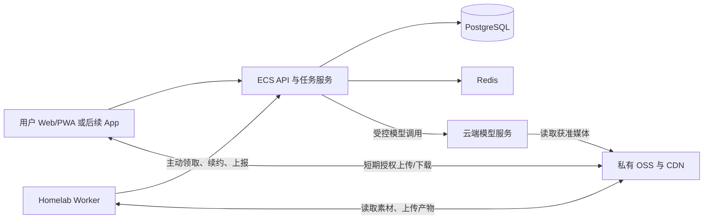

# Nomad 选型与后续交接

**2026-09-19 更新：** 用户指定 XHS-Downloader；OSS/CDN 延至云服务器上线前再配置，U-Link 暂停配置，Sentry/Langfuse 改用自部署并先准备参数。对应旧资源缺项不再作为当前索取条件，U-App 保持。见 [最新选择记录](nomad-services-selfhost-deferrals-2026-09-19.md)；本文其余内容保留为 9 月 18 日历史存档。

本记录保存用户在侧边对话中确认的选型、部署方向及尚待验证的事项。本轮实际操作仅为创建本记录和本地私有凭据文件；没有修改业务代码、PRD/Epics、CURRENT、Sprint 或主线程执行状态，没有连接云账号、homelab 或数据库，没有发送短信、采购、部署或修改 DNS。

文档是决策交接材料，不证明所列资源已经开通，也不单独产生执行授权。后续主线程应按当前用户指令和实际目标继续；不得从本文推导出对其他域名、实例、历史数据或备份的任意操作许可。

## 1. 用户已明确的方向

| 项目 | 已确认方向 | 尚待核实 |
| --- | --- | --- |
| 云服务器 | 用户最终选择 ECS 经济型 e，规格按 `ecs.e-c1m1.large`（2 vCPU / 2 GiB）理解；没有选择轻量云替代 | 控制台实际规格、实例 ID、地域、公网 IP、带宽、云盘及资源现状 |
| 云端应用 | 保留对外 API、账号与会话、行程读写、必要轻量校验、任务状态和 SSE；PostgreSQL/Redis 留在云上 | 2 GiB 下的真实运行余量、连接数、缓存/队列保留量和负载基线 |
| 重任务 | 可用家里的 homelab 运行视频采集/预处理、必要补帧和长图导出等异步 worker | 可用计算资源、上下行网络、断线恢复和执行节点隔离 |
| 媒体 | 用户提出媒体使用 OSS，媒体数据不经小 ECS 中转；CDN 直接分发 | 实际桶、地域、私有访问、CDN 域名/额度；仓库原 COS 方案尚未同步替换 |
| 身份入口 | 首期可收敛到手机号注册/登录，Google 等第三方登录暂缓考虑 | 正式合同中的 Apple/微信等入口需由主线程同步本次范围决定；账号密码是否首期仍待明确 |
| 手机验证 | 按讨论采用阿里 PNVS 短信认证 API | 实际服务权益、系统签名、模板及参数、测试号码与调用范围 |
| 人机验证 | 按讨论采用阿里 PNVS 图形认证 H5 方案 | appId、服务端 appKey、额度与真实前后端验票 |
| 统计与深链 | 用户选择 U-App / U-Link，要求先核实其对当前宿主的支持，不自动替换为 U-Web/U-Mini | 纯 Web/PWA 完整闭环尚未证实；已有应用与查询权限未检查 |
| App | 用户明确后续需要 App | 平台优先级、开发/构建资源、发布方式；Capacitor 仅是推荐路线，未批准为已实施方案 |
| 域名 | 用户提供 `yinianyunqi.top`，并让助手选择测试子域名 | 域名托管、已有记录、实名/备案、目标实例等均未查询 |
| 云资源管理 | 用户希望通过统一阿里云 API 管理域名和各项配置 | RAM 身份与可用权限未验证；统一管理入口不代表所有产品共用一种凭据 |

## 2. 推荐部署边界



- 云端 PostgreSQL 保存账号、业务版本、任务受理/尝试/结果引用；Redis、队列和 worker 内存不能成为唯一事实来源。
- worker 主动通过受认证的 HTTPS 接口连接云端。生产路径不要求把家庭网络变成对外入口；若后续选择直接消费 Redis/BullMQ，则需单独核验受控网络和跨网络连接语义。
- 家中 worker 离线时，登录、已有行程和轻量读写继续工作；依赖重任务的能力显示真实等待/可恢复失败，有任务期限、队列上限和退避。
- 任务领取、心跳、执行代际、幂等提交和发布时 owner/账号资格检查共同防止重复或迟到结果覆盖；外部计费调用的未知结果不能因租约过期就视为未执行。
- 文件上传完成与结果发布分开：先验证对象存在、大小/摘要和任务归属，再由云端提交引用；不因客户端回报“成功”直接开放对象。
- 大文件从浏览器或 worker 直达对象存储，不经 ECS 转发。homelab 从 OSS 下载属于公网取文件，要计入对象存储流出费用。
- 2 核 2 GiB 仅作为低并发试运行起点，尚无容量实测或可用率保证。构建、Chromium、视频解码及大模型运行不放在该 ECS 上；保留升到 4 GiB 的路径。

当前代码并非已经具备上述远程 worker 架构：`apps/server/src/ingest/pipeline.ts` 仍有进程内启动路径，`apps/server/src/export/renderer.ts` 仍在当前进程启动 Chromium。主线程需要按相应 Story 拆分并验证，不能只改环境地址宣布完成。

## 3. 视频理解的输入与计算分工

用户指出视频模型可直接接收网址。该方式可作为云端视频理解候选路径，但须区分：

1. 小红书分享页/短链接：先由采集器取得作品文字、来源信息和真实媒体。
2. 可访问的视频文件 URL 或私有 OSS 临时签名 URL：选定的模型可按接口能力拉取并分析，云端应用无需本地运行视频模型。
3. 音轨：仅视觉理解模型不一定处理音频；需要按实际模型选用音视频联合理解或额外 ASR。

现有 Story 1.10 明确要求按时长采样、局部二次抽帧、先 VAD 后 ASR、时间戳证据与有界预算。采用云端视频 URL 路径时，需逐项证明覆盖情况并同步处理策略；不能把 URL 输入能力直接视为全部验收已满足。homelab 可仅承担采集、格式/大小处理和必要补看，而非默认承担全部推理。

## 4. 测试域名及内网穿透方案

选定测试域名：`nomad-test.yinianyunqi.top`。

- 计划前端 Origin：`https://nomad-test.yinianyunqi.top`。
- 计划 API Base：同源 `/api`；优先减少 Cookie/CORS/证书的额外分支。
- DNS 状态：仅完成名称规划；未查询已有记录、未创建 A/CNAME、未验证所有权或证书。
- DNS 实施前核对：域名当前 DNS 托管方及记录、目标 ECS 公网 IP、域名/备案与 HTTPS 条件。目标未核实前不填猜测 IP，不覆盖已有记录。
- 不改根域、`www`、MX 或其他现有子域；公网入口与证书实际就绪后才报告域名可访问。

### 生产常态

Web/API 留在 ECS，homelab 仅主动领取任务和上报。该路径无需为了 worker 运行而单独购买内网穿透产品。

### 开发测试需要访问家庭 Web 服务时

可以选用 frp：公网 HTTPS 在 ECS 上的 Nginx/Caddy 终止，再经受认证/加密的隧道转发到家庭测试服务。隧道出口、后端端口、认证方式、TLS 及进程运行身份需形成具体配置后验证，本文不包含可直接部署的配置或 token。

主要调试项：

| 项目 | 核验目标 |
| --- | --- |
| DNS与证书 | 测试域名命中正确公网入口，证书名称正确，避免公网端与家庭端重复/错误终止 TLS |
| 代理路径 | 前端及 `/api` 路径重写一致，页面刷新/深链不出现404，后端看到正确的外部 Origin |
| Cookie与代理信任 | HTTPS Secure/HttpOnly及适用SameSite生效；仅信任明确代理；穿透本身不代替真实认证或CSRF |
| SSE与长任务 | 进度流不被代理缓冲，心跳与超时相容，断线按持久cursor恢复；长任务不占一个无限等待的HTTP请求 |
| 网络故障 | frpc重连、家庭断网、worker重启、重复上报及迟到结果有可观察的恢复行为 |
| 访问范围 | 不把数据库、Redis、PVE管理端或开发调试端口当公网服务暴露；测试环境保持独立数据/凭据边界 |
| App调试 | 真机可达HTTPS、应用前后台恢复、冷/热启动深链和登录返回分别测试；模拟器localhost不等于ECS或家庭服务 |

配置难度属中等，可逐跳定位。公网入口可达不等于端到端可靠；测试环境穿透链路不可直接作为生产可用率保证。

## 5. 后续 App 与友盟

- 后续 App 是用户确认的产品方向，不在本轮创建 Android/iOS 工程。
- 优先评估现有 React/Vite + Capacitor：复用 Web 界面，增加原生 SDK 桥接、系统能力、生命周期及深链处理。尚未确认官方现成 Capacitor 友盟插件。
- React Native 或 Swift/Kotlin 重写保留为比较选项，不因统计需求直接启动重写。
- U-App 官方当前主要是原生/混合应用统计；旧 H5 说明提及 JavaScript SDK，但本轮未证实可支持当前纯 Web/PWA 的完整统计路径。
- U-Link H5 SDK的主要目标是唤起/安装原生 App，未来需要真实包名/Bundle ID、签名/关联域名、目标页面和实际打开/归因证据。
- 不将 U-Web、U-Mini 或普通查询 OpenAPI 静默当作 U-App 已交付。先保留已选产品的待核验状态，未来根据宿主明确接入。
- Android/iOS 需要各自真机与构建/签名条件；iOS 构建需要 macOS/Xcode或对应云构建资源。发布审核不属于“打包出可安装版本”的证据。

## 6. 凭据落盘与统一管理

本轮阿里云凭据保存于项目根目录 `.env.aliyun-admin.local`，仅含以下变量：

```text
ALIBABA_CLOUD_ACCESS_KEY_ID
ALIBABA_CLOUD_ACCESS_KEY_SECRET
```

文件权限为 `0600`，被现有 `.gitignore` 的 `.env.*` 规则忽略，不覆盖 `apps/server/.env`，不自动接入应用启动，不应打入前端/发布包。**本文件不记录凭据值、前缀、摘要或完整用户原文。**

- 用户通过聊天提供该凭据并授权保存到 env；密钥已经出现在聊天，建议真实使用前由账号所有者轮换。权限范围、RAM/主账号类型、有效性和产品权益均未检查。
- 统一管理可使用阿里云 CLI/SDK + 一个受限部署 RAM 身份，按实际域名、实例、存储桶和动作形成权限清单。
- ECS 应用运行优先使用独立实例 RAM 角色/STS 临时凭据；部署管理身份不注入面向用户的应用运行配置。
- PNVS 图形认证的 appId/appKey、友盟凭据、百炼推理 Key及高德 Key仍需按各服务提供。云资源管理 AK不能自动替代这些凭据。
- 未执行身份查询、DNS查询或任何云 API；没有开通/购买套餐、发送短信或产生模型调用。

## 7. 尚需补充与主线程同步事项

### 首批资源信息

1. ECS 实例ID、地域、公网地址、系统/部署访问方式及现有资源用途；域名托管和备案状态。
2. 独立测试 PostgreSQL/Redis 的配置引用、现有数据是否需保留、备份/隔离恢复目标。
3. PNVS短信认证的系统签名、模板、变量和方案名；H5图形认证appId/appKey；测试号码与真实调用范围/预算。
4. OSS/CDN的桶与地域/域名规划；媒体和数据库备份分开登记。
5. 友盟已有应用平台/AppKey及实际查询权益，后续原生App平台优先级。
6. homelab worker的运行位置、资源配额、与云端通信方式；不把历史机器状态当当前容量证明。

### 业务接入后补

- 高德 Web服务Key及地图JS配置。
- 模型平台、模型名/地域/API Key；视频音轨与局部补看能力验证。
- Sentry/Langfuse接入与数据脱敏；交通时刻、天气、反馈与告警按所属Story继续选型。
- 应用/worker内部随机凭据由实施生成，无需为了生成secret新增云服务。

### 需要主线程消费的差异

- 当前 `.env.example` 与 runtime-config 仍是 Authing/极光 + 腾讯验证码路径，需按已确认阿里方案调整；无需为旧字段购买旧供应商。
- 源文档中的 COS、第三方登录入口、原生宿主限制与视频处理策略，尚未因本记录自动修改；需显式同步差异、保留历史并验证。
- 本次没有推进 Story 1.0、条件状态或恢复暂停的 3.1；凭据落盘不能把“真实资源已验证”置为完成。
- 后续验证应覆盖真实登录/拒绝、跨实例持久会话、owner迁移、SSE撤权、云/家断线恢复、实际媒体/模型证据及数据库恢复。

## 8. 依据与验证范围

本地依据：

- `CURRENT.md`
- `_bmad-output/implementation-artifacts/1-0-production-login-and-multi-device-sessions.md`
- `_bmad-output/planning-artifacts/epics.md` Story 1.10
- `docs/architecture/tech-stack.md`
- `docs/architecture/backend-architecture.md`
- `apps/server/src/ingest/pipeline.ts`
- `apps/server/src/export/renderer.ts`

官方资料（查阅日期2026-09-18，属于公开文档能力，不代表本项目真实接通）：

- [阿里经济型e规格](https://help.aliyun.com/zh/ecs/user-guide/shared-instance-families)
- [PNVS短信认证](https://help.aliyun.com/zh/pnvs/getting-started/sms-authentication-service-novice-guide)
- [PNVS图形认证](https://help.aliyun.com/zh/pnvs/user-guide/graphical-authentication-service-usage-process)
- [PNVS计费与套餐区别](https://help.aliyun.com/zh/pnvs/product-overview/product-pricing)
- [视频URL输入及音频能力限制](https://help.aliyun.com/zh/model-studio/vision)
- [阿里云CLI统一入口](https://help.aliyun.com/zh/cli/what-is-alibaba-cloud-cli)
- [ECS实例RAM角色](https://help.aliyun.com/zh/ecs/user-guide/attach-an-instance-ram-role-to-an-ecs-instance)
- [友盟网页SDK目录](https://devs.umeng.com/?client=web)
- [U-App的H5桥接说明](https://devs.umeng.com/docs/119267/detail/121481)
- [Capacitor平台与插件](https://capacitorjs.com/docs)
- [Capacitor构建环境](https://capacitorjs.com/docs/getting-started/environment-setup)
- [frp自定义域名访问](https://gofrp.org/zh-cn/docs/examples/vhost-http/)
- [frp传输TLS](https://gofrp.org/en/docs/features/common/network/network-tls/)
- [Nginx代理缓冲与超时](https://nginx.org/en/docs/http/ngx_http_proxy_module.html)

本轮验证仅限新增存档的内容/引用、私有env权限/字段及Git忽略状态；没有运行应用验收、云端配置检查、浏览器穿透联调或性能测试。
