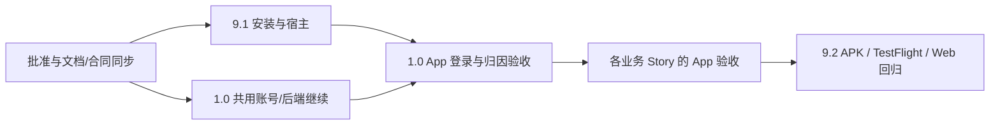

# Sprint 范围变更提案：首期交付 Capacitor Android / iOS App

本稿把本期交付调整为 **保留网页，并交付 Android 可安装 APK 与 iOS TestFlight 测试版本**。复用现有 React/Vite、服务端和业务设计，新增独立 App 交付 Epic；登录、定位、保存分享与统计的 App 验收分别进入原责任 Story。

用户已确认集中审阅完整提案、iOS 采用 TestFlight。以下新增 Story、相册保存边界、兼容范围及排期已于本轮由用户批准。本文与[合同修改附录](sprint-change-capacitor-contracts-2026-09-19.md)共同组成审批对象；当前源 PRD、Epics、实施 Story 与 Sprint 已进入正式同步，验收进度以新定向报告/实施记录为准。

## 1. 触发问题与当前证据

Story 1.0 的 AC1 明确只验收 Web/PWA 或已有宿主，且“不要求新建原生 App”；T8 也禁止因 U-App 归因自行新建 App。PRD 的 Target Device and Platforms、FR45/NFR16、UX 的平台与保存规则存在同样限制。新增两个原生工程需要改变这些正式合同。

| 核对对象 | 当前事实 | 对本次变更的意义 |
| --- | --- | --- |
| `CURRENT.md` / 当前 Sprint | 1.0 为 in-progress；3.1 继承 in-progress 且暂停；7 张历史 done | 保留已有进度和迁移身份，增加 App 依赖与证据，不重置历史 |
| `apps/mobile/package.json` | React 19.2.7 / Vite 8.0.16；未声明 Capacitor | 现有前端可复用，不能把目录名 mobile 当成原生工程证据 |
| `apps/mobile/src/auth/api.ts`、服务端认证边界 | 现有客户端使用带 cookie 的 fetch；服务端配置约束 HTTPS/可信 Origin | 必须验证本地 WebView origin、原生凭据、回调、SSE 与私有下载，不能假定浏览器方案直接适用 |
| 9 月 19 日资源确认记录 | 已登记 PNVS H5/Android/iOS 和双端 U-App；当时配置预检通过，实际归因未验收 | 使用已有资源记录，不再把 App Key 当作缺失项；也不据此宣称 SDK 接通 |
| 同一资源确认记录 | homelab VM104 已获开发测试授权；整体开发测试后再处理公有云 | App 测试继续使用此阶段目标，HTTPS/设备可达性需实际验证 |
| 本次 WSL PATH 检查 | node/pnpm 可定位；未定位 java、adb、xcodebuild；gradle 解析到 Windows 路径 | 当前 shell 不能证明具备原生构建链；没有使用该 Windows Gradle，也不据此断言其他机器没有工具 |
| 交接检查器 | 固定 8 Epic / 60 Story / 1018 GWT，以及旧来源哈希、准备顺序 | 范围升版必须改进基线校验并保留历史证据，不能仅改计数或删掉指纹断言 |

本次 `pnpm run ci:handoff` 通过，输出 60 Story / 1018 GWT / 7 done / 2 in-progress / 51 backlog。这证明旧基线自洽，不证明 App 规划或交付已就绪。工作树已有大量未提交的规划和认证实现；本提案不覆盖、回退或替它们声明完成。

提交提案前再次读取 CURRENT/Sprint，发现本轮期间另有 1.0 开发进展写入：[最新开发记录](../implementation-artifacts/story-1-0-dev-progress-2026-09-19.md)记录了持久认证、PNVS 适配、owner 兼容与隔离 PG/HTTP 验证，DB-CHANGE-01 和 METRICS-03 已为 in-progress。后续同步必须以届时最新任务/证据为准，不能从本稿初始读取恢复旧状态；真实供应商、浏览器/原生客户端、归因与整体关闭仍未由这些记录完成。

## 2. 交付边界与影响分析

### 2.1 拟确认的首期交付

| 端 / 能力 | 本期完成标准 |
| --- | --- |
| 网页 | 保留现有移动浏览器 / PWA 合同和桌面运营 Web；同一业务 API、owner 和版本语义 |
| Android | 签名的可安装测试 APK、版本与校验和、安装说明；真实设备完成安装、冷启动、升级与核心流程验收 |
| iOS | 在指定 App Store Connect 应用及测试组中可用的 TestFlight build；获准测试者实际安装并完成核心流程。仅 Xcode 编译或产生 IPA 不算完成 |
| App 用户体验 | 复用旅行者页面；补系统返回、键盘、安全区域、外链、权限及前后台恢复 |
| App 保存与分享 | 在 5.5 增加用户主动保存行程图片到相册，以及系统分享；保存回执、取消、部分失败、结果未知分别处理。网页仍执行原下载规则 |
| 测试环境 | 现阶段连接获准的 homelab HTTPS 后端；在测试包说明中写清设备可达条件。App 测试包不依赖公有云提前发布 |

拟以 **Android 10+、iOS 16+ 的手机竖屏**作为首期产品支持范围；这是本提案的产品取舍，不是声称 Capacitor 的最低要求。9.1 固定实际 OS/WebView/设备矩阵，9.2 覆盖最低支持版与交付时当前稳定版；其中每个平台至少一台真机，低内存 Android 和无 Google Play Services 的国内使用路径须有证据。较旧 OS、平板专门布局、桌面原生 App 不属于这次增量。

本期 App 范围继续遵守既有延期决定：7.2 打卡、FR40.1 照片/视频产物、连续后台定位、远程推送和分享接收扩展不因宿主新增而进入 MVP。相册保存仅写入本次明确导出的行程图片，不增加相册扫描、相机或照片到访记录。应用商店公开上架、付费构建服务采购、公有云提前发布也不由测试包目标自动产生。

TestFlight 内测方式已选定；内部测试组还是需要 Beta Review 的外部测试组，待核对实际测试者和账号权限后确定，不能靠把外部测试者设成运营成员来规避边界。Apple 官方说明了两类测试组、上传处理与测试版本期限；应记录真实可用 build 与到期时间。[TestFlight 官方流程](https://developer.apple.com/help/app-store-connect/test-a-beta-version/testflight-overview/)

### 2.2 Epic 影响

| Epic | 调整与交付责任 |
| --- | --- |
| 1 安全开始与灵感 | 1.0 增补三端身份/回调/会话/归因；1.6 深链和用户触发粘贴；1.7 原生挂起与恢复。历史 1.1–1.5 保留 |
| 2 初始规划 | 2.9 增补 App 进程中断与单一任务恢复；2.7/2.8 按宿主矩阵核验地图、版权、Sheet，不改地点意图和路线语义 |
| 3 安全编辑 | 键盘、系统返回和恢复进入实际任务/关闭矩阵；3.1 的原暂停条件和 keep/change/remove 审计继续生效 |
| 4 联程 | 验证返回/挂起恢复不丢 active city、child Plan 和精确 revision；不改联程原子发布或重审全套页面 |
| 5 行程单与导出 | 5.4 原生受保护文件获取；5.5 增加相册保存、原生分享及设备内存/编码矩阵 |
| 6 旅中 | 6.2 消费原生单次定位、当前系统权限、坐标系转换与前后台事件；既有降级规则保留 |
| 7 账号与持续使用 | 7.1 恢复；7.3 退出；7.4 系统文件保存；7.5 原生凭据/缓存清理；7.6 外链返回与用户选图 |
| 8 观测与运营 | 8.1 增加 App JS / 原生故障和发布版本关联、U-App 双计数防护；运营页面仍只做桌面 Web |
| **新增 9：在手机安装并持续使用 Nomad** | **9.1 可安装宿主与基础交互；9.2 APK / TestFlight 测试交付。**把安装与发布责任从登录 Story 分离 |

保留原 8 个 Epic 和全部稳定 Story key，不重新编号。新 Epic 采用 9，是独立交付责任的编号；9.1 的执行顺序前置，9.2 在受影响业务验收之后。无既有 Epic 因这次变更失效。

### 2.3 主要风险与资源门槛

| 项目 | 已知 / 尚待核验 | 责任与失败影响 |
| --- | --- | --- |
| macOS 构建机、Xcode、Apple Developer / App Store Connect 权限 | 当前资料未证明已有可用链路；不等同于资源不存在 | 9.1/9.2；缺少时 iOS 构建/分发保持未完成，共享后端工作可继续 |
| Android 包名与签名、iOS Bundle ID / Team / profile | 需核对已有供应商登记和签名连续性，只记录安全引用 | 9.1；不能先随意使用占位包名发布，再假定后续可无损更换 |
| HTTPS API、回调与关联域 | 9 月 19 日记录了 homelab 目标，未证明 App 真机链路 | 1.0/1.6；证书、网络/代理和冷暖启动回调分别验收 |
| Native Session / SSE / 下载 | 浏览器凭据路径不能作为 WKWebView/Android WebView 实证 | 1.0；先完成有界验证，再固定原生传输方案，失败不放宽认证 |
| U-App / U-Link / PNVS | 双端资源已登记；Capacitor 桥接、当前 SDK 版本、签名/平台匹配未验证 | 1.0 首次交付，1.6 输入归因，8.1 汇总；SDK 安装或控制台 Key 不算可查询事件 |
| 相册/文件/定位与大图 | 原生权限、坐标系、内存、格式兼容和系统回执需实测 | 5.4/5.5/6.2/7.4；拒绝权限或插件失败保留真实降级，不伪报成功 |

Capacitor 官方当前 v8 文档要求 Node 22+，iOS 构建需要 macOS/Xcode。WSL 不承担本机 Xcode 构建；提案允许专用 macOS 原生构建工作区/runner，日常项目 Node/pnpm 仍在 WSL，Windows-native Node/pnpm 禁令保留。构建工具的精确版本在 9.1 锁定并记录，不在此承诺未知机器已经可用。[Capacitor 构建环境](https://capacitorjs.com/docs/getting-started/environment-setup)

## 3. 推荐路线、投入与顺序

选择 **Direct Adjustment / 中等范围变更**：扩展交付平台、增加两张可独立验收的 Story，并给受影响业务补 App 条件。产品目标、领域模型、后端服务和已批准的主要界面保持可复用，因此不需要整体重新规划。

| 备选路线 | 评估 |
| --- | --- |
| 直接调整（推荐） | 新 App 工程加适用业务验收，工程量中等；原生登录/SDK、iOS 构建存在较高集成不确定性 |
| 回退已完成工作 | 不推荐；没有证据表明撤销账号、规划或页面实现能降低宿主接入成本，反而损失历史与数据保障 |
| 缩减 MVP / 推迟一端 | 不作为本稿推荐；只有构建资源、供应商能力或可接受时间窗口不能满足时，再提出明确差异供用户决策，不能静默改成仅 Android |

增量初估 **15–25 人日，低置信度，9.1 核验后重估**：文档/合同/交接检查 1–2；宿主与双端构建 4–6；登录/归因原生适配 4–7；保存/定位/账号及观测增量 4–7；发布候选与安装回归 2–3。该估算不包含原有业务 Story 工期、账号开通、签名资源等待或 Apple 处理/审核时间；当前没有可据此承诺的日历交付日期。

执行顺序：

1. 批准本稿后，归档当前基线；同步 PRD → 架构/UX → Epics → 来源目录/交付映射 → 已准备的 1.0 实施合同。
2. 准备 9.1 合同并做定向就绪检查。先交付可安装、可打开既有登录首屏/协议的双端宿主；其验收不依赖 1.0 整张完成，更不依赖后续导出、定位或完整运营页面。
3. 1.0 的共用身份、数据库、权限、会话与隔离测试可按已有授权继续；App 登录/归因关闭证据在 9.1 后补齐。1.0 保持 in-progress，不退回 backlog，也不以 Web 完成代替三端关闭。
4. 按更新后的准备队列继续 1.6 等业务 Story，各自在首次使用原生能力时交付适配和真机证据；基础插件不集中堆进 9.1。
5. 最后由 9.2 复用各 Story 证据，冻结候选版本，交付签名 APK、TestFlight 可安装 build、网页回归和升级证据。

9.1 直接交付“测试者能安装并使用已有登录入口/协议”的结果；不另设只提供抽象插件、必须等未来业务才有价值的技术 Story，符合 AR18。AR19 的“更早 Story”按经批准的执行依赖解释，不能按编号大小制造 1.0 ↔ 9.1 循环。

## 4. 具体修改提案

### 4.1 PRD 与需求库存

以下改动同时进入 `docs/prd.md` 与 BMAD `planning-artifacts/prd.md`；需求原文还进入 `epics.md` 的 inventory 与 coverage map。

**P-01 — Target Device and Platforms / MVP 范围 / Technical Assumptions**

旧文：
> 旅行者当前采用移动优先Web/PWA，按已批准移动浏览器体验验收；运营管理采用桌面Web，不要求运营移动适配。原生登录/SDK/WebView规则仅在实际存在对应宿主时适用，不由本文要求新建原生应用。

新文：
> 首期旅行者交付保留移动优先 Web/PWA，并新增基于同一 React/Vite 前端的 Capacitor Android/iOS App。Android 交付签名可安装测试 APK，iOS 交付指定测试组可用且经实际安装的 TestFlight build。App 必须验收登录会话、系统交互、前后台恢复及已启用原生能力；网页保持原能力和降级路径。运营管理继续采用桌面 Web。各端共用服务端身份、数据与 API，不以安装依赖或产生工程目录作为 App 交付证据。

**P-02 — 新增 FR52 与 NFR25**

旧：无首期 App 工程、可安装包与可重复构建的明确需求条款。

新：

- **FR52：首期多端交付。**保留网页，交付可安装的 Android APK 与 iOS TestFlight 版本；旅行者在各端使用同一账号与业务数据。App 具备真实可用的返回/键盘/安全区域/权限/外链/前后台恢复，登录、深链、保存分享、定位、账号与反馈分别满足所属 Story 的 App 验收。9.1 负责安装与宿主，9.2 负责测试分发及完整交付证据。
- **NFR25：App 构建与交付可核验。**版本记录可追溯到源代码、锁文件、Web 资源摘要、原生依赖/工具链、配置环境和签名引用；双端从受控输入完成构建、安装与升级回归。安装包不包含服务端密钥或开发身份通道；支持范围、权限/SDK 清单、文件/回调边界、原生故障与版本关联有实证。签名产物不要求字节级复现，但构建输入和功能结果必须可重复核验。

**P-03 — 原有条款的宿主增量**

| 条款 / 位置 | 旧 → 新 |
| --- | --- |
| FR1 / FR14 / FR15 / FR16，账号与归因章节 | 现有浏览器或已有宿主 → 明列 Web / Android / iOS；保留已批准的 Apple/手机号/微信顺序与真实不可用状态，消费 9 月 18–19 日已经确认的 PNVS 决定。旧供应商品牌同步为当前选择，不重新选供应商、不减少必需登录方式 |
| FR11 / FR24 / 导出说明 | Web/PWA 整趟下载与能力化分享 → 网页维持原合同；App 增加同一版本图片的相册保存与系统分享，具体结果语义见 5.5 增量 |
| FR45 / NFR16 | “已有实际 WebView，且不新增原生壳” → Web/PWA 外部打开；本期 Capacitor 使用受限外链能力；返回不代表提交。外部页面不进入携带 Nomad 桥接权限的业务 WebView |
| FR48 / NFR18 | 已有抽象 App 前台单次定位 → 明列 Android/iOS 系统权限与生命周期实证，规则不改为持续或后台定位 |
| NFR2 / NFR3 / NFR6 / NFR7 / NFR8 | 原恢复、隐私、观测、协议、交互义务 → 纳入 App 实际宿主、发布版本、权限和设备矩阵；不把移动浏览器截图视为双端证据 |
| IR 实施责任末句 | “本段不新增……原生应用” → 旧 IR 未包含 App；本次 CC 单独加入 FR52/NFR25 和 Epic 9，其余已批准边界继续有效 |

### 4.2 架构与插件边界

**A-01 — 技术栈与目录**

旧：`apps/mobile` 是移动优先 React/Vite Web/PWA；无 Android/iOS 工程与宿主适配层。

新：复用 `apps/mobile`，增加 `capacitor.config.ts`、`android/`、`ios/` 和小型 `src/platform/` 能力接口；Web 产物仍可独立构建。App 发布包内置冻结的 Web assets，以 HTTPS 访问后端；开发 live reload 与发布配置明确分离，不把远程开发地址当发布包主页面。原生工程与必要 wrapper/依赖锁纳入版本管理，签名私钥、证书秘密、个人配置和构建输出不入 Git。精确目录可由 9.1 遵循现有模式实现，不能复制旧迁移镜像。

| 平台能力 | 首次责任 Story | 约束 |
| --- | --- | --- |
| 安装、App 生命周期、返回键、键盘、安全区、受限外链 | 9.1 | 仅暴露实现所需接口；listener 成对释放；能力缺失可读失败；业务模块不直接散落平台判断 |
| 凭据、登录回调、HTTPS/API/SSE/私有下载 | 1.0 | 复用服务端 User/OAuthIdentity/Session 权威，Web 与 App 各有真实验证路径；设备 ID 和 origin 不是身份 |
| U-App / U-Link | 1.0 / 1.6 | 官方原生 SDK 经受限桥接消费，按平台与批准的隐私选择初始化；不预设已有官方 Capacitor 插件可用 |
| 图片保存、文件分享 | 5.4 / 5.5 | 原生下载至 owner 隔离临时区，系统只接收文件；不得传 cookie、凭据或签名 URL；及时清理临时副本 |
| 单次定位 | 6.2 | 当前权限 + 前台用途；坐标系可追溯转换后才接 AMap；无后台追踪 |
| 账号副本文件保存、选取反馈截图 | 7.4 / 7.6 | 副本不自动公开分享；反馈只消费用户选中的一张图，保留 EXIF 清理与明确提交后上传 |
| App 故障采集/符号与发布关联 | 8.1 | JS 与原生错误分别可查，禁止重复采集和私人数据外发；服务端 Langfuse 边界继续有效 |

**A-02 — 会话与恢复设计决定**

旧：现有 browser fetch/cookie 和 tab/bfcache 验证是主要客户端路径。

新：1.0 增加 Native Session/Transport ADR，优先保持同一服务端持久会话权威；原生凭据如需落盘，由 Keychain / Keystore 保护的实现持有，禁止放入 localStorage、普通 Preferences、深链或日志。候选的原生 cookie jar / 受控凭据注入路线必须用 Android+iOS 的 `/me`、写请求、SSE、受保护下载、退出/撤权证明后再固定；不预设 Cookie 插件会自动解决所有 WebView、系统浏览器和流式请求问题。精确 HTTPS API 与本地宿主来源分开配置，不能为接受本地 scheme 放宽全局 HTTPS、通配 CORS 或现有 CSRF 防护。[Capacitor Cookies 的 iOS 限制](https://capacitorjs.com/docs/apis/cookies)

第三方登录按实际供应商支持使用官方 SDK 或合适的系统认证会话；浏览外链和身份认证会话不是同一能力承诺。回调只携带短时单次关联信息，先服务端验证 state/nonce/PKCE 等适用证明，再读取会话身份并恢复获准上下文；冷启动和已运行时都去重。前台恢复先验证身份/资格，再对账 job/revision/cursor；进程被杀不代表服务端任务取消，未有持久确认的草稿不承诺已保存。

**A-03 — 保存与权限的实现约束**

App 写相册与系统分享分开：Android 可使用受限 MediaStore 写入，iOS 可使用 PhotoKit 的 add-only 能力；最终插件需核对维护、许可、版本与回执，不把 Filesystem 写入沙箱或打开 Share Sheet 当成相册保存。Android 官方区分应用自身媒体与读取他人媒体的权限；Apple 提供 add-only 权限等级。本项目据此选择最小权限实现，实际 OS 矩阵由 5.5 验证。[Android MediaStore](https://developer.android.com/training/data-storage/shared/media)、[Apple PhotoKit 权限](https://developer.apple.com/documentation/photos/phaccesslevel)

App 生命周期与深链可使用 Capacitor App API；Geolocation/Share 等按各自 Story 接入。系统分享打开/返回只证明对应系统动作，不能证明接收者收到；定位支持并不等于使用 watch 或后台跟踪。[App API](https://capacitorjs.com/docs/apis/app)、[Geolocation API](https://capacitorjs.com/docs/apis/geolocation)、[Share API](https://capacitorjs.com/docs/apis/share)

9.1 建立实际 SDK/权限声明清单，各消费 Story 增量维护，9.2 对最终二进制复核：AndroidManifest、iOS Info.plist 的用途说明、entitlements、适用 PrivacyInfo.xcprivacy / required-reason API 声明必须与真实使用一致。TestFlight 上传所需的应用资料和声明按实际情况准备，不能照抄样例原因或把未使用的权限一起打开。[Capacitor Privacy Manifest](https://capacitorjs.com/docs/ios/privacy-manifest)

架构同步范围：`docs/architecture/index.md`、`tech-stack.md`、`source-tree.md`、`frontend-architecture.md`、`rest-api-spec.md`、`observability.md`、`testing-strategy.md`、`mvp-implementation-checklist.md`、`compatibility.md`；身份传输如改变后端合同，再同步 `backend-architecture.md` / `data-models.md`。更新 BMAD `architecture.md` packet；Epic 2/3 技术说明只补宿主矩阵与恢复验收，不重写 Planner/编辑设计。API 变更仍由实施 Story 更新 OpenAPI 并生成类型。

### 4.3 UX 修改

**U-01 — 平台声明：**`docs/front-end-spec.md` 的 traveler Web/PWA-only 声明替换为本稿三端范围；`mobile-ia.md`、`prototype-coverage.md` 与 BMAD `ux.md` 同步。

**U-02 — 新增 UX-DR36（App 宿主交互）：**保留 S0–S11 与既有页面。Android 返回先处理键盘、当前临时层和页面历史；涉及未提交修改时沿所属 Story 的保留/取消规则，不隐式提交；根页面按平台预期退到后台。iOS 返回手势遵守相同草稿/状态边界。安全区只由共用布局处理，键盘打开后输入与主要操作可达，状态栏和系统导航区不遮挡触控、读屏及大字号内容。

**U-03 — 前后台与权限：**恢复中遮蔽未重新确认的私有视图；无网显示实际恢复状态。权限在用户需要相应能力时说明并请求，拒绝后保留不依赖该权限的路径。未经同意不初始化会采集个人信息的第三方模块；重新进入前台读取系统现状，不只读历史授权标志。系统授权、外链与 Share Sheet 返回不自动提交表单或重跑业务。

**U-04 — 保存与反馈：**网页保留精确提示 `已开始下载，请确认`；App 用 `保存整趟图片` / `保存 N 张图片`，仅系统确认成功后显示 `已保存到相册`，部分/失败/未知各自恢复，未知重试提示可能重复。系统分享仍使用按城市排序的图片组。账号副本是受保护的 `ZIP（内含 JSON）` 文件保存流程，不复用图片相册入口；反馈外链返回恢复原页面和安全草稿。

**U-05 — 视觉证据：**复用已批准页面及 18 组呈现方案；只补四组宿主状态：登录/回调/恢复，返回/键盘/安全区，权限拒绝/设置返回，保存/分享/文件结果。新证据须登记“App 增量”；旧 `story-5-5-native-save-share-r1.png` 已被替代，不因这次加入 App 自动恢复其整张图为权威。不重审未受影响页面。

### 4.4 Epic 与实际 Story 合同

新增 **AR23：同一前端的受限原生能力边界**；新增 **AR24：双端构建、签名、分发与真实设备证据**。保持 AR18 的可用价值切片原则。

详细 As a / I want / So that、Requirements、14 个新增 Story GWT，以及 20 个既有 Story 增量 GWT 见[合同修改附录](sprint-change-capacitor-contracts-2026-09-19.md)。新增两张 Story：

| Story | 独立可验收结果 | 依赖与边界 |
| --- | --- | --- |
| **9.1 安装 Nomad App 并使用现有入口**，`9-1-capacitor-app-installation-and-host-foundation` | 测试者在 Android/iPhone 安装候选 App，打开既有登录/协议页，体验可用返回、键盘、安全区与失败恢复；Web 构建仍可用 | 复用历史首屏；不以完成真实登录为自身前置，不承担未来所有插件。真实登录归 1.0 |
| **9.2 Android APK 与 iOS TestFlight 内测交付**，`9-2-android-apk-and-ios-testflight-delivery` | 可分发 APK、指定 TestFlight build、安装/升级/核心业务回归与版本证据可对应 | 依赖 9.1 和本期需交付业务；原业务证据引用复用，关键跨端组合重新实测 |

1.0 的 AC1/AC11/AC14、T0/T6/T7/T8/T10、来源说明和关闭清单同时修改，不能只更新 `source_contract_sha256`。14 条原 GWT 的安全/业务义务保留，适用宿主扩展并增加 4 条 App GWT；9 月 18 日 PNVS 决定忠实写回品牌表述。所有任务勾选与实施记录依据当前工作树和证据保留，不由本提案重置。

1.6、1.7、2.9、5.4、5.5、6.2、7.1、7.3、7.4、7.5、7.6、8.1 的源 GWT 增量列于附录。其余涉及旅行者 UI 的 Story 在准备时带入宿主交互条件与适用测试矩阵；没有原生差异时有依据地注明适用性，不复制一套业务验收。

## 5. Sprint 同步与实施交接

### 5.1 数量、目录与来源指纹

按本稿与附录精确应用，预计为 **9 Epic / 62 Story / 1052 GWT / 66 FR（62 MVP、4 延期）/ 25 NFR**；新增 9.1 的 8 GWT、9.2 的 6 GWT，加既有 Story 的 20 GWT。7 张历史 done 不变，当前目标从 53 增至 55。实际同步后重新解析源文档校验，计数不能替代内容核对。

1. 批准后保存修改前的源文档、Story、Sprint、CURRENT、交接脚本和哈希；不包含私有 env、密钥、构建文件或旧数据。
2. 保留原 `sprint-migration-2026-09-15.yaml`、9 月 17 日交付合同、旧 readiness 和 SP 授权快照。生成新的 `sprint-migration-2026-09-19.yaml` 与 `sprint-delivery-contract-2026-09-19.yaml`，显式引用旧基线和本次批准记录，形成可追踪升版，不把旧快照改成当时已经有 App。
3. 当前 catalog 仍从唯一正式 `epics.md` 解析；每张 Story 的标题、完整 source block 哈希、GWT 数和路径据实际内容生成。PRD 全文件/逐 FR/NFR 哈希、行号及正反交付映射同时重算。
4. 新增 FR52 由 9.1/9.2 负责总体交付，并把实际登录/恢复/文件/定位/观测切片反向绑定到对应责任 Story；NFR25 绑定 9.1、9.2 与实际受影响原生切片。保持原 FR/NFR 的全部责任、四项延期和 3.1 唯一迁移关系。
5. `login-attribution`、`input-attribution`、`analytics-consolidation` 的 task/evidence 明列新增宿主；保留 `map-copyright`，增加 App 构建分发义务。义务进入任务和关闭证据，不仅存在映射标签。
6. 修订已经准备的 1.0 合同并重验；按新队列准备 9.1，写入 `source_story_id`、真实 `source_contract_sha256`、FR/NFR、工程条件、来源义务与附录中的 Tasks。9.2 先进入正式 Epics/backlog，到准备节点再创建实际实施文件；其余尚未准备 Story 在各自 create-story 时消费新版合同。

### 5.2 状态与工程条件

- 新准备顺序为 `9.1 → 1.0 → 原 1.6 至 8.6 队列 → 9.2`；已准备的 1.0 不重新排成未准备。9.1 准备前 `next_story_to_prepare=9.1`，完成后跳过已有 1.0 合同，回到下一个实际未准备项。准备顺序与正式源文档展示顺序允许不同，但必须完整、唯一且依赖无环。
- 1.0 保持 in-progress；新增 9.1/9.2 初始 backlog，不因提案批准或 GWT 存在而自动 ready/done。实际开始 9.1 时再更新 CURRENT 的 active story/file/action/branch；原 1.0 仍保留未完成状态和证据。
- `execution_phase` 已是 execution，保留；新增 `scope_change` 批准记录与授权范围只记录用户实际批准内容。当前分支和全部未提交工作保留，不 reset/clean，不把用户的 TestFlight 选择误记成全部方案已批准。
- 3.1 继续 paused，仍需 1.0、2.7、2.9、2.10、2.11、当前合同及 migration audit；旧 2.2 不独立派发。
- Epic 9 增加自己的 retrospective；Epic 1 的历史回顾不重写，扩围回顾仍待完成。Epic done 必须覆盖当前全部 Story。

| 新工程条件 | 首次负责人 | 逐 Story 关闭证据 |
| --- | --- | --- |
| APP-BUILD-01 | 9.1 | 原生/Web 构建输入、版本/环境、最小权限与双端实际安装；9.2 再核验发布候选 |
| APP-HOST-01 | 9.1 建立矩阵，各消费 Story 完成自己的行 | 原生返回/键盘/安全区/权限/恢复与 owner 隔离；真实设备记录、失败证据及适用性依据 |
| APP-DISTRIBUTE-01 | 9.2 | 签名 APK、可用 TestFlight build、测试组权限、真实安装与升级、候选版本及撤回/替换说明 |

新条件初始 not-started，沿现有 `condition_progress` 逐 Story 维护。提交前最新 Sprint 中 OPS-01、DB-CHANGE-01、METRICS-03 为 in-progress，METRICS-01/02 为 not-started；升版保留实际最新进度。App 平台/版本维度进入原测量工作负载。9.1 的通过不把 1.0/5.5/6.2/8.1 或生产开放条件一起标为 verified。

### 5.3 交接检查器和定向就绪检查

当前 `scripts/check-handoff.mjs` 将旧 readiness 的源哈希、固定数量与当前 epics 直接比较；`check-sprint-delivery.mjs` 还固定四个 source obligations；准备顺序也被要求等于源目录顺序。升版需要显式支持“不可变历史基线 + 获批当前范围”，不是移除这些保护。

| 检查 | 批准后完成标准 |
| --- | --- |
| 批准与历史 | 旧快照/历史 Story/原 SP 授权完整；新范围有对应批准记录；历史报告对其归档来源核验，当前来源对新定向报告核验 |
| FR/NFR → Epic → 实施合同 | 新旧需求都有实际责任；源 hash 与 narrative/Requirements/GWT、Tasks/关闭项一致；没有只改哈希、保留旧“不新建 App”的合同 |
| 队列与状态 | 9.1 可先于 1.0 的 App 关闭，9.2 在业务之后；无双向依赖，无漏排、重复或越过 3.1 暂停 |
| UX / 插件 | 仅新增宿主差异与高风险状态；原 18 组方案、无 ZIP 图片、权限降级和桌面运营边界保留 |
| 构建资源 | 可分别标记“代码可开始”“Android 可构建”“iOS 可构建”“测试分发可进行”；未完成资源验证不签发 App 全面 READY |
| 回归保护 | 新增获批升版正例，以及未批准改源、漏 FR52/NFR25、Story/task 漂移、伪安装证据、漏原生关闭项、修改历史、错误队列/循环、恢复 3.1 等反例 |

同步后运行 `pnpm run ci:handoff`、`node --test scripts/check-handoff.test.mjs` 以及因 guard 修改新增的定向回归；检查器从当前获批清单派生数量，同时独立验证批准差异和旧快照，不能通过修改单一清单绕过授权校验。生成 `implementation-readiness-capacitor-2026-09-19.md`，分别报告规划承接、9.1 开发条件和真实构建/发布门槛。旧的 READY-for-SP 不扩写成新 App 已就绪。

### 5.4 角色与后续执行

- **yimeng-tong：**确认本提案的交付范围与取舍；提供已有构建机、开发者账号、应用/测试组等资源的名称或受控配置位置，并参与实际安装验收，无需在聊天发送密钥。
- **Codex（规划/架构职责）：**同步受影响文档、来源目录、交付映射和已准备 Story，完成有明确证据的定向就绪检查。
- **Codex（开发/验证职责）：**准备并实施 9.1，继续 1.0 的原生接入；按业务切片交付和独立步骤验证，最后完成 9.2。未运行独立审阅代理，不把这些角色写成已由不同人员审过。

请求本次批准覆盖：上述范围与合同调整、Sprint/guard 同步和必要 Story 准备；定向检查通过后按上述顺序开发新增 App 范围并继续既有已授权 1.0。测试分发使用实际确认的应用与测试组；不假定可采购新账号、邀请未指定第三方或提前公有云发布。

## 6. Correct Course 检查清单与验证记录

| Checklist | 状态 | 结果 |
| --- | --- | --- |
| 1.1–1.3 触发与证据 | [x] | 用户新增首期 App 要求；1.0/PRD/UX 的旧排除条款及资源现状已定位 |
| 2.1–2.5 Epic 影响与顺序 | [x] | 全部 8 Epic 影响分类完成；新增 Epic 9 的两个结果切片与依赖明确 |
| 3.1–3.4 文档/工程冲突 | [x] | PRD、架构、UX、Story、指纹、CI、发布/观测均有修改责任 |
| 4.1 直接调整 | [x] 可行 | 推荐；中等范围、原生集成风险需早验 |
| 4.2 回退已交付工作 | [N/A] 不采用 | 无须撤销历史业务与数据 |
| 4.3 缩减 MVP | [N/A] 不采用 | 两端与网页纳入本稿；资源失败再提出差异，不静默延期 |
| 4.4 路线选择 | [x] | Direct Adjustment；估算与时间不确定性已写明 |
| 5.1–5.5 完整提案与交接 | [x] | 本文件及合同附录提供 before/after、GWT、任务、资源和角色 |
| 6.1–6.2 一致性复核 | [x] | 提案范围/新增计数、引用与现行基线检查；不代替升版后的就绪审阅 |
| 6.3 完整提案批准 | [x] | 用户已明确批准全文并授权持续推进，记录于scope_decision |
| 6.4 Sprint 正式同步 | [x] | 9月19日当前catalog/delivery及实际1.0合同已同步，旧基线保留 |
| 6.5 执行交接 | [x] | 定向检查通过，9.1已进入开发，已直接协调原任务，正式交接见实施记录 |

输入核对方式：读取 CURRENT → project-context → Sprint/交付合同/迁移 → 1.0，载入四份 BMAD 主规划文件的结构与来源，按宿主/认证/导出/定位/反馈/观测边界核查相关源章节。没有重新评审所有页面或声称逐条重验旧 1018 个 GWT。

| 基线来源 | SHA-256 |
| --- | --- |
| `docs/prd.md` 与 BMAD PRD | `0d93adbc89f009642dfa31d0b877b316af962061cebdc9493b3b30ccaa194d93` |
| `_bmad-output/planning-artifacts/epics.md` | `16ad8d0e60217aa301ea3b4870da19ca0b46792ec811e391b4cffe0812f5ec86` |
| `_bmad-output/planning-artifacts/architecture.md` | `d991975e004820de5614c6e5163ed7b7897b7865f1b08baab2668a6c4d0c409c` |
| `_bmad-output/planning-artifacts/ux.md` | `55ecf0742d4ff1d71a13cc4147fd1573716c7532178d30cfea7bdf032f86894a` |

本轮修改仅为两个提案文档。未安装 Capacitor、创建原生工程、运行构建/签名、访问开发者账号或执行测试分发。当前资源信息来自[9 月 19 日确认记录](../implementation-artifacts/research/story-1-0-resource-confirmation-2026-09-19.md)，不把该历史检查当作此刻的外部服务健康证明。官方资料查阅日期为 2026-09-19，实施时再次锁定实际版本与宿主能力。

提案检查结果：两份 YAML front matter 可解析；全部本地 Markdown 链接可定位；附录 34 组 Given/When/Then/And 一一对应（9.1 为 8、9.2 为 6、既有增量为 20）；提案文件无行尾空白。再次运行现行 `ci:handoff` 通过。本次没有改 guard，未重复运行其回归套件。全工作树 `git diff --check` 曾报告未由本提案修改的 `docs/api/openapi.yaml` 两处行尾空白，不能据此写成全库格式已通过；本轮未介入该认证开发文件。

完整提案审批点来自已调用的 [bmad-correct-course Step 5](../../.agents/skills/bmad-correct-course/SKILL.md)：**“Get explicit user approval for complete proposal”**。因此先交付可审阅全文，再确认是否把这套具体修改提升为有效规划和执行合同。

## 批准后执行记录（2026-09-19）

本提案已批准并实际同步；前文提案时的旧基线/验证段保留其时间含义。当前状态以CURRENT、9月19日Sprint与定向readiness为准。已完成60项guard回归、开始9.1宿主并实际生成双端工程/首次Android构建，真实App关闭仍未完成。实施进度见 `../implementation-artifacts/story-9-1-dev-progress-2026-09-19.md`；持续交接见 `../implementation-artifacts/capacitor-main-task-handoff-2026-09-19.md`。30分钟heartbeat已创建，ID记录在monitor-state中。
