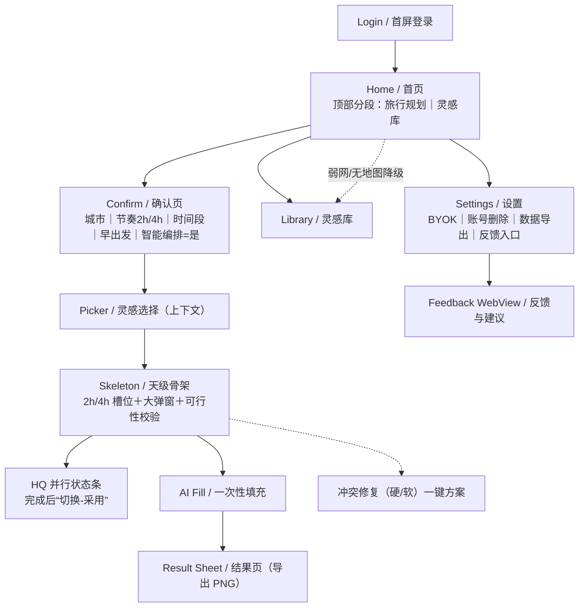
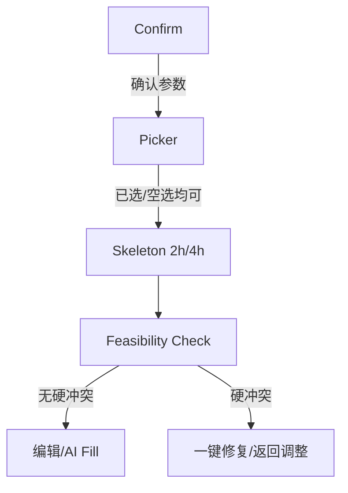
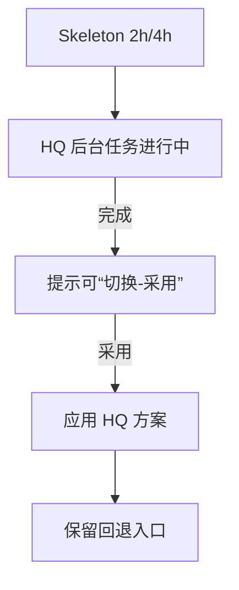
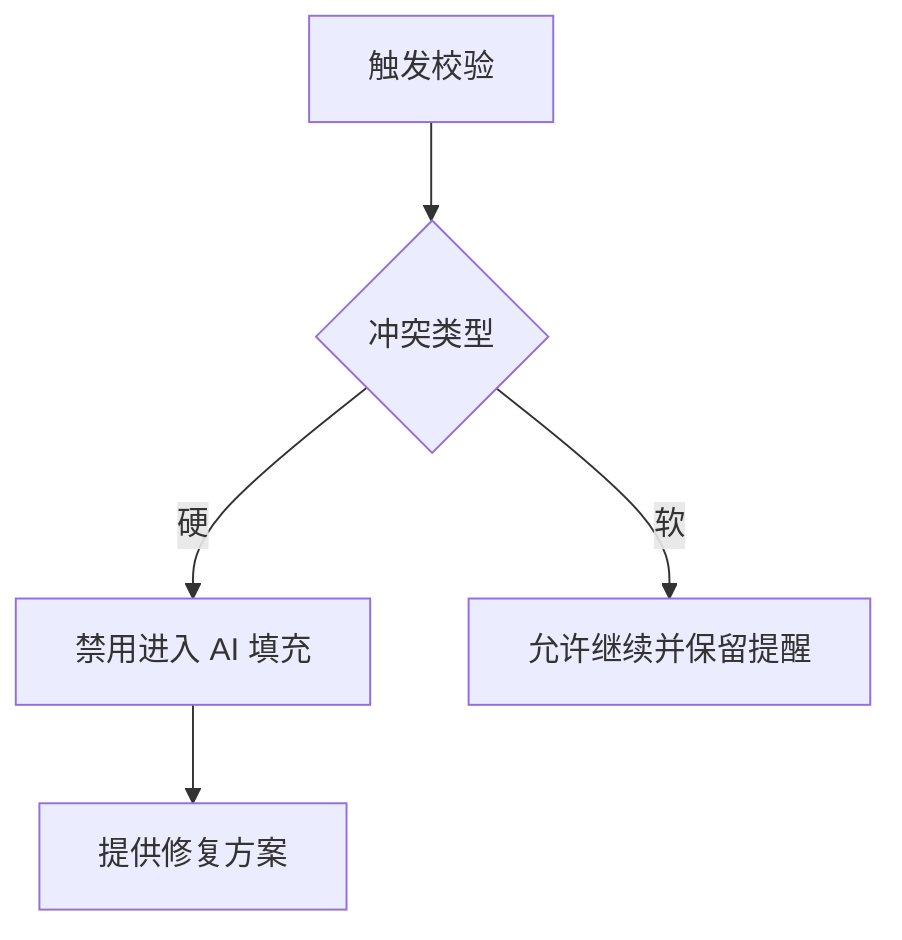
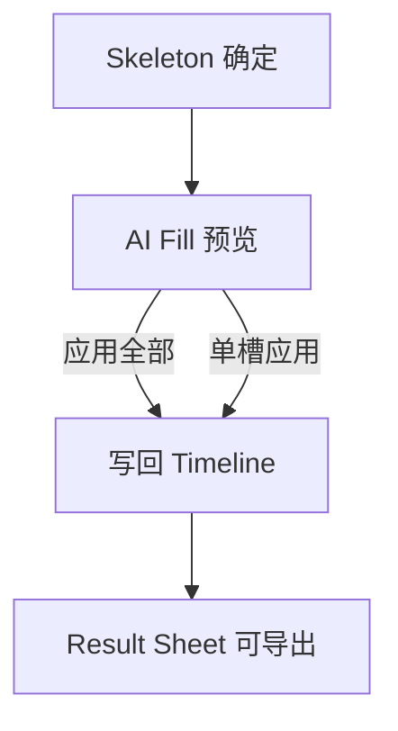
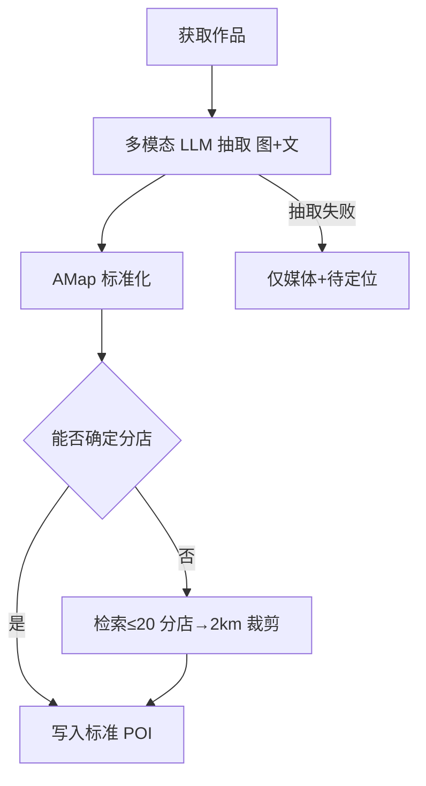
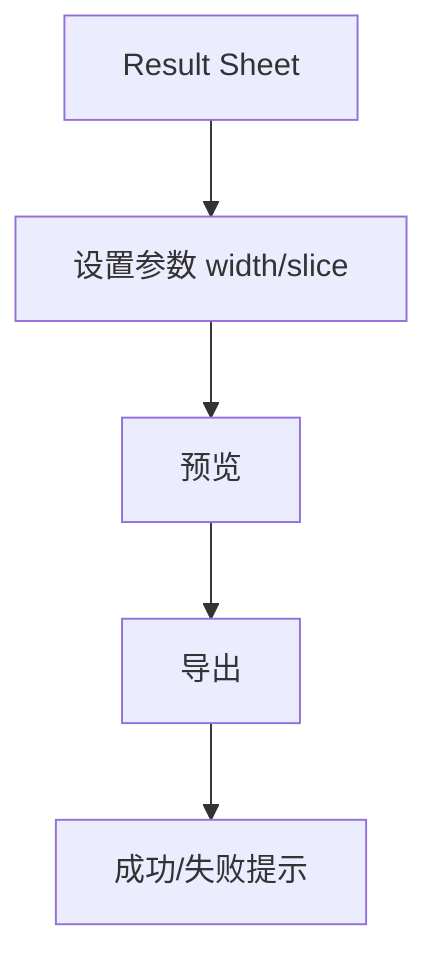
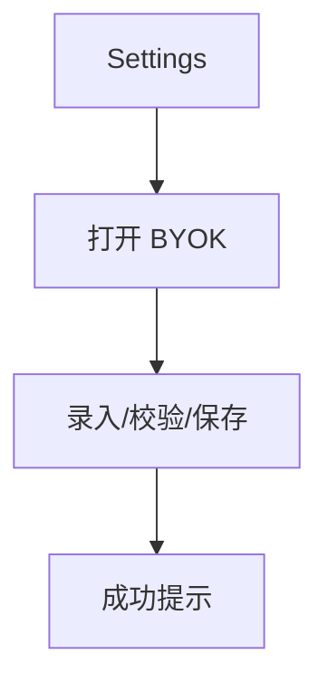
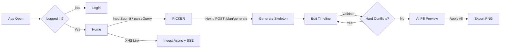

# Nomad MVP UX Input Package

Generated: 2026-06-17

This BMAD input package combines the mobile-first front-end specification and UX deltas.


---

## Source: `docs/front-end-spec.md`

# Nomad MVP UI/UX Specification

## Change Log

| Date | Version | Description | Author |
| --- | --- | --- | --- |
| 2025-11-01 | 0.1 | 初始版本：依据 PRD v0.4 输出 UX 规格（确认页、L2 快速编排、HQ 并行“切换-采用”、餐时分割 A/B、2h/4h 槽位） | UX |

## Introduction

This document defines the user experience goals, information architecture, user flows, and visual design specifications for Nomad MVP’s user interface. It serves as the foundation for visual design and frontend development, ensuring a cohesive and user-centered experience.

Rationale:
- 聚焦真实旅程：确认页（城市/节奏/时间段/早出发/智能编排默认是）→ L2 快速编排（2h/4h）先用后优 → HQ 并行与“切换-采用”。
- 结构优先：天级时间轴以 2h/4h 槽位为心智模型，餐时分割 A/B 不改变底层编辑/校验/导出。
- 可用性与可观测：VLM 默认启用；LLM Provider 抽象（OpenAI 兼容，api_base+model）可远程切换/回退；Langfuse 追踪。
- 地理准确：连锁抑制列表与分店≤20/主 POI 附近 2km 裁剪，保障消歧质量与一致性。

### Target & Platforms
- Mobile-first（iOS/Android），单列布局；触控目标≥44pt；动效 120–200ms。
- 不设桌面适配要求；后续如需平板适配，遵循移动优先断点延展。

## Overall UX Goals & Principles

### Target User Personas
- 初次规划者（Casual Planner）: 从灵感出发，期望“先有可用骨架，再逐步优化”，低学习成本与明确引导。
- 重度规划者（Power Planner）: 希望快速完成精细化编辑与验证，偏好批量操作、可解释性与回退。
- 在途执行者（On-trip User）: 查看行程与关键要点，关注“可执行、可替代”，不被复杂编辑打断。
- 运营/评测者（Internal Ops/QA）: 需要抽取与编排质量可观测，便于回放样本与定位问题。

### Usability Goals
- 5 分钟出可用骨架：确认页 + L2 快速编排（2h/4h）。
- 2 步完成高质量切换：HQ 并行完成后“切换-采用”，保留回退路径。
- 冲突可自修复：顶部校验（硬/软冲突）+ 一键修复 + 可解释理由。
- 地图-卡片一致：选中状态、飞行/滚动联动一致；弱网降级清单视图。
- 性能可感知：关键动效 120–200ms；HQ 状态清晰（进行中/完成可切换）。

### Design Principles
- 先用后优：以“可执行的最低可用骨架”优先，HQ 为可选升级。
- 槽位心智一致：2h/4h 槽位为全局心智；餐时分割仅展示，不破坏底层编辑/导出。
- 清晰与可解释：关键决策点（冲突、切换、替换）给出简短可解释理由。
- 渐进暴露：首屏不打断；需要时呈现更多选项（高级筛选/替换等）。
- 可观测与可回退：关键步骤可观测、可回退，用户始终可控。

## Information Architecture

### Site Map / Screen Inventory



### Navigation Structure
- Primary Navigation: 首页顶部分段“旅行规划｜灵感库”；左上侧边入口（最近行程/侧边栏）。
- Secondary Navigation:
  - Skeleton 顶部：D1..Dn Tabs；状态条（HQ 并行/完成可“切换-采用”）；A/B 展示开关（餐时分割）。
  - Timeline：空槽大弹窗（候选/AI 建议/自由活动）；长按编辑；顶部可行性校验与一键修复。
  - Settings：BYOK、账号删除、数据导出、反馈入口（WebView）。
- Breadcrumb Strategy: 移动端单页面流，面包屑不显式；通过标题/返回与 Tabs 维持定位。

## User Flows

### Flow: Confirm → Picker → Skeleton（规划主路径）
**User Goal:** 快速得到可用骨架（2h/4h）

**Entry Points:** 首页 CTA / 解析 trip_params → Confirm

**Success Criteria:** 进入骨架页，至少 1 个有效槽位，无硬冲突；弱网可降级



**Edge Cases & Error Handling:**
- 缺参 → 参数 Sheet 补齐
- 弱网/无地图 → 降级清单视图
- 解析失败 → 提供“手动录入/稍后再试”

---

### Flow: HQ 并行生成与“切换-采用”
**User Goal:** 在可用骨架基础上获得更优方案，并一键采用

**Entry Points:** Confirm 默认启用智能编排 或 Skeleton 顶部开关

**Success Criteria:** 完成提示 + “切换-采用”应用成功，保留回退



**Edge Cases & Error Handling:**
- HQ 超时/失败 → 保持快速版，并提示稍后重试
- 采用引发冲突 → 即时校验 + 修复建议

---

### Flow: 冲突校验与一键修复
**User Goal:** 使计划可执行

**Entry Points:** Skeleton 顶部校验/编辑动作后

**Success Criteria:** 无硬冲突或仅 1 个残留且可修复



**Edge Cases & Error Handling:**
- 跨日不可达/无坐标/闭店 → 均视为硬冲突
- 修复失败 → 显示替代点/挪日建议

---

### Flow: AI Fill（一次性填充）
**User Goal:** 在不改变时间/顺序的前提下补齐“做什么/准备/注意”

**Entry Points:** Skeleton → AI 填充页

**Success Criteria:** 成功应用全部/按槽位应用；可回退；引用可追溯



**Edge Cases & Error Handling:**
- 无可用事实引用 → 降级为“通用建议”并标注
- 应用失败 → 重试/部分应用

---

### Flow: XHS 入库与地理消歧（VLM 默认启用）
**User Goal:** 将灵感可靠转为可规划候选

**Entry Points:** 首页统一输入（优先识别 XHS 链接）

**Success Criteria:** 产出标准 POI（AMap），不确定分店按 ≤20 且主 POI 附近 2km 裁剪



**Edge Cases & Error Handling:**
- 连锁误解析 → 连锁抑制列表过滤
- 费用/配额压力 → 缓存与失败降级

---

### Flow: 导出 PNG（行程卡片）
**User Goal:** 将行程以可分享的图片形式导出

**Entry Points:** Result Sheet

**Success Criteria:** 指定宽度导出成功，超长按天切片



---

### Flow: Settings → BYOK 配置
**User Goal:** 配置个人 OpenAI Key 覆盖平台额度

**Entry Points:** 设置页 BYOK

**Success Criteria:** 安全保存，后续调用走 BYOK；可随时切换/删除



**Edge Cases & Error Handling:**
- 校验失败/失效 → 友好提示与回退到平台额度

## Wireframes & Mockups

- Primary Design Files: （待接入 Figma 链接）
- Key Screen Layouts: Login、Home、Confirm、Picker、Skeleton（含状态条/A-B 开关）、AI Fill、Result Sheet、Settings、Feedback WebView

## Component Library / Design System（提纲）

- 组件清单（示例）：TopSwitch、UnifiedInput、CityCard、LocationModal、PlanTimelineMobile、FixSheet、HQStatusBar、SwitchAdoptToast、BYOKForm
- 状态与变体：loading/empty/error/weak-network

## Component Specifications（Mobile）

### Confirm Page Components
1) CityPicker
- Props: `value: {id,name}?`，`options: City[]`，`onChange(city)`，`searchable?: boolean`，`loading?: boolean`，`disabled?: boolean`，`error?: string`
- Behavior: 远程搜索（300ms debounce）、弱网本地缓存回显；缺省城市以 PRD 优先城市/最近城市建议
- Empty/Error: 无结果显示“换关键字试试”；失败“稍后重试”

2) PaceSegmentedControl
- Props: `value: 'tight'|'comfortable'`，`onChange(v)`
- Notes: 与槽位时长映射（2h/4h）强绑定；切换需提示可能影响编排

3) DateRangePickerFlexible
- Props: `mode: 'flex'|'fixed'`，`days?: number`，`dateRange?: {start,end}`，`arrival?: time`，`departure?: time`，`timezone?: string`，`onChange(payload)`
- Validation: 起止有效、最小1天；可选首尾到/离港时间

4) MorningStartTimePicker
- Props: `value: time`，`step: 15|30`，`onChange(time)`
- Notes: 与 2h/4h 起始对齐，影响 Timeline 起点

5) SmartPlanSwitch
- Props: `checked: true`（默认是），`onToggle(checked)`，`hint: string`
- Notes: 打开即后台启动 HQ 并行；状态交由 Skeleton 顶部状态条承接

6) PrimaryCTAButton
- Props: `label`，`onPress`，`loading?`，`disabled?`

### Picker Components
1) CityTabs
- Props: `tabs: {cityId,name,count,distKm}[]`（仅 count>1 显示），`active`，`onChange(id)`

2) InspirationCardGrid
- Item: `title,image,tags,status: 'default'|'added'|'locate'`，`onAdd()`，`onLocate()`
- Loading: 骨架 6–12 张；弱网降级纯列表

3) MapSheet
- Props: `mode: 'High'|'Split'|'MapFull'`，`onModeChange(m)`；与卡片联动高亮

4) SelectedBasketPanel
- Props: `items: Selected[]`（含 `must_go,time_hint,stay_minutes_hint`），`onUpdate(item)`，`onRemove(id)`，`onGenerate()`

5) LocationModal (Top-5)
- Props: `candidates: {name,address}[]`，`onSelect(i)`，`onClose()`
- Rules: 仅显示“名称+地址”，不显示距离/置信度

### Skeleton Components
1) DayTabs
- Props: `days: n`，`active`，`onChange(idx)`

2) HQStatusBar
- Props: `state: 'running'|'done'|'failed'`，`onAdopt()`（“切换-采用”），`message?`
- Behavior: running 显示进行中；done 显示可“切换-采用”；failed 给出重试

3) ABToggle (MealSplit)
- Props: `enabled`，`onToggle()`；仅影响展示，不改数据

4) PlanTimelineMobile
- Props: `slotMinutes: 120|240`，`slots: Slot[]`（含 id, time, poi/meta）
- Interactions: 长按编辑（替换/移动 D±1/调时/删除）；拖拽吸附 30/60 分；撤销 token 5–8s

5) EmptySlotModal
- Tabs: 候选抽屉（按时窗/距离/vibe 重排）、AI 建议、自由活动
- Actions: 预览→落位；遵循硬约束；失败给修复建议

6) FixSheet（可行性修复）
- Input: 冲突列表（hard/soft, cause, action）
- Actions: 一键修复（换序/替换/缩短/挪日）；修复失败给替代方案

7) SwitchAdoptBar
- Props: `visible`，`onAdopt()`，`onDismiss()`；采用后提供回退入口

### AI Fill Components
1) AIFillPreviewList
- Item: `do,prepare,notice,why_short,sources[]`；支持“应用全部/按槽应用”
- Fallback: 无可用事实引用 → 标注“注意事实核查”

### Result & Export Components
1) ExportPreview
- Props: `width_px: 1080|1242`，`slice_by_day: boolean`
- ExportButton: 反馈成功/失败；超长分天切片

### Settings & Feedback Components
1) BYOKForm
- Props: `value`，`onValidate(key)`，`onSave(key)`；失败回退平台额度

2) FeedbackWebView
- Props: `url`，失败降级 `FallbackForm{text, screenshot}`（COS 上传）
- Events: `open/submit/success/fail`

### Cross-cutting
- Loading/Empty/Error/Weak-Network：各组件提供统一四态
- Accessibility：触控≥44pt；可聚焦与读屏标签；颜色对比 AA
- Performance：首屏渐进加载；关键交互 120–200ms；大图 LQIP/懒加载

## States & Validation Copy（Mobile）

### 基本风格
- 语气克制、明确；一句话≤18字为宜；提供行动指引（按钮/链接）。
- 优先本地即时校验；服务端失败时给可重试与兜底路径。
- 弱网提示后给降级策略（清单/重试/后台继续）。

### Confirm（确认页）
- 空态/缺参：
  - 城市未选："请选择城市"
  - 日期/天数缺失："请完善出行时间"
  - 早出发未设："请选择出发时间"
- 校验失败：
  - 到/离港时间无效："到/离港时间不合理，请重新选择"
  - 时间范围过短："最少 1 天，请调整"
- 弱网："网络较慢，已本地保存所填内容"

### Picker（灵感选择）
- 空列表："暂无可用灵感，试试更换城市或关键词"
- Top-5 定位："仅展示名称+地址，可稍后在骨架页再调整"
- 弱网降级："网络较差，已切换为清单模式"
- 操作反馈：
  - 加入成功："已添加 · 撤销"
  - 去定位入口："待定位 · 选择地址"

### Skeleton（天级骨架）
- HQ 并行：
  - 进行中："正在生成高质量版…"
  - 完成："高质量版已就绪 · 切换-采用"
  - 失败："生成失败 · 稍后重试"
- 可行性校验：
  - 硬冲突："存在不可达/闭店等硬冲突，请先修复"
  - 软冲突："存在轻微超时/通勤较远，建议优化"
- 一键修复结果：
  - 成功："已修复"
  - 失败："未能修复，试试替换/挪日"
- 弱网："网络较慢，操作可能延迟"

### EmptySlotModal（空槽大弹窗）
- 候选不足："暂无合适候选，试试更宽的时间窗"
- AI 建议失败："建议生成失败 · 重试"
- 自由活动提示："将添加 2h/4h 空闲时段"

### AI Fill（一键填充）
- 无引用降级："注意事实核查"
- 应用成功："已应用到时间线"
- 应用失败："应用失败 · 重试"

### Result Sheet / Export（导出）
- 参数提示："宽度 1080（可选 1242），超长按天切片"
- 导出成功："已导出"
- 导出失败："导出失败 · 重试"

### Settings / BYOK
- 保存成功："已保存"
- 校验失败："密钥无效，请检查"
- 回退提示："已回退到平台额度"

### Feedback WebView
- 打开失败："页面无法内嵌，已在系统浏览器打开"
- 表单降级："内置表单已启用，可提交文本与截图"

### XHS 入库 & 地理消歧（参考）
- 抽取失败："仅媒体+待定位"
- 分店裁剪："已按 2km 范围筛选附近分店"

## Key Screen Layouts（Detailed）

### Confirm（确认页）
**Purpose**: 在进入编排前一次性收集关键参数，降低返工。

**Layout**
- Header: 标题“确认规划参数”，返回按钮；说明文案一行。
- Body（纵向单列）：
  1) 城市选择（CityPicker）
  2) 出行节奏 Pace（Segmented: 紧凑2h｜舒适4h）
  3) 出行时间段（灵活天数/日期选择；可选首尾到/离港时间）
  4) 早上出发时间（2h/4h 起始对齐选项）
  5) 智能编排开关（默认是，说明“后台将生成高质量版本，可稍后切换-采用”）
- Footer CTA: “继续（进入灵感选择）”。

**Interaction Notes**: 参数校验；缺参弹 Sheet 补齐；弱网保底本地回显。

### Picker（灵感选择-上下文）
**Purpose**: 选择 must_go/候选作为骨架输入，支持空选继续。

**Layout**
- Header: 城市/日期/天数概览 + “修改参数”入口。
- Content: 卡片列表 + 地图联动（High→Split→Map-Full），弱网降级清单。
- Basket: 吸底“已选 N | 生成骨架”；面板含 must_go / time_hint / stay_minutes_hint。

**Interaction Notes**: 卡片与 Marker 一致；飞行/滚动联动；Top-5 定位弹窗。

### Skeleton（天级骨架）
**Purpose**: 提供 2h/4h 槽位的可执行骨架，作为 HQ 的基线。

**Layout**
- Top Bar: D1..Dn Tabs；状态条（HQ 并行中/完成可“切换-采用”）；A/B 开关（餐时分割）。
- Timeline: 2h/4h 槽位；空槽大弹窗（候选/AI 建议/自由活动）；长按编辑。
- Validation: 顶部可行性校验（硬/软冲突）+ 一键修复入口。

**Interaction Notes**: “切换-采用”后保留回退入口；操作有埋点。

### AI Fill（一次性填充）
**Purpose**: 在不改变时间/顺序条件下补齐“做什么/准备/注意”。

**Layout**
- Preview List: 按 Timeline 顺序展示每槽三段文本，why_short/引用来源短链。
- Controls: “应用全部”/按槽应用；失败与降级提示。

**Interaction Notes**: 无可用事实引用 → 标注“注意事实核查”。

### Result Sheet（结果页/导出）
**Purpose**: 浏览与导出行程卡片。

**Layout**
- Readonly List: 每槽“做什么/准备/注意”最终文案；导出参数（width/slice）与预览。
- Export CTA: 导出 PNG；成功/失败反馈。

**Interaction Notes**: 超长分天切片；弱网提示重试。

### Settings（设置/BYOK/反馈）
**Purpose**: 账户与 Key 管理、反馈入口。

**Layout**
- BYOK: 录入/校验/保存；状态显示；失败回退平台额度。
- Account: 账号删除、数据导出。
- Feedback: 跳 WebView（失败降级内置表单）。

**Interaction Notes**: BYOK 安全提示；最小必要字段；不打断主流程。

### Feedback WebView（反馈与建议）
**Purpose**: 在内嵌环境完成官方反馈流程。

**Layout**
- WebView: JS/DOM Storage 开启；失败降级内置简表单（文本+截图上传）。

**Interaction Notes**: 若站点禁止内嵌，回退系统浏览器；关键埋点：open/submit/success/fail。

## Accessibility（提纲）

- 触达目标：移动端基本可达性（触控目标、对比度、可聚焦与屏幕阅读顺序）

## Responsiveness / Animation / Performance / Next Steps（提纲）

- 响应式：移动优先；兼容小屏/窄屏断点
- 动效：120–200ms；HQ 状态条/切换-采用反馈
- 性能：首屏渐进加载；弱网降级
- Next Steps：细化线框、组件清单、Figma 联动与交接清单

## Analytics & Metrics Plan（埋点与指标方案）

### 命名规范与采集约束
- 命名：snake_case，按页面/领域前缀（如 `confirm_*`, `picker_*`, `skeleton_*`, `aifill_*`, `export_*`, `byok_*`）。
- 上报：统一封装层（友盟/埋点 SDK），失败重试与离线队列；所有调用含时间戳与 session_id。
- 隐私：不采集 PII（手机号/邮箱/Key）；BYOK 仅记录操作结果，不记录密钥明文/摘要。
 - 事件包头（Envelope，必携）：`event_id`（uuidv4）、`prev_event_id?`、`seq`（自增）、`timestamp_ms`、`session_id`、`journey_id?`、`plan_id?`、`trace_id?`、`span_id?`
 - ID 生成规则：
   - `journey_id`：在 `confirm_continue` 生成，贯穿 Confirm→Result 的一次完整路径；“另存为/新计划”生成新 ID。
   - `plan_id`：首次生成骨架或显式创建计划时生成，用于跨会话/设备恢复。
   - `event_id/prev_event_id/seq`：前端按事件序列维护，支持重排与回放。
   - `trace_id/span_id`：对齐后端与 Langfuse/Sentry；HQ 与 Ingest 任务返回 `hq_job_id`/`ingest_job_id` 以便关联。

### 关键事件（Key Events）
- Confirm
  - `confirm_open`
  - `confirm_param_change` {field, from, to}
  - `confirm_continue` {city, days, pace, morning_start, smart_plan:true}

- Picker（灵感选择）
  - `picker_open` {city, tabs_count}
  - `picker_add_inspiration` {item_id, source:'card|map'}
  - `picker_remove_inspiration` {item_id}
  - `picker_locate_open` {item_id}
  - `picker_locate_select` {item_id, choice_idx}
  - `picker_generate_skeleton` {selected_count, must_go_count}

- Skeleton（天级骨架）
  - `skeleton_open` {days, pace, slot_minutes}
  - `skeleton_feasibility_check` {hard_cnt, soft_cnt}
  - `skeleton_fix_apply` {action:'reorder|replace|shorten|move_day', result:'success|fail'}
  - `skeleton_slot_edit` {action:'replace|move|retime|delete', scope:'slot|day'}
  - `skeleton_empty_slot_open` {day, slot_idx}
  - `skeleton_ab_toggle` {enabled:true|false}
  - `skeleton_hq_status` {state:'running|done|failed'}
  - `skeleton_hq_switch_adopt` {clicked:true}
  - `skeleton_hq_switch_adopt_result` {result:'success|fail'}

- AI Fill（一次性填充）
  - `aifill_open`
  - `aifill_apply_all`
  - `aifill_apply_slot` {slot_id}
  - `aifill_apply_fail` {error_code}
  - `aifill_source_missing` {slot_id}

- Export（导出）
  - `export_open`
  - `export_preview` {width_px, slice_by_day}
  - `export_click` {width_px, slice_by_day}
  - `export_success` {time_ms}
  - `export_fail` {error_code}

- Settings / BYOK
  - `byok_open`
  - `byok_validate_success`
  - `byok_validate_fail` {error_code}
  - `byok_save_success`
  - `byok_save_fail` {error_code}
  - `byok_revert_platform`

- Feedback
  - `feedback_open` {mode:'webview|fallback_form'}
  - `feedback_submit_success`
  - `feedback_submit_fail` {error_code}

- XHS 入库（前端侧）
  - `ingest_sse_stage_update` {stage:'created|fetching|parsing|geo|storing|done'}
  - `ingest_fail` {error_code}

- 网络与性能（通用）
  - `network_state_change` {state:'online|weak|offline'}
  - `perf_mark` {name, time_ms}（如 `ttfp_ms`, `hq_ready_ms`, `export_time_ms`）

### 事件属性（Common Properties）
```
{
  // Envelope
  event_id, prev_event_id?, seq, timestamp_ms,
  session_id, journey_id?, plan_id?, trace_id?, span_id?,
  // User/Device
  user_id?, device:'ios|android', app_version,
  // Planning Context
  city_code?, city_name?, days?, pace:'tight|comfortable', slot_minutes:120|240,
  hq_enabled:true|false, hq_adopted?:true|false,
  conflict_hard_cnt?, conflict_soft_cnt?,
  source:'home_input|home_card', network:'wifi|cell|weak',
  // Jobs (optional)
  hq_job_id?, ingest_job_id?, plan_token?
}
```

### 指标与目标（Metrics & Targets）
- **先用后优（TTFP）**：`ttfp_ms = skeleton_render_end - confirm_continue`；目标 P50 ≤ 5 分钟内产“可用骨架”。
- **HQ 采用率**：`hq_adopt_rate = skeleton_hq_switch_adopt_result.success / skeleton_open`。
- **可行性修复成功率**：`fix_success_rate = skeleton_fix_apply.result==success / skeleton_fix_apply`；目标提升 P50 次数并降低硬冲突残留。
- **导出率**：`export_success / result_sheet_open`。
- **添加→落位转化**：`picker_add_inspiration → skeleton_slot_edit|autoplace` 的转化比。
- **VLM/入库可达率（前端可见）**：`ingest_sse_stage_update.done / ingest_sse_stage_update.created`。
- **交互性能**：关键交互 120–200ms；Skeleton 首屏加载 P50 目标明确。

### 漏斗（示例）
1. `confirm_open → confirm_continue → picker_generate_skeleton → skeleton_open → aifill_open → export_success`
2. `skeleton_open → skeleton_hq_status.done → skeleton_hq_switch_adopt → skeleton_hq_switch_adopt_result.success`

### 实施要点
- 封装埋点 Hook/Service，页面与组件仅调用语义化方法，避免散落。
- 统一属性字典与事件校验（Type 定义 + 编译期校验）。
- 失败样本采样与脱敏；关键错误附 `error_code`（与后端统一枚举）。
 - `journey_id` 生命周期：`confirm_continue` 生成→写本地→跨页面与重启恢复；深链携带 `plan_token` 以跨设备回连同一计划路径。


---

## Source: `docs/ux/mobile-ia.md`

# nomad-mvp Mobile IA & Wireframes (v0.1 → v0.2/v0.3-light inline)

Date: 2025-10-26
Owner: UX

## 0. Design Principles & Tone
- Awe/Wanderlust: ignite the desire to go; large imagery, natural light, breathing space.
- Companion, not Guru: gentle, specific, low-pressure guidance; avoid info overload.
- Trust & Doable: clear timeline, commute hints, undo everywhere; confidence in execution.
- Frame for Freedom: structure (2h slots, reachability circle) + freedom (free activities, drag/adjust).
- Here & Now: fast, restrained micro-interactions; map & cards stay in sync.

Motion: 120–200ms; Sheet snap 240–300ms; Marker activate 150–180ms; timeline insert 200ms + subtle haptic.
Touch target: ≥ 44×44pt. Dynamic type: text scales without layout breakage.

## 1. Navigation Model (Global)
- TopSwitch (sticky): 旅行规划 | 灵感库
- Drawer (left, ☰):
  - 主区： 首页 / 灵感库 / 设置
  - 分隔
  - 历史规划：已完成/ 未完成
    - 列表项：显示 “{城市} · {起始日期} · {天数}天” 与最近更新时间；点击进入对应 plan（保留状态）
    - 过滤/搜索（可选，MVP 可省略）
  - 分隔
  - 帮助与反馈 / 关于
- UnifiedInput (bottom, sticky): 粘贴小红书链接，或输入：杭州 11/2 起 3天
- Tabs in planner: D1 | D2 | … | Dn (memorize each day scroll)

Header Usage
- 首页/灵感库：hamburger button + TopSwitch（计划|灵感）；
- 规划流程页（Planner Picker / 天级骨架 / AI 填充 / 行程单）：HeaderBar（返回箭头 + 标题城市/日期 + More + ProgressBreadcrumb）

### IA Tree (High Level)
- 登录首屏
- 首页
  - 目的地卡片（横滑）
  - 统一输入（粘贴/自然语言）
- 灵感库
  - 城市 Chips
  - 列表：今日新增 / 已入库 / 待定位（点整行→定位弹窗）
  - 地图联动模式（Map-to-Action Bridge）
- 灵感选择页（Planner Picker）
- 天级骨架（2h 槽位）
  - 空槽大弹窗：候选抽屉 | AI 建议 | 自由活动
  - 顶部可行性校验与一键修复
  - 长按：替换/移动D±1/调时/删除（撤销）
- AI 填充（一键生成→预览→应用全部）
- 导出（PNG 卡片）
- 设置（BYOK、账号删除、数据导出、单位/时间制/动效开关）

## 2. Global Components & Patterns
- TopSwitch: sticky segmented control.
- HeaderBar: 顶部通用导航栏
  - 左侧：有前进后退关系的页面以“返回箭头”替代菜单（Planner Picker / 天级骨架 / AI 填充）；首页与灵感库保留菜单
  - 标题：规划流程页显示“{城市} · {出行日期}”，非规划页显示页面名
  - 右侧：More（…）轻按钮 → 菜单：导出 / 分享 / 帮助
- ProgressBreadcrumb（极轻量）：标题右侧点/徽章：灵感✔︎ / 骨架✔︎ / AI填充✔︎ / 行程单•；可点回到上一阶段（保留状态）
- UnifiedInput: link/intent detection; shows disambiguation panel when unknown
  - 位置：底部吸底；视觉不“细扁”，接近常见 AI 对话框尺寸
  - 多行自适应：最大高度 3–5 行（超出滚动）
  - 发送：右侧发送按钮；回车行为可在设置中切换“发送/换行”
  - 提交：Loading/禁用态避免重复提交
  - 粘贴识别：检测 XHS 分享口令/链接 → 轻提示“识别为小红书链接”
- Drawer: 侧边栏（hamburger 打开）
  - 分组与项：同 1. Navigation Model 所述
  - 历史规划项点击：
    - 已完成 → 以只读模式打开（允许导出/分享/编辑）
    - 未完成 → 继续编辑（跳转到上次离开页签/滚动位置）
  - 空态：暂无历史规划 → 提示“开始一次新的规划吧”

Telemetry（Drawer）
- drawer_open, drawer_close, drawer_nav_click(page)
- drawer_plan_open(plan_id, status=done|draft)

- CityCard: name + "XX 个想去"; CTA: 开始规划 / 查看灵感。
- PlanTimelineMobile: vertical day view, default 2h slots; blocks with duration; empty-slot placeholder.
- FixSheet: feasibility results + one-tap fixes (换时/近邻/挪日)。
- LocationModal: search (模糊+拼音/简称) + Top-5 (名称+地址) no confidence score.
- SlotSuggesterList: time-window fit > distance > vibe > popularity; shows "为何推荐" ≤16 chars；来源 Chip：“来自 用户候选/AnchorPool”；可显示“靠近酒店/回程方便”等 near_hotel 解释（不显示距离/评分/置信度）。
- AITipsList: lightweight activities (步行线/拍照点/小吃等)。
- Buttons/CTAs: primary bottom CTA per screen; consistent copy.

Accessibility: color contrast ≥ WCAG AA; large tap targets; focus order logical.

## 3. Screen Wireframes (Textual)

### 3.1 登录首屏
Purpose: secure entry; pass review.
Layout:
- Brand minimal, privacy/terms links visible on first screen (可跳转查看)
- 登录方式（iOS 中国区）：Apple｜手机号｜微信，并列同层等权、同尺寸；排序：Apple｜手机号｜微信
- 行为验证：默认不打断；命中风控（IP/号段/设备指纹异常）或短信失败重试时触发；高峰期可临时切到“发送前必过”（远程开关）
States:
- OTP sent / resend / error / cooldown
- Failure → surface help

### 3.2 首页
Purpose: spark action with minimal elements.
Layout:
- Header: hamburger button+TopSwitch（计划|灵感）
- 最近行程入口：在内容顶部以卡片形式展示“继续上次行程：{城市} · {起始日期} · {天数}天”，根据计划状态展示 CTA：“继续编辑/查看行程单”。
- Content: 目的地卡片横滑（城市名 + 次文案“XX 个想去”）
- Footer: UnifiedInput（粘贴/自然语言；多行 3–5 行；发送按钮；回车行为可切换；提交 Loading/禁用；粘贴 XHS 轻提示）
CTAs:
- 开始规划: prefill input with city, focus for date/days; no picker
- 查看灵感: switch to 灵感库 filtered by city
Copy:
- 不额外“找到N条灵感”提示条；融合在卡片次文案

### 3.3 灵感库（列表 + 地图联动）
Purpose: browse/manage inspiration; locate; pick.
Layout:
- Header: hamburger button+TopSwitch（计划|灵感）
Modes:
- List (Sheet-High≈清单) ↔ Split(≈55%) ↔ Map-Full（抽屉吸附位）
List:
- City chips; sections: 今日新增 / 已入库 / 待定位
- 待定位：点整行 → 定位弹窗（搜索 + Top5 名称/地址 → 确认即入库）；不阻塞浏览
Map-to-Action Bridge:
- Map (top 32–40% default; lazy load; cluster)
- CardSheet (bottom; keeps bottom action bar visible in all snaps)
- 详情展示统一使用全高 Bottom Sheet，不跳路由
Sync:
- Card→Map: visible cards highlight marker; tap card → flyTo 300ms
- Map→Card: tap marker → scroll & "lift" card (shadow)
Action strategy:
- 有骨架：主CTA=加入 D{n}·{上午/下午/晚间}（可改）
- 无骨架：主CTA=加入候选；底条“已选 N / 生成骨架”

### 3.4 灵感选择页（Planner Picker）（上下文灵感选择页）
Purpose: 在规划上下文内挑选本次要用的 UGC 素材，作为“部分填充/锚点输入”。不属于“灵感库”导航项，但复用其卡片/定位能力。

Header
- 使用 HeaderBar：左“返回”、标题“{城市} · {出行日期?占位} · {天数?占位}”、右“More”；标题右侧 ProgressBreadcrumb（灵感• / 骨架 / AI填充）

Entrances & Route
- 仅以下两条路径可进入本页；本页不出现在“灵感库”导航，其他页面不允许直接跳转。
- 入口 A（主）：首页底部输入解析 trip_params 成功 → 进入本页
- 入口 B（补充）：首页目的地卡“开始规划” → 进入本页
- 路由：/planner/pick?city={CITY}&start={YYYY-MM-DD?}&days={N?}&source={home_input|home_card}&rec_id={CARD_ID?}

Layout（Map-to-Action Bridge）
- Top：MapPane 默认 32–40% 屏高；向上拖进入 Split（≈55%）/Map-Full（≈100%）
- Bottom：CardSheet 三段吸附：Sheet-High → Split → Map-Full；任一吸附位均保留底部操作条（已选 N | 下一步）
- 详情：统一全高 Bottom Sheet（不跳路由）

Linking Rules
- 卡片→地图：列表滚动时可见卡片的 Marker 高亮；点卡片→地图飞到该点（300ms）
- 地图→卡片：点 Marker→滚动该卡片并“抬升”（阴影/缩进）
- 选择一致性：卡片与地图点的“加入/已加入”实时同步

Overlays（可开关）
- UGC POI 层（与搜索结果颜色区分）
- 可达圈：步行 10/20/30 分（约 80m/分钟），标注“约 10/20/30 分”
- 热门拍照点热度圈
- MVP 不上 Lasso；改用半径三档 + 类目筛选 Chips

Gestures & Priority
- 下滑 CardSheet：先到 Split，再到 Map-Full；Map-Full 上滑回 Split
- 地图平移优先；抽屉顶部预留 24px 抓手区

Performance
- 地图懒加载：首屏停留 >300ms 或进入 Split 再加载
- Marker 聚合；列表虚拟化；图片 LQIP + 渐进清晰；统一骨架屏
- 弱网/无地图：自动降级 Sheet-High 清单视图，地图区灰块提示“网络不佳，稍后自动重试”
 - 降级 CTA：提供“仅列表继续”按钮（保持列表操作可用），网络恢复后提示“可切换至地图模式”。

Wireframe — Planner Picker 弱网降级（仅列表继续）
```
[Map 区域降级占位]
┌──────────────────────────────┐
│ 网络不佳，稍后自动重试       │
│ [ 仅列表继续 ]               │
└──────────────────────────────┘

[CardSheet · 列表正常可用]
┌ 卡片 ▸ 加入候选 / 已加入 · 撤销 ┐
│ ...（支持选择、已选篮、下一步） │
└────────────────────────────────┘
注：点击“仅列表继续”隐藏地图区占位，保留列表与底部操作条；网络恢复后顶部轻提示“地图可用，切换至地图模式”。
```

Cards & Selection
- 卡片：4:5 封面 + 标题 + 标签 + 次信息；右下固定主 CTA
- 主 CTA：加入候选 → 已加入（显示“已加入 · 撤销”）；低置信显示“去定位”入口，复用定位弹窗

Basket & Footer
- 已选篮（吸底左）：“已选 N”（可展开面板：移除、must_go、time_hint、stay_minutes_hint）
- 主按钮（吸底右）：“下一步/生成骨架”；无“用热门生成骨架”动作（已删除）
- 缺参补齐：点主按钮时若缺 start/days → 弹参数 Sheet 补齐后生成

Generate（接口语义）
- POST /plan/generate：selected_items 作为锚点输入生成“部分填充”骨架（must_go/time_hint 优先落位；近邻聚类仅做部分填充）
- 未落位条目：不在骨架主视图直接展示，而是在“空槽→大弹窗”的“候选抽屉”中展示；若 Planner Picker 的 POI 已用完则提示“已用完”

Empty States
- 无灵感：展示“热门 UGC/AI 建议”棚格；CTA 仍为加入候选/行程
- 手势可发现性：抽屉顶部抓手 + “向上查看地图”细文案；首次进入给一次轻引导动画

### 3.5 天级骨架（2h 槽位）
Purpose: structure day; manual adjust only.
Header
- 使用 HeaderBar：左“返回”、标题“{城市} · {出行日期}”、右“More”；标题右侧 ProgressBreadcrumb（灵感✔︎ / 骨架• / AI填充）
Layout:
- Tabs D1..Dn; vertical timeline; empty-slot placeholder "空闲 · 2h"
- Bottom primary: 下一步：进入 AI 填充（仅当所有天已确认）
Seed:
- `origin=ai_seed` 块显示紧凑徽标“AI 预排”（标题右侧，按压态降噪）；生成完成后一次性顶部提示：“已为你预排 N 个（均可修改）”（6s 自动隐藏，可手动关闭）。
Interactions:
- 空槽 → 大弹窗（搜索|候选抽屉|AI建议|自由活动）
  - 候选抽屉：展示来自 灵感选择页（Planner Picker） 尚未用完的 POI；若已用完则提示“已用完”；按时窗/距离/vibe 重排
  - AI 建议：依据模型能力进行推荐（不改变时间与顺序，仅作为候选）
  - 自由活动：提供选项 购物｜city walk｜喝茶休息｜保持空白；“自由活动”表示该槽位不在后续流程自动填充
  - 搜索（FR44‑lite）：顶部文本搜索（AMap），Top‑5 列表（无地图）；结果项：加入候选｜直接落位（遵循硬约束）；失败提示“搜索暂不可用，请稍后重试”
- 候选卡：名称/通勤/时窗匹配 → 进入“时间调整”
- 时间调整：拖拽起止；允许跨槽；拖拽吸附 30/60 分钟刻度；冲突→轻量修复条（换到 14:00 | 缩短 15m | 换近邻）
- 长按块：替换/移动到D±1/调时/删除；撤销（8s Toast）+ 当日时间轴“最近操作”入口（可再撤一条）
Undo/Reset:
- 全局撤销 Toast 5–8s（默认 6s，单例刷新计时）；More(…) 菜单提供“一键重置预布局”（仅还原 `origin=ai_seed` 相关变更；保留手动编辑历史）。
Fix:
- 顶部可行性校验；提供一键修复；目标=0冲突或≤1且可修
- 冲突分级：硬冲突（无坐标/闭店/跨日不可达）→ 禁用“进入 AI 填充”，需先修复；软冲突（略超时/通勤略远等）→ 允许进入 AI 填充，顶部保留提醒与一键修复

FixSheet 示例数据（对齐 OpenAPI，参见 `docs/api/openapi.yaml`）
```
// ValidatorConflict example（too_far，含两条 FixSuggestion）
{
  "type": "too_far",
  "severity": "soft",
  "day": 2,
  "slot_id": "s_abc",
  "details": { "commute_minutes": 28, "limit_minutes": 18 },
  "suggestions": [
    {
      "id": "fix_1",
      "conflict_type": "too_far",
      "safe": true,
      "requires_user_input": false,
      "score": 0.87,
      "actions": [ { "type": "reorder", "notes": "交换前一槽以降低通勤" } ],
      "apply_sequence": [
        { "op": "move", "slot_id": "s_abc", "new_day": 2, "new_start": "14:00", "new_end": "16:00" },
        { "op": "move", "slot_id": "s_prev", "new_day": 2, "new_start": "16:00", "new_end": "18:00" }
      ]
    },
    {
      "id": "fix_2",
      "conflict_type": "too_far",
      "safe": true,
      "requires_user_input": true,
      "score": 0.81,
      "actions": [ { "type": "replace_with_alternative", "notes": "使用更近的替代项" } ],
      "apply_sequence": [ { "op": "replace", "slot_id": "s_abc", "replace_with_poi_id": "poi_nearby_1" } ]
    }
  ]
}

// FixSuggestion example（最小闭环）
{
  "id": "fix_1",
  "conflict_type": "too_far",
  "safe": true,
  "requires_user_input": false,
  "score": 0.87,
  "actions": [ { "type": "reorder", "notes": "交换前一槽以降低通勤" } ],
  "apply_sequence": [ { "op": "move", "slot_id": "s_abc", "new_day": 2, "new_start": "14:00", "new_end": "16:00" } ]
}
```

Hotel 单候选自动写入（FR41）
- 当某日仅存在 1 个酒店候选时，生成骨架后自动写入至当日末尾 hotel_slot，并显示轻 Toast：“已为你选定当晚酒店 · 撤销”。
- 撤销在 6s 内可用；撤销后恢复为空白状态。
- 说明：MVP 不触发任何自动重排；仅当用户主动更换/首次选择酒店时才提示是否重排（仅晚段/整日/取消）。

Wireframe — Hotel Autoset Toast & Undo
```
[Timeline DayN 末尾]
┌──────────────────────────────┐
│ 住宿 · {酒店名称}（展示）      │
└──────────────────────────────┘

底部轻 Toast（6s 自动消失，可手动关闭）：
┌─────────────────────────────────────────────┐
│ 已为你选定当晚酒店 · 撤销                   │
└─────────────────────────────────────────────┘

点击“撤销”后：恢复为空白 hotel_slot；提示“已撤销”。
```

### 3.6 AI 填充（一键）
Definition:
- 编排目标：仅“剩余、可控、非自由活动块”
- 说明补齐：为“所有块”补齐「做什么/准备/注意」
Header
- 使用 HeaderBar：左“返回”、标题“{城市} · {出行日期}”、右“More”；标题右侧 ProgressBreadcrumb（灵感✔︎ / 骨架✔︎ / AI填充•）
Norms:
- 做什么（必填）：≤ 3 行，单行 ≤ 30 字
- 准备（可选）：≤ 3 行，单行 ≤ 30 字
- 注意（可选）：≤ 3 行，单行 ≤ 30 字
- 列表超长折叠；详情可展开；后端对超长硬裁并加省略号
- 缺少“做什么”→ 直接报错并回退
Layout:
- Tabs D1..Dn；只读预览（按天分组）
- CTA: 应用全部 → 写回 notes/attachments；不改时间/顺序
Failure/Degrade:
- 失败/配额不足：保持骨架；提示稍后/分天生成
- 缺必需信息：跳回对应块补最小字段（如坐标）

Citings & Why（事实引用与简因说明）
- 每个槽位在「做什么/准备/注意」下方显示 why_short（≤16 字）作为轻量原因标签；点击打开来源短链（来源类型：AMap/官方/UGC 等）。
- 引用呈现：在 why_short 右侧显示来源短链（例如 a.map/xxxx），点击以系统 WebView 打开；站点禁止内嵌时回退系统浏览器（参考设置页面的 WebView 规则）。
- 缺少来源处理：当「做什么」无法关联事实来源时，保留文案并在行尾以浅色徽标显示「注意事实核查」。
- 可访问性：why_short 与来源短链具备可聚焦与朗读描述（"原因：…，来源：…"）。
- 埋点：ai_fill_citation_open(source), ai_fill_citation_missing(slot_id)。

### 3.7 行程单（ResultSheet）
- Purpose: read-only summary with light edits; export hub.
- Layout:
  - 按天分组只读视图；每槽位显示「做什么/准备/注意」。
  - 槽位轻编辑：≤3×30 字/段；按钮“恢复 AI 内容（单槽重置）”。
  - 顶部轻条：导出前显示可行性修复建议摘要。

Header（导出与 BYOK 冷启动）
- 导出区域右侧显示「免费导出次数：N」；当 N ≤ 3 显示软提醒；当 N = 0 显示 BYOK 教育条（按钮“去配置我的 OpenAI Key”）。
- 点击教育条跳转设置页 BYOK 区域；返回时刷新计数显示。
- 文案：
  - N ≤ 3：“剩余免费导出次数不多，建议尽快完成或配置 BYOK。”
  - N = 0：“已用尽免费导出次数。你可以配置 BYOK 继续导出。”
- 埋点：resultsheet_open, resultsheet_export_click, byok_prompt_open, byok_prompt_confirm。

Wireframe — ResultSheet Header（BYOK+Export）
```
[HeaderBar]
┌───────────────────────────────────────────────────────────────┐
│ ← {城市 · {出行日期}}             导出 PNG   免费导出：N ▢ │
│                                                （≤3 显黄点）│
└───────────────────────────────────────────────────────────────┘

BYOK 教育条（当 N=0 显示，位于 Header 下方）
┌───────────────────────────────────────────────────────────────┐
│ 已用尽免费导出次数。你可以配置 BYOK 继续导出。 [ 去配置 ]  │
└───────────────────────────────────────────────────────────────┘
注：导出按钮在 N=0 仍可点击，但点击前先展示教育条；“去配置”跳设置页 BYOK 段。
```

Slot 状态（打卡）
- 交互：右侧提供「打卡 <> 已打卡」二态切换（胶囊/按钮），点击立即切换；无网络时排队并提示“稍后同步”。
- 接口：PATCH /plan/slots/{slot}/status；属性：status_checked: boolean。
- 显示：已打卡状态在时间线与结果页均显示对勾标识；可在结果页切换。
- 埋点：slot_check_toggle(slot_id, to=checked|unchecked, page=resultsheet|timeline)。
- Export:
  - 本页提供导出 PNG 入口；到达本页视为“已完成”。

Save/Restore Edge & Errors（轻编辑）
- 保存成功：底部轻 Toast “已保存”。
- 保存失败：提示“保存失败，稍后重试”；保留本地草稿并在网络恢复时自动重试一次。
- 恢复 AI 内容：执行后提示“已恢复为 AI 生成内容”；失败时弹提示并允许重试。
- 离线：编辑进入排队，显示“离线草稿 · 将在联网后同步”。

### 3.8 导出
- 长图形式：固定宽度 1080 px（可选 1242 px），纵向不设上限；行程过长按天切片多张
- 格式：优先 WebP；不兼容时降级 JPEG（75–80%）
- 体积目标：尽量 ≤ 600 KB（清晰可读优先）
- 导出接口：/export/png 支持 width_px、slice_by_day；预览提示“行程较长，已分为多张”

### 3.9 设置
- 总体：分组为 账号与登录 / 规划偏好 / AI 与 BYOK / 数据与隐私 / 诊断与缓存

A. 账号与登录（MVP）
- 我的账号：头像、昵称、手机号
- 退出登录：放本页底部，二次确认
- 后端（占位接口）：GET /me、POST /auth/bind/*、POST /auth/unbind/*、GET /sessions、DELETE /sessions/:id

B. 规划偏好（MVP）
- 默认节奏：慢速 / 正常（默认）/ 稍快
- 默认起始时间：09:00（可改）
- 时间微调步进：15 分钟（默认）

C. AI 与 BYOK（MVP）
- AI 调用来源：平台额度（默认） / 使用我的 OpenAI Key（BYOK）
- 我的 OpenAI Key：状态（未配置/已配置，掩码展示）
- 配置/更换密钥：文本框 + 保存
- 删除密钥：二次确认

D. 可访问性与减少动效（全局）
- 系统“减少动态效果”开启时：
  - 地图飞行动画降级为瞬时定位（无平移动画）。
  - 抽屉吸附过渡时长减半且无弹性曲线；时间线插入/拖拽过渡弱化。
  - 微动效统一使用淡入/淡出；避免复杂缩放/弹跳。
  - 动画持续时间上限 180ms，首屏 LCP 相关动画延后执行。
- TalkBack/VoiceOver：确保 TopSwitch、why_short 与来源短链、打卡切换、撤销按钮可聚焦与朗读。

G. 数据与隐私（MVP）
- 删除账号与全部数据：二次确认 + 3 秒延迟按钮
- 第三方与权限说明：Authing / 高德 / 腾讯云 COS / 友盟（链接到文档或“关于”）

H. 诊断与缓存（MVP）
- 清理缓存：本地图片/临时文件
- 问题报告：上报日志快照（Sentry event id）+ 追加说明文本

## 4. Entry & Clipboard Flows
- Deep link / clipboard carries XHS text/password → 登录后继续原动作
- Disambiguation: 无法判定 → 底部半高 Sheet 提示二选一（不遮挡目的地卡/地图抓手）
- Multi-link paste: 自动截取第一条入队并 Toast：“其余请逐条粘贴”（含“更换”入口可改选）
- 灵感选择页（Planner Picker） 入口：
  - 仅以下两条路径；其余路径一律不进入本页
  - 底部输入解析 type=trip_params → /planner/pick
  - 目的地卡“开始规划” → /planner/pick（传 city 与可选 place_hints；start/days 生成前补齐）
- 粘贴识别：若检测到 XHS 分享口令/链接，显示轻提示“识别为小红书链接”
- 提交禁用：提交过程按钮 Loading/禁用以防重复提交
- Clipboard failure: fallback copy; teach "长按粘贴"
- U-Link attribution: channel/click_id → first_open/register → bind user_id

## 5. Microcopy (Key)
- 统一输入占位："粘贴小红书分享链接，或输入：杭州 11/2 起 3天"
- 粘贴识别："识别为小红书链接"
- 灵感选择页说明："勾选想去的地方；也可直接跳过生成"
- 时轴空槽："空闲 · 2h"
- 添加成功："已添加 · 撤销"
- 冲突提醒："与 14:00 的安排重叠 · 试试 15:00 或缩短 30 分钟"
- CTA 说明："当所有天的骨架确定后，再进行智能填充"
- AI 顶部："一次性编排剩余可控非自由活动块，并为每个块补齐做法/准备/注意"
- 应用完成："已应用到行程，可在时间线查看详情"
 - 行程单："行程单 · 只读预览（可轻编辑）" / "导出前请检查可行性与修复建议"
 - 槽位轻编辑占位："在此补充你的做法/准备/注意（≤30字/行，最多3行）"
 - 槽位恢复 AI：按钮“恢复 AI 内容”；确认“确定将此槽位恢复为 AI 生成内容？”
 - FR44‑lite 搜索占位："搜索地点或类别（Top‑5）"；失败：“搜索暂不可用，请稍后重试”

补充：
- 结果页打卡："打卡" / "已打卡"
- 最近行程入口："继续上次行程"
- BYOK 教育条："已用尽免费导出次数。你可以配置 BYOK 继续导出。"
- 免费次数少："剩余免费导出次数不多，建议尽快完成或配置 BYOK。"
- 事实核查："注意事实核查"
- 引用来源占位："来源：AMap/官方/UGC"

## 6. Compliance & Risk Guards (UX-Scope)
- First-screen links: Privacy/ToS accessible; plain language.
- Permission prompts: purpose-first phrasing; lazy ask (on user action).
- SMS safety: behavior verification on risk; rate limiting; IP throttle; number blacklist.
- Map attribution: AMap logo/copyright placement.

## 7. Telemetry Blueprint (UX-facing)
- Funnel: login → ingest → select → skeleton → ai_fill_apply → resultsheet → export
- Event naming (draft):
  - app_open, login_success, ingest_start/success/fail, library_select, skeleton_generate, slot_add, fix_apply, ai_fill_apply_all, resultsheet_open, resultsheet_export_click, slot_edit_apply, slot_edit_reset_ai, search_open, search_submit, search_result_click, export_png
- Properties (draft): city, day_idx, slot_idx, poi_id, source(xhs/nl), candidate_reason, conflict_type, fix_type

补充事件（MVP）
- slot_check_toggle(slot_id, to=checked|unchecked, page)
- ai_fill_citation_open(source)
- ai_fill_citation_missing(slot_id)
- byok_prompt_open / byok_prompt_confirm
- recent_plan_open(plan_id, status=done|draft)

## 8. Open Questions
- Monorepo packages & shared UI lib naming?
- Sheet snap thresholds per device class.
- Hero slot rules per city/season; ops override UI.

## 9. Simple Flow (Mermaid)


## 10. PRD ↔ UX Coverage Mapping (v0.1)
- FR1 登录与合规 → 3.1 登录首屏 + 6. Compliance & Risk
- FR2 首页分段/目的地卡/统一输入 → 1. Navigation Model + 3.2 首页 + 2. Global Components (TopSwitch/CityCard/UnifiedInput)
- FR3 统一输入分流（链接优先/NL 备选/无法判定二选一） → 2. Global: UnifiedInput 分流 + 4. Entry & Clipboard Flows
- FR4 XHS 入库异步 + COS 二次存储 + SSE 进度 → 10.1 入库进度 UI（新增）
- FR5 灵感库城市聚合 + 待定位 Top-5 → 3.3 灵感库 + LocationModal
- FR6 灵感选择页（可选） → 3.4 灵感选择页
- FR7 生成天级骨架 + 空槽大弹窗（候选/AI/自由） → 3.5 天级骨架 + SlotSuggesterList + AITipsList
- FR8 时间轴编辑（替换/移动D±1/调时/删除/撤销） → 3.5 天级骨架 Interactions
- FR9 可行性校验 + 一键修复 → FixSheet + 3.5 Fix
- FR10 AI 一次性填充（不改时间/顺序，补齐三要点） → 3.6 AI 填充
- FR11 导出 PNG → 3.7 导出
- FR12 设置（BYOK/删除/导出） → 3.8 设置（A/B/C/G/H 分组）
- FR13 观测与评测（Langfuse/promptfoo/Sentry） → 7. Telemetry Blueprint（UX 侧埋点草案）
- FR14 第三方集成（登录/地图/COS 等） → 6. Compliance & Risk（可见性与文案）
- NFR1 国内可用/降级策略 → 文案与状态兜底（见 10.3）
- NFR2 前后端以 SSE 展示进度 → 10.1 入库进度 UI
- NFR3 BYOK 安全（加密/脱敏/签名 URL） → 3.8 设置（呈现与说明）
- NFR4 性能目标（交互时延） → 0. Design Principles & Motion
- NFR6 可观测性漏斗 → 7. Telemetry Blueprint
- NFR8 动效/单列/分段吸顶 → 0/1/3 对应

### Gaps/Notes
- 地图-卡片联动的性能与分段吸附位阈值需按机型调参（见 Open Questions）。
- 导出 PNG 卡片规格需与工程对齐尺寸与字重（后续补规格图）。
- 登录首屏第三方与 Apple 等权：按平台差异出入口布局需评审。

### 10.1 入库进度 UI（SSE）
States
- created: 任务已创建
- fetching: 拉取
- parsing: 解析
- geo: 定位
- storing: 存储
- done: 完成（可进入灵感库）

UI
- 标签显示：获取/解析/定位/完成（可将 created/fetching 合并为“获取”；storing 归入完成前态）
- 展示规则：只显示阶段状态 + 个数，不显示百分比

### 10.1b 骨架生成 SSE（v0.2）
Phases（后端）：started → freeze → must_go → quota → candidates → place → validate → persist → done

呈现（两种其一，按开关实验）：
1) Header 轻量面包屑（默认）：紧凑胶囊依次点亮（skeleton_sse_ui=breadcrumb）；
2) 轻量 Toast（实验）：仅提示 started / place / done 三个关键节点（不叠加）（skeleton_sse_ui=toast）。

文案：
- 正在生成骨架… / 已冻结指定时段 / 必去优先落位 / 已计算预排额度 / 候选已就绪 / 正在预排推荐点 / 正在校验可行性 / 保存中 / 骨架生成完成

Retry & Copy
- 自动重试：指数退避，最多 3 次（次数/结果进埋点）
- 文案：
  - 重试中：“网络波动，正在为你自动重连…”
  - 超阈失败：“解析失败 · 轻点重试”

弱网表现
- 面包屑模式：未收到事件 >10s 显示“网络波动 · 正在重连”，并保持已完成阶段点亮不回退。
- Toast 模式：关键节点 Toast 合并不叠加；显示“正在重连…” 单条提示，成功后显示“已恢复”。

Empty/Errors
- 多行粘贴 → 顶部气泡提示：“一次仅处理一条链接”
- 网络波动 → 暂停态 + 重连倒计时；保留已完成阶段
- 内容安全触发 → 行内提示“已过滤敏感内容”，不阻塞后续

Wireframe — Skeleton SSE 面包屑（默认）
```
[HeaderBar]
┌──────────────────────────────────────────────┐
│ ← {城市 · {出行日期}}            …          │
└──────────────────────────────────────────────┘

[SSE Breadcrumb]
获取  ▸  解析  ▸  定位  ▸  完成
■□□□  （点亮顺序：获取→解析→定位→完成；弱网：显示“正在重连…”）

Toast 模式（实验开关）仅在关键节点显示：
┌  正在预排推荐点  ┐（不叠加，下一条覆盖）
└──────────────────┘
```

### 10.2 定位弹窗（待定位 Top-5）细化
- 搜索框支持模糊/拼音/简称；结果列表仅“名称+地址”
- 推荐区：Top-5 候选（按城市命中 > 名称相似 > 地址包含地标 > 连锁分店优先常去区域）
- 交互：点选即确认入库；返回列表保持滚动位置
- 展示限制：仅展示名称 + 地址（含商圈/地标）；不展示距离/时长/置信度/评分
- 语义说明：灵感库条目为素材池，与规划无关；不引入“更近/更快”的规划语境

手动录入兜底（FR44‑lite 对齐）
- 表单：名称（必填） + 地址/坐标（可选）→ 地理编码 → 入候选（低置信标记“待定位”）。
- 失败提示：
  - 地理编码失败：“未能解析地址 · 请检查后重试”
  - 网络失败：“网络异常 · 稍后重试”
- 直接落位：遵循硬约束/分段边界；失败给出原因并回退为候选。

### 10.3 Edge & Error States（关键场景）
- 剪贴板读取失败 → 文案 + “长按粘贴”教学
- SSE 断开重连 → toast + 指示当前阶段，重连后续传
- AI 填充失败/配额不足 → 保持骨架；引导分天或稍后
- 骨架冲突剩余 1 处 → 顶部 fix 条提供 1-2 个可落地选项
- 地图配额接近 → 降级：关闭热力圈/仅列表；提示“地图功能降级”
- BYOK 未配置 → AI 页顶部灰条提示 + 一键前往设置

## 10.4 实施补充（建议纳入）
- 地图 × 卡片抽屉三段吸附：列表主视 / 分屏 / 全屏地图；地图懒加载、Marker 聚合
- 可访问性与性能：触控目标 ≥ 44pt；遵循系统“减少动态效果”；LQIP + 渐进清晰；骨架屏统一；分屏时再加载地图
- 内容安全与去重：XHS 图片二次存储至 COS（禁热链）；文本 + 主图指纹去重；基础敏感内容检测
- 数据与回收：账号删除与数据导出（App 内可自助）；对象存储生命周期与孤儿文件清理；Postgres 备份与 PITR
- 埋点与特性开关：友盟漏斗（Auth.View → Ingest.Start/Persisted → Plan.Generate → Plan.InsertBlock → Plan.Finalize → AI.Fill.Apply → Export.Success）；远程开关（候选数量、地图默认高度、软冲突放行、CTA 智能时段）
- A/B 与排序策略：首屏版式（Hero+双列 vs 纯双列）、CTA 文案（加入行程 vs 加入 Dn·时段）；待定位 Top-5 后台排序按“城市 > 名称相似 > 类目 > 热度”，不外显得分与距离

### 决策落地（补充）
1) 城市 Tabs 排序：按“与目标城市中心点直线距离”排序；过滤灵感量 ≤1 的城市（不显示）
2) “用热门生成骨架”：删除此动作（不展示）
3) 近邻聚类特征：不引入“用户画像/常去区域”，保持“地理邻近 + 开放时间 + 主题标签”
4) 未落位清单：仅在“空槽 → 候选抽屉”中展示；骨架页不直接展示，提供“去定位”入口在相关卡片上


---

## Source: `docs/ux/ux-v0.2-delta.md`

# nomad-mvp UX v0.2 Delta

Date: 2025-10-27
Owner: UX
Refs: PRD v0.2 (`docs/prd.md`), Mobile IA v0.1 (`docs/ux/mobile-ia.md`)

## Scope

This delta documents UX changes introduced in PRD v0.2. It augments the Mobile IA (v0.1) without replacing it. Engineering and QA should use this as the authoritative source for UI behavior updates tied to the new AI seed/AnchorPool and skeleton SSE phases.

## Summary of UX Changes

- Skeleton shows seed block badge and a one-time tip: “已为你预排 N 个（均可修改）”.
- Candidate drawer labels source (用户候选/AnchorPool) and displays “为何推荐” ≤ 16 chars.
- Provide 5–8s global undo toast and an “一键重置预布局” action.
- Cold-start (0 selection) guarantees at least 1 seed when S_left ≥ 1.
- Surface skeleton generation SSE phases to users via lightweight status.

---

## 1) Seed Visibility on Skeleton

Screen: 天级骨架（PlanTimelineMobile）

- Seed badge on blocks: show a compact tag “AI 预排” on blocks with `origin=ai_seed`.
  - Placement: block header, right of title; 12–13px cap height; subtle accent color.
  - States: default, pressed; hidden when block enters edit mode to reduce clutter.
- Tip banner (one-time per generation):
  - Copy: “已为你预排 N 个（均可修改）”
  - Placement: skeleton header below title; dismissible “×”; auto-hide after 6s.
  - Behavior: shown after SSE `done`; persists only for current session unless dismissed.
- Telemetry: `seed_tip_show(seed_count)`, `seed_tip_dismiss`, `seed_block_edit(seed=true)`.

## 2) Candidate Drawer: Source & Reason

Screen: 空槽 → 大弹窗 → 候选抽屉（SlotSuggesterList）

- Source label:
  - Chip before title: “来自 用户候选” | “来自 AnchorPool”
  - Do not show scores/distances/confidence.
- Why short (“为何推荐”):
  - Truncate to ≤ 16 chars; single-line, secondary text.
  - Examples: “时窗贴合”, “距离更近”, “人气更高”.
- Sorting signal (visual only, no numbers): time-window fit > distance > vibe > popularity.
- Telemetry: `candidate_source` (user|anchor), `candidate_reason_short`.

### Edge Behavior: Too-far Slots (跨簇过远)

- For slots skipped due to `too_far` (跨簇通勤超限)，不要自动产出替代；槽位保持为空。
- 引导放入 FixSheet（而非自动候选）：提供“换近邻 / 挪日 / 缩短时长”等可执行建议。
- 候选抽屉不因 `too_far` 自动插入替代项，避免与可行性校验规则冲突。

## 3) Global Undo (5–8s) & Reset Prelayout

Contexts: 插入/替换/移动/删除、预排落位与撤销、seed 操作

- Global undo toast:
  - Copy: “已应用 · 撤销” with countdown 5–8s (default 6s). Only one toast at a time; refresh duration on new action.
  - Undo scope: reverses the last atomic action; chainable via当日“最近操作”。
- One-click reset prelayout:
  - Entry: HeaderBar More(…) menu → “重置预布局”；二次确认。
  - Scope: revert to pre-seed snapshot; keep manual edit history; only affects `origin=ai_seed` inserts/moves.
- Telemetry: `undo_toast_show(kind)`, `undo_apply`, `seed_reset_confirm`, `seed_reset_done`.

## 4) Cold-start Template (0 Selection)

Trigger: POST /plan/generate with `selected_items=[]` and `S_left ≥ 1`.

- Guarantee: place at least 1 seed block on the first day (policy per PRD).
- Copy (tip banner): “已为你预排 1 个推荐点（均可修改）”。
- Fallbacks:
  - AnchorPool unavailable → use built-in Top-50; log fallback.
  - If no viable candidate passes constraints → show empty state and suggest “自由活动”。
- Telemetry: `seed_coldstart_used`, `seed_coldstart_fallback(anchorpool=false)`.

## 5) Skeleton SSE Progress (User Transparency)

Phases: `started → freeze → must_go → quota → candidates → place → validate → persist → done`

UI Options (choose one per experiment flag):

1. Header breadcrumb (default): compact pills update inline.
2. Ephemeral toasts (quiet mode): only key milestones.

Copy mapping:

- started: “正在生成骨架…”
- freeze: “已冻结指定时段”
- must_go: “必去优先落位”
- quota: “已计算预排额度”
- candidates: “候选已就绪”
- place: “正在预排推荐点”
- validate: “正在校验可行性”
- persist: “保存中”
- done: “骨架生成完成”

Rules:

- Collapse rapid transitions; never stack more than 1 toast.
- Show max 3 messages in toast mode: started → place → done.
- Respect NFR2: avoid spinners with unknown durations; prefer discrete states.
- Telemetry: `skeleton_phase_seen(phase)`; durations derived from backend timestamps.
- anchors_ready（后端并行读取/准备 AnchorPool）并入“candidates: 候选已就绪”提示中，不单独对用户暴露技术事件。

---

## Microcopy (Additions)

- Seed tip: “已为你预排 N 个（均可修改）”
- Seed tip (cold-start): “已为你预排 1 个推荐点（均可修改）”
- Reset action: “重置预布局” / 二次确认：“确定重置为预布局前状态？”
- Source chip: “来自 用户候选” / “来自 AnchorPool”
- Why short label: “为何推荐” (prefix hidden; show value only)

## Acceptance Hooks (QA)

- Seed blocks visually distinguishable; tip appears after `done`.
- Candidate drawer shows source chip and ≤16-char reason.
- Undo toast persists 5–8s; reset prelayout reverts only `origin=ai_seed`.
- Cold-start places ≥1 seed when eligible.
- At least started/place/done phases surfaced to the user.

## Dev Handoff

- Components to touch:
  - PlanTimelineMobile: seed badge, tip banner, undo/reset integration points.
  - SlotSuggesterList: source chip + why_short, truncation rules.
  - HeaderBar (Planner pages): More(…) menu entry for reset.
  - Toast system: global single-instance countdown with refresh.
- Flags/Config:
  - `enable_ai_seed`, `planner_autoplace_v1` (remote)
  - SSE UI mode: `skeleton_sse_ui = breadcrumb|toast`
- Telemetry (proposed keys): see sections above; route to 友盟; include `plan_id`, `day_idx`, `slot_idx`, `poi_id` where applicable.

## QA Notes

- Verify no distances/scores shown in candidate drawer.
- Verify reset only affects `origin=ai_seed` changes; manual edits persist.
- Verify cold-start places ≥1 seed when `S_left ≥ 1` and AnchorPool available; fallback logged when not.

## PRD ↔ UX Mapping (v0.2)

- FR32/33/34 → Sections 1/2/3/4/5 (this document)
- Microcopy updates → add to Mobile IA §5 Microcopy
- SSE phases → Mobile IA new §10.1b Skeleton SSE


---

## Source: `docs/ux/ux-v0.3-light-delta.md`

# nomad-mvp UX v0.3-light Delta (MVP)

Date: 2025-10-28
Owner: UX
Refs: PRD v0.3-light (`docs/prd.md`), Mobile IA (`docs/ux/mobile-ia.md`), v0.2 Delta (`docs/ux/ux-v0.2-delta.md`)

## Scope

This delta specifies UX changes required for the MVP (v0.3-light). It builds on v0.2 and introduces ResultSheet, FR44‑lite search, hotel_slot (display-only), near_hotel hints, and BYOK visibility. Multi-city/transport/history timeline are not exposed.

## 1) IA & Navigation

- Add ResultSheet page after AI Fill: Skeleton → AI Fill → ResultSheet (read-only + light edit).
- ProgressBreadcrumb: 灵感✔︎ / 骨架✔︎ / AI填充✔︎ / 行程单•
- Hide multi_city/transport/history timeline entries.
- Home 增加“最近行程”入口：在首页内容顶部展示最近一次计划（进行中/已完成），提供“继续编辑/查看行程单” CTA。

## 2) ResultSheet

- Per-day grouped read-only view; each slot shows 做什么/准备/注意.
- Light edit per slot: ≤3×30 chars per field; “恢复 AI 内容（单槽重置）”。
- Export PNG from this page; show feasibility fix summary before export.
- Visiting ResultSheet marks plan as completed.
- Slot Check-in：每个槽位右侧提供「打卡 <> 已打卡」切换；无网排队提示“稍后同步”；时间线与结果页一致显示状态对勾。
- BYOK Counter：导出区域显示「免费导出次数：N」；N ≤ 3 显示软提醒；N = 0 显示 BYOK 教育条并跳转设置页。

## 3) Skeleton

- Keep seed badge and one-time tip.
- Global undo 5–8s; More → “重置预布局”（seed-only scope）。
- near_hotel (when hotel selected): reasons like “靠近酒店/回程方便”; no distance/score/confidence.
- too_far slots: no automatic replacements; FixSheet suggests “换近邻/挪日/缩短时长”。

## 4) Slot Modal — FR44‑lite Search

- Top text search (AMap), returns Top‑5 list (no map).
- Actions: add to candidates | place directly (respect hard constraints/segment boundaries).
- Coexists with 候选抽屉/AI 建议/自由活动; list shows only ≤16-char “为何推荐”。
- Failure: “搜索暂不可用，请稍后重试”。

## 5) Hotel Slot (display-only)

- Fixed region at end of DayN timeline; not part of 2h scheduling; highlighted in ResultSheet.
- Hotel selection modal uses FR44‑lite search (Top‑5, no map); select writes to hotel_slot; no “留空”。
- No auto-replan on choose/change in MVP.

## 6) BYOK Visibility

- ResultSheet/export header bar shows free export counts; ≤3 soft reminder; 0 → BYOK education.
- Default channel is platform credits; BYOK is optional enhancement.
  - 文案：N ≤ 3：“剩余免费导出次数不多，建议尽快完成或配置 BYOK。”；N = 0：“已用尽免费导出次数。你可以配置 BYOK 继续导出。”

## 7) Microcopy

- ResultSheet: “行程单 · 只读预览（可轻编辑）”；“导出前请检查可行性与修复建议”。
- Slot edit placeholders: “在此补充你的做法/准备/注意（≤30字/行，最多3行）”。
- Reset: “恢复 AI 内容”；Confirm: “确定将此槽位恢复为 AI 生成内容？”
- Search placeholder: “搜索地点或类别（Top‑5）”；Failure: “搜索暂不可用，请稍后重试”。
- Reasons: “时窗贴合/距离更近/人气更高/靠近酒店”。
 - Check-in："打卡" / "已打卡"
 - 最近行程入口："继续上次行程"
 - BYOK：N ≤ 3 提醒文案；N = 0 教育文案

## 8) Telemetry & Flags

- New: resultsheet_open, resultsheet_export_click, slot_edit_apply, slot_edit_reset_ai,
  search_open, search_submit, search_result_click, candidate_reason_source,
  slot_check_toggle, ai_fill_citation_open, ai_fill_citation_missing, byok_prompt_open, byok_prompt_confirm, recent_plan_open。
- Keep: seed_*, skeleton_phase_seen, undo_toast_show/undo_apply, seed_reset_*.
- Flags: skeleton_sse_ui=breadcrumb|toast, fr44lite_enabled=true|false.

## 9) QA Hooks

- ResultSheet light edit limits; single-slot reset works; pre-export fix summary visible.
- FR44‑lite: Top‑5 no map; failure message; direct placement respects constraints.
- hotel_slot fixed at DayN end; selection persists; no auto-replan.
- Candidate drawer: no distance/score/confidence; “为何推荐” ≤16 chars; near_hotel only explanatory.
 - Check-in：状态切换持久化；离线排队提示；时间线与结果页一致。

## 10) AI Fill — Citations & Why

- 每个槽位显示 why_short（≤16 字）与来源短链（AMap/官方/UGC 等），点击可在 WebView 打开；禁止内嵌回退系统浏览器。
- 当「做什么」缺少来源时，显示浅色徽标“注意事实核查”。
- 可访问性：提供聚焦朗读（原因与来源）。
- Telemetry：ai_fill_citation_open, ai_fill_citation_missing。
