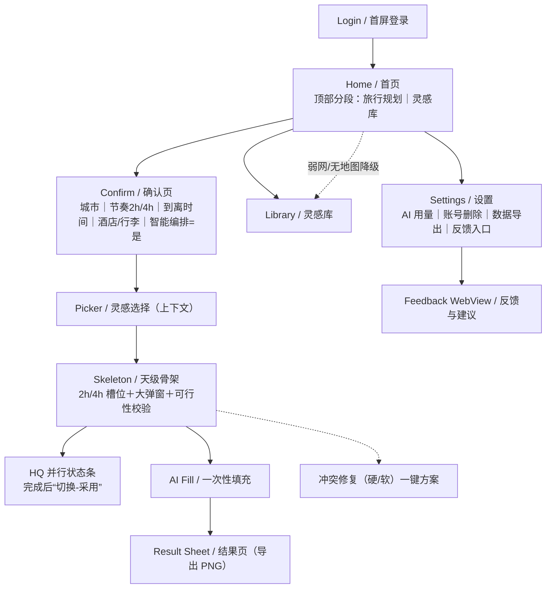
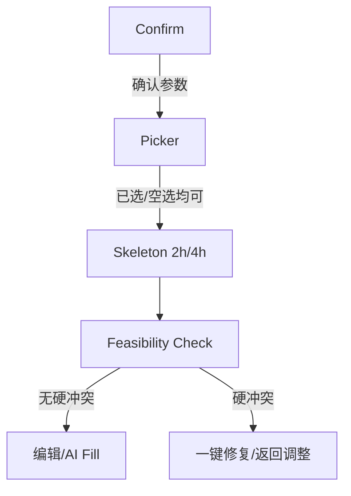
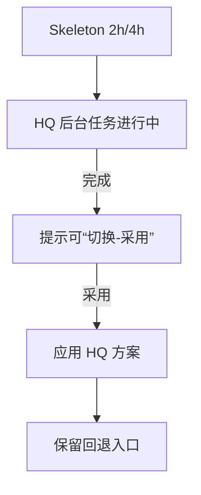
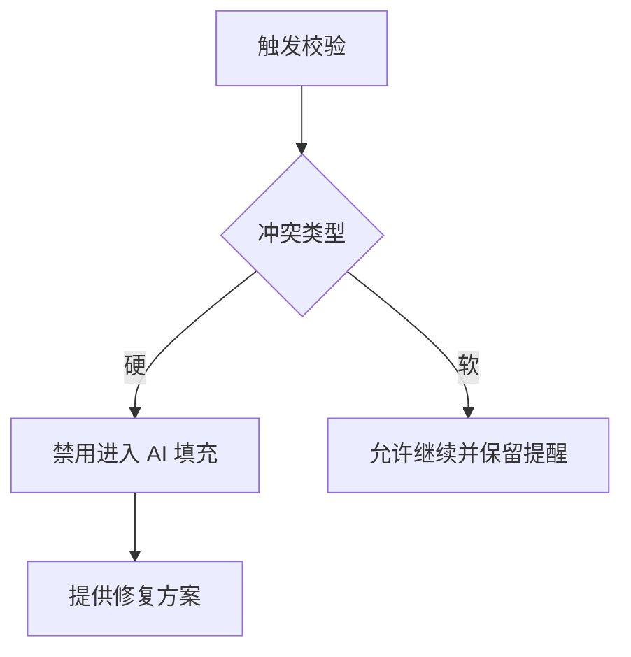
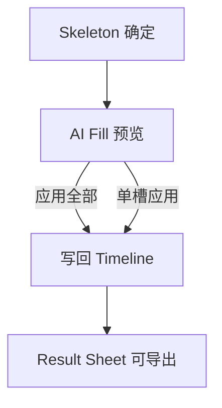
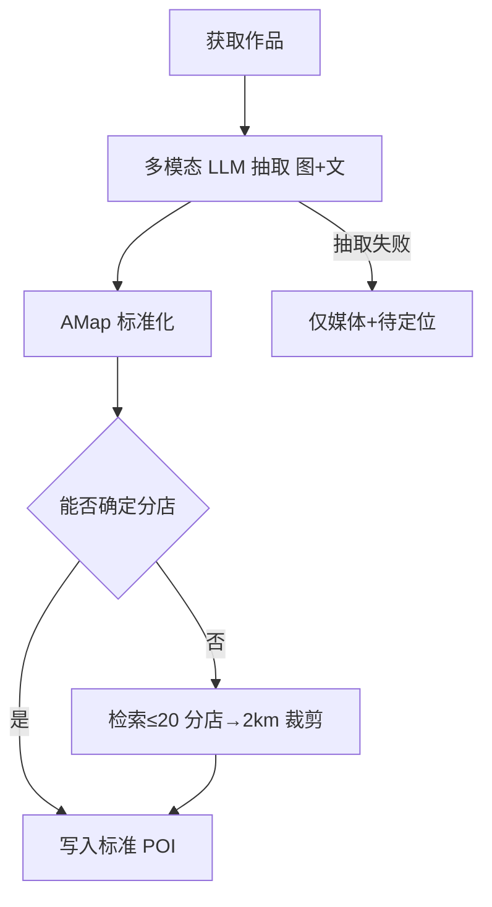
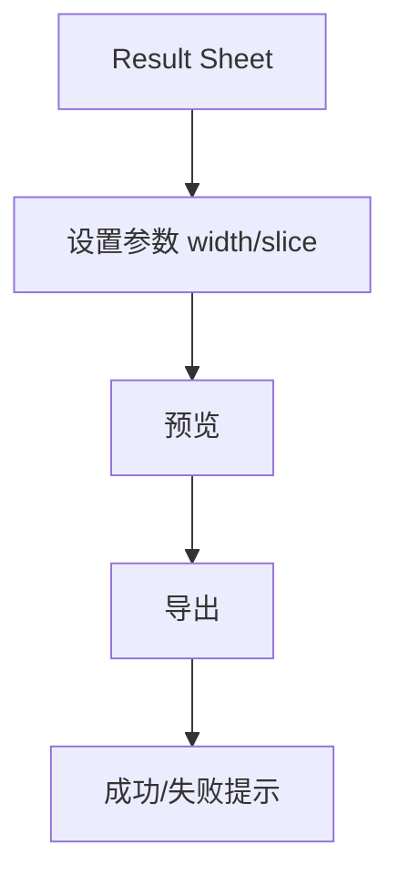
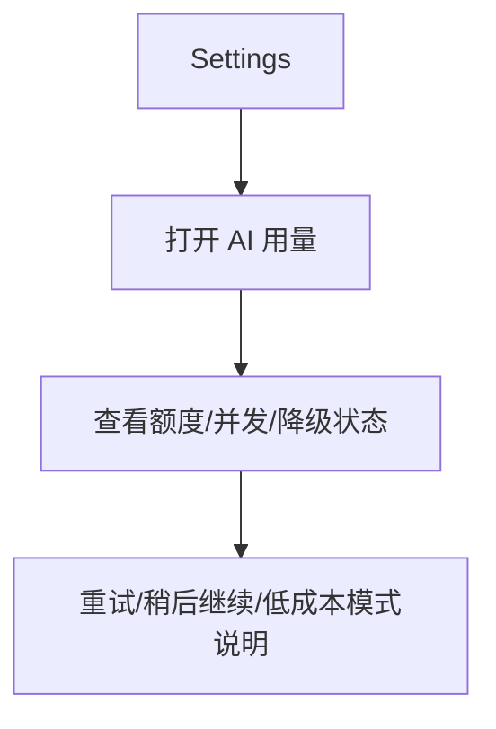

# Nomad MVP UI/UX Specification

## Change Log

| Date | Version | Description | Author |
| --- | --- | --- | --- |
| 2025-11-01 | 0.1 | 初始版本：依据 PRD v0.4 输出 UX 规格（确认页、L2 快速编排、HQ 并行“切换-采用”、餐时分割 A/B、2h/4h 槽位） | UX |

## Introduction

This document defines the user experience goals, information architecture, user flows, and visual design specifications for Nomad MVP’s user interface. It serves as the foundation for visual design and frontend development, ensuring a cohesive and user-centered experience.

Rationale:
- 聚焦真实旅程：确认页（城市/节奏/时间段/早出发/智能编排默认是）→ L2 快速编排（2h/4h）先用后优 → HQ 并行与“切换-采用”。
- 结构优先：天级时间轴以 2h/4h 槽位为心智模型，餐时分割 A/B 不改变底层编辑/校验/导出。
- 可用性与可观测：VLM 默认启用；LLM Provider 抽象（OpenAI 兼容，api_base+model）可远程切换/回退；Langfuse 追踪。
- 地理准确：连锁抑制列表与分店≤20/主 POI 附近 2km 裁剪，保障消歧质量与一致性。

### Target & Platforms
- Mobile-first（iOS/Android），单列布局；触控目标≥44pt；动效 120–200ms。
- 不设桌面适配要求；后续如需平板适配，遵循移动优先断点延展。

## Overall UX Goals & Principles

### Target User Personas
- 初次规划者（Casual Planner）: 从灵感出发，期望“先有可用骨架，再逐步优化”，低学习成本与明确引导。
- 重度规划者（Power Planner）: 希望快速完成精细化编辑与验证，偏好批量操作、可解释性与回退。
- 在途执行者（On-trip User）: 查看行程与关键要点，关注“可执行、可替代”，不被复杂编辑打断。
- 运营/评测者（Internal Ops/QA）: 需要抽取与编排质量可观测，便于回放样本与定位问题。

### Usability Goals
- 5 分钟出可用骨架：确认页 + L2 快速编排（2h/4h）。
- 2 步完成高质量切换：HQ 并行完成后“切换-采用”，保留回退路径。
- 冲突可自修复：顶部校验（硬/软冲突）+ 一键修复 + 可解释理由。
- 地图-卡片一致：选中状态、飞行/滚动联动一致；弱网降级清单视图。
- 性能可感知：关键动效 120–200ms；HQ 状态清晰（进行中/完成可切换）。

### Design Principles
- 先用后优：以“可执行的最低可用骨架”优先，HQ 为可选升级。
- 槽位心智一致：2h/4h 槽位为全局心智；餐时分割仅展示，不破坏底层编辑/导出。
- 清晰与可解释：关键决策点（冲突、切换、替换）给出简短可解释理由。
- 渐进暴露：首屏不打断；需要时呈现更多选项（高级筛选/替换等）。
- 可观测与可回退：关键步骤可观测、可回退，用户始终可控。

## Information Architecture

### Site Map / Screen Inventory



### Navigation Structure
- Primary Navigation: 首页顶部分段“旅行规划｜灵感库”；左上侧边入口（最近行程/侧边栏）。
- Secondary Navigation:
  - Skeleton 顶部：D1..Dn Tabs；状态条（HQ 并行/完成可“切换-采用”）；A/B 展示开关（餐时分割）。
  - Timeline：空槽大弹窗（候选/AI 建议/自由活动）；长按编辑；顶部可行性校验与一键修复。
  - Settings：AI 使用额度/状态、账号删除、数据导出、反馈入口（WebView）。
- Breadcrumb Strategy: 移动端单页面流，面包屑不显式；通过标题/返回与 Tabs 维持定位。

## User Flows

### Flow: Confirm → Picker → Skeleton（规划主路径）
**User Goal:** 快速得到可用骨架（2h/4h）

**Entry Points:** 首页 CTA / 解析 trip_params → Confirm

**Success Criteria:** 进入骨架页，至少 1 个有效槽位，无硬冲突；弱网可降级



**Edge Cases & Error Handling:**
- 缺参 → 参数 Sheet 补齐
- 弱网/无地图 → 降级清单视图
- 解析失败 → 提供“手动录入/稍后再试”

---

### Flow: HQ 并行生成与“切换-采用”
**User Goal:** 在可用骨架基础上获得更优方案，并一键采用

**Entry Points:** Confirm 默认启用智能编排 或 Skeleton 顶部开关

**Success Criteria:** 完成提示 + “切换-采用”应用成功，保留回退



**Edge Cases & Error Handling:**
- HQ 超时/失败 → 保持快速版，并提示稍后重试
- 采用引发冲突 → 即时校验 + 修复建议

---

### Flow: 冲突校验与一键修复
**User Goal:** 使计划可执行

**Entry Points:** Skeleton 顶部校验/编辑动作后

**Success Criteria:** 无硬冲突或仅 1 个残留且可修复



**Edge Cases & Error Handling:**
- 跨日不可达/无坐标/闭店 → 均视为硬冲突
- 修复失败 → 显示替代点/挪日建议

---

### Flow: AI Fill（一次性填充）
**User Goal:** 在不改变时间/顺序的前提下补齐“做什么/准备/注意”

**Entry Points:** Skeleton → AI 填充页

**Success Criteria:** 成功应用全部/按槽位应用；可回退；引用可追溯



**Edge Cases & Error Handling:**
- 无可用事实引用 → 降级为“通用建议”并标注
- 应用失败 → 重试/部分应用

---

### Flow: XHS 入库与地理消歧（VLM 默认启用）
**User Goal:** 将灵感可靠转为可规划候选

**Entry Points:** 首页统一输入（优先识别 XHS 链接）

**Success Criteria:** 产出标准 POI（AMap），不确定分店按 ≤20 且主 POI 附近 2km 裁剪



**Edge Cases & Error Handling:**
- 连锁误解析 → 连锁抑制列表过滤
- 费用/配额压力 → 缓存与失败降级

---

### Flow: 导出 PNG（行程卡片）
**User Goal:** 将行程以可分享的图片形式导出

**Entry Points:** Result Sheet

**Success Criteria:** 指定宽度导出成功，超长按天切片



---

### Flow: Settings → AI 用量与额度
**User Goal:** 查看平台 AI 使用额度、生成状态与降级策略

**Entry Points:** 设置页 AI 用量、AI Fill/ResultSheet 额度提示

**Success Criteria:** 用户理解剩余额度、排队/降级状态与重试路径，不需要配置自己的 Key



**Edge Cases & Error Handling:**
- 额度不足/服务繁忙 → 友好提示、排队、稍后重试或无 AI 降级路径

## Wireframes & Mockups

- Primary Design Files: （待接入 Figma 链接）
- Key Screen Layouts: Login、Home、Confirm、Picker、Skeleton（含状态条/A-B 开关）、AI Fill、Result Sheet、Settings、Feedback WebView

## Component Library / Design System（提纲）

- 组件清单（示例）：TopSwitch、UnifiedInput、CityCard、LocationModal、PlanTimelineMobile、FixSheet、HQStatusBar、SwitchAdoptToast、TripConstraintForm、AIQuotaPanel
- 状态与变体：loading/empty/error/weak-network

## Component Specifications（Mobile）

### Confirm Page Components
1) CityPicker
- Props: `value: {id,name}?`，`options: City[]`，`onChange(city)`，`searchable?: boolean`，`loading?: boolean`，`disabled?: boolean`，`error?: string`
- Behavior: 远程搜索（300ms debounce）、弱网本地缓存回显；缺省城市以 PRD 优先城市/最近城市建议
- Empty/Error: 无结果显示“换关键字试试”；失败“稍后重试”

2) PaceSegmentedControl
- Props: `value: 'tight'|'comfortable'`，`onChange(v)`
- Notes: 与槽位时长映射（2h/4h）强绑定；切换需提示可能影响编排

3) DateRangePickerFlexible
- Props: `mode: 'flex'|'fixed'`，`days?: number`，`dateRange?: {start,end}`，`arrival?: time`，`departure?: time`，`timezone?: string`，`onChange(payload)`
- Validation: 起止有效、最小1天；可选首尾到/离港时间

4) MorningStartTimePicker
- Props: `value: time`，`step: 15|30`，`onChange(time)`
- Notes: 与 2h/4h 起始对齐，影响 Timeline 起点

5) TripConstraintForm
- Props: `hotels[]`，`breakfastIncluded?: boolean`，`luggagePlan?: 'old_hotel'|'new_hotel'|'station'|'carry'|'unknown'`，`tickets?: Constraint[]`，`wakePreference?`
- Notes: 酒店影响早晚活动半径、区域聚类、换酒店缓冲与行李处理；预约/门票用于生成 hard time hints

6) SmartPlanSwitch
- Props: `checked: true`（默认是），`onToggle(checked)`，`hint: string`
- Notes: 打开即后台启动 HQ 并行；状态交由 Skeleton 顶部状态条承接

7) PrimaryCTAButton
- Props: `label`，`onPress`，`loading?`，`disabled?`

### Picker Components
1) CityTabs
- Props: `tabs: {cityId,name,count,distKm}[]`（仅 count>1 显示），`active`，`onChange(id)`

2) InspirationCardGrid
- Item: `title,image,tags,status: 'default'|'added'|'locate'`，`onAdd()`，`onLocate()`
- Loading: 骨架 6–12 张；弱网降级纯列表

3) MapSheet
- Props: `mode: 'High'|'Split'|'MapFull'`，`onModeChange(m)`；与卡片联动高亮

4) SelectedBasketPanel
- Props: `items: Selected[]`（含 `must_go,time_hint,stay_minutes_hint`），`onUpdate(item)`，`onRemove(id)`，`onGenerate()`

5) LocationModal (Top-5)
- Props: `candidates: {name,address}[]`，`onSelect(i)`，`onClose()`
- Rules: 仅显示“名称+地址”，不显示距离/置信度

### Skeleton Components
1) DayTabs
- Props: `days: n`，`active`，`onChange(idx)`

2) HQStatusBar
- Props: `state: 'running'|'done'|'failed'`，`onAdopt()`（“切换-采用”），`message?`
- Behavior: running 显示进行中；done 显示可“切换-采用”；failed 给出重试

3) ABToggle (MealSplit)
- Props: `enabled`，`onToggle()`；仅影响展示，不改数据

4) PlanTimelineMobile
- Props: `slotMinutes: 120|240`，`slots: Slot[]`（含 id, time, poi/meta）
- Interactions: 长按编辑（替换/移动 D±1/调时/删除）；拖拽吸附 30/60 分；撤销 token 5–8s

5) EmptySlotModal
- Tabs: 候选抽屉（按时窗/距离/vibe 重排）、AI 建议、自由活动
- Actions: 预览→落位；遵循硬约束；失败给修复建议

6) FixSheet（可行性修复）
- Input: 冲突列表（hard/soft, cause, action）
- Actions: 一键修复（换序/替换/缩短/挪日）；修复失败给替代方案

7) SwitchAdoptBar
- Props: `visible`，`onAdopt()`，`onDismiss()`；采用后提供回退入口

### AI Fill Components
1) AIFillPreviewList
- Item: `do,prepare,notice,why_short,sources[]`；支持“应用全部/按槽应用”
- Fallback: 无可用事实引用 → 标注“注意事实核查”

### Result & Export Components
1) ExportPreview
- Props: `width_px: 1080|1242`，`slice_by_day: boolean`
- ExportButton: 反馈成功/失败；超长分天切片

### Settings & Feedback Components
1) AIQuotaPanel
- Props: `quotaStatus`，`usageSummary`，`degradeState?`，`onRetry?`，`onOpenDetails?`
- Behavior: 展示平台额度、生成/导出用量、并发/排队状态与降级提示；不收集用户模型 Key

2) FeedbackWebView
- Props: `url`，失败降级 `FallbackForm{text, screenshot}`（COS 上传）
- Events: `open/submit/success/fail`

### Cross-cutting
- Loading/Empty/Error/Weak-Network：各组件提供统一四态
- Accessibility：触控≥44pt；可聚焦与读屏标签；颜色对比 AA
- Performance：首屏渐进加载；关键交互 120–200ms；大图 LQIP/懒加载

## States & Validation Copy（Mobile）

### 基本风格
- 语气克制、明确；一句话≤18字为宜；提供行动指引（按钮/链接）。
- 优先本地即时校验；服务端失败时给可重试与兜底路径。
- 弱网提示后给降级策略（清单/重试/后台继续）。

### Confirm（确认页）
- 空态/缺参：
  - 城市未选："请选择城市"
  - 日期/天数缺失："请完善出行时间"
  - 早出发未设："请选择出发时间"
  - 酒店未定："可先留空，稍后会影响早晚安排"
  - 行李未定："换酒店日请确认行李处理"
- 校验失败：
  - 到/离港时间无效："到/离港时间不合理，请重新选择"
  - 时间范围过短："最少 1 天，请调整"
- 弱网："网络较慢，已本地保存所填内容"

### Picker（灵感选择）
- 空列表："暂无可用灵感，试试更换城市或关键词"
- Top-5 定位："仅展示名称+地址，可稍后在骨架页再调整"
- 弱网降级："网络较差，已切换为清单模式"
- 操作反馈：
  - 加入成功："已添加 · 撤销"
  - 去定位入口："待定位 · 选择地址"

### Skeleton（天级骨架）
- HQ 并行：
  - 进行中："正在生成高质量版…"
  - 完成："高质量版已就绪 · 切换-采用"
  - 失败："生成失败 · 稍后重试"
- 可行性校验：
  - 硬冲突："存在不可达/闭店等硬冲突，请先修复"
  - 软冲突："存在轻微超时/通勤较远，建议优化"
- 一键修复结果：
  - 成功："已修复"
  - 失败："未能修复，试试替换/挪日"
- 弱网："网络较慢，操作可能延迟"

### EmptySlotModal（空槽大弹窗）
- 候选不足："暂无合适候选，试试更宽的时间窗"
- AI 建议失败："建议生成失败 · 重试"
- 自由活动提示："将添加 2h/4h 空闲时段"

### AI Fill（一键填充）
- 无引用降级："注意事实核查"
- 应用成功："已应用到时间线"
- 应用失败："应用失败 · 重试"

### Result Sheet / Export（导出）
- 参数提示："宽度 1080（可选 1242），超长按天切片"
- 导出成功："已导出"
- 导出失败："导出失败 · 重试"

### Settings / AI 用量
- 正常："当前使用平台额度"
- 接近上限："额度不多，建议先导出关键行程"
- 额度不足："额度暂时不足，可稍后重试"
- 降级："已切换为低成本生成"

### Feedback WebView
- 打开失败："页面无法内嵌，已在系统浏览器打开"
- 表单降级："内置表单已启用，可提交文本与截图"

### XHS 入库 & 地理消歧（参考）
- 抽取失败："仅媒体+待定位"
- 分店裁剪："已按 2km 范围筛选附近分店"

## Key Screen Layouts（Detailed）

### Confirm（确认页）
**Purpose**: 在进入编排前一次性收集关键参数，降低返工。

**Layout**
- Header: 标题“确认规划参数”，返回按钮；说明文案一行。
- Body（纵向单列）：
  1) 城市选择（CityPicker）
  2) 出行节奏 Pace（Segmented: 紧凑2h｜舒适4h）
  3) 出行时间段（灵活天数/日期选择；可选首尾到/离港时间）
  4) 起床/早上出发偏好（2h/4h 起始对齐选项）
  5) 酒店、是否酒店早餐、换酒店与行李处理
  6) 预约/门票/日出/日落/夜市等强时间约束
  7) 智能编排开关（默认是，说明“后台将生成高质量版本，可稍后切换-采用”）
- Footer CTA: “继续（进入灵感选择）”。

**Interaction Notes**: 参数校验；缺参弹 Sheet 补齐；弱网保底本地回显。

### Picker（灵感选择-上下文）
**Purpose**: 选择 must_go/候选作为骨架输入，支持空选继续。

**Layout**
- Header: 城市/日期/天数概览 + “修改参数”入口。
- Content: 卡片列表 + 地图联动（High→Split→Map-Full），弱网降级清单。
- Basket: 吸底“已选 N | 生成骨架”；面板含 must_go / time_hint / stay_minutes_hint。

**Interaction Notes**: 卡片与 Marker 一致；飞行/滚动联动；Top-5 定位弹窗。

### Skeleton（天级骨架）
**Purpose**: 提供 2h/4h 槽位的可执行骨架，作为 HQ 的基线。

**Layout**
- Top Bar: D1..Dn Tabs；状态条（HQ 并行中/完成可“切换-采用”）；A/B 开关（餐时分割）。
- Timeline: 2h/4h 槽位；空槽大弹窗（候选/AI 建议/自由活动）；长按编辑。
- Validation: 顶部可行性校验（硬/软冲突）+ 一键修复入口。

**Interaction Notes**: “切换-采用”后保留回退入口；操作有埋点。

### AI Fill（一次性填充）
**Purpose**: 在不改变时间/顺序条件下补齐“做什么/准备/注意”。

**Layout**
- Preview List: 按 Timeline 顺序展示每槽三段文本，why_short/引用来源短链。
- Controls: “应用全部”/按槽应用；失败与降级提示。

**Interaction Notes**: 无可用事实引用 → 标注“注意事实核查”。

### Result Sheet（结果页/导出）
**Purpose**: 浏览与导出行程卡片。

**Layout**
- Readonly List: 每槽“做什么/准备/注意”最终文案；导出参数（width/slice）与预览。
- Export CTA: 导出 PNG；成功/失败反馈。

**Interaction Notes**: 超长分天切片；弱网提示重试。

### Settings（设置/AI 用量/反馈）
**Purpose**: 账户、AI 用量、隐私与反馈入口。

**Layout**
- AI Usage: 平台额度、生成/导出用量、并发/排队状态、降级说明。
- Account: 账号删除、数据导出。
- Feedback: 跳 WebView（失败降级内置表单）。

**Interaction Notes**: 额度/成本提示不打断主流程；仅在额度不足或降级时给清晰行动路径。

### Feedback WebView（反馈与建议）
**Purpose**: 在内嵌环境完成官方反馈流程。

**Layout**
- WebView: JS/DOM Storage 开启；失败降级内置简表单（文本+截图上传）。

**Interaction Notes**: 若站点禁止内嵌，回退系统浏览器；关键埋点：open/submit/success/fail。

## Accessibility（提纲）

- 触达目标：移动端基本可达性（触控目标、对比度、可聚焦与屏幕阅读顺序）

## Responsiveness / Animation / Performance / Next Steps（提纲）

- 响应式：移动优先；兼容小屏/窄屏断点
- 动效：120–200ms；HQ 状态条/切换-采用反馈
- 性能：首屏渐进加载；弱网降级
- Next Steps：细化线框、组件清单、Figma 联动与交接清单

## Analytics & Metrics Plan（埋点与指标方案）

### 命名规范与采集约束
- 命名：snake_case，按页面/领域前缀（如 `confirm_*`, `picker_*`, `skeleton_*`, `aifill_*`, `export_*`, `ai_quota_*`）。
- 上报：统一封装层（友盟/埋点 SDK），失败重试与离线队列；所有调用含时间戳与 session_id。
- 隐私：不采集 PII（手机号/邮箱/Key）；AI 用量事件仅记录状态、额度区间、降级原因，不记录用户输入原文或 Provider secrets。
 - 事件包头（Envelope，必携）：`event_id`（uuidv4）、`prev_event_id?`、`seq`（自增）、`timestamp_ms`、`session_id`、`journey_id?`、`plan_id?`、`trace_id?`、`span_id?`
 - ID 生成规则：
   - `journey_id`：在 `confirm_continue` 生成，贯穿 Confirm→Result 的一次完整路径；“另存为/新计划”生成新 ID。
   - `plan_id`：首次生成骨架或显式创建计划时生成，用于跨会话/设备恢复。
   - `event_id/prev_event_id/seq`：前端按事件序列维护，支持重排与回放。
   - `trace_id/span_id`：对齐后端与 Langfuse/Sentry；HQ 与 Ingest 任务返回 `hq_job_id`/`ingest_job_id` 以便关联。

### 关键事件（Key Events）
- Confirm
  - `confirm_open`
  - `confirm_param_change` {field, from, to}
  - `confirm_continue` {city, days, pace, morning_start, hotel_count, has_luggage_plan, ticket_count, smart_plan:true}

- Picker（灵感选择）
  - `picker_open` {city, tabs_count}
  - `picker_add_inspiration` {item_id, source:'card|map'}
  - `picker_remove_inspiration` {item_id}
  - `picker_locate_open` {item_id}
  - `picker_locate_select` {item_id, choice_idx}
  - `picker_generate_skeleton` {selected_count, must_go_count}

- Skeleton（天级骨架）
  - `skeleton_open` {days, pace, slot_minutes}
  - `skeleton_feasibility_check` {hard_cnt, soft_cnt}
  - `skeleton_fix_apply` {action:'reorder|replace|shorten|move_day', result:'success|fail'}
  - `skeleton_slot_edit` {action:'replace|move|retime|delete', scope:'slot|day'}
  - `skeleton_empty_slot_open` {day, slot_idx}
  - `skeleton_ab_toggle` {enabled:true|false}
  - `skeleton_hq_status` {state:'running|done|failed'}
  - `skeleton_hq_switch_adopt` {clicked:true}
  - `skeleton_hq_switch_adopt_result` {result:'success|fail'}

- AI Fill（一次性填充）
  - `aifill_open`
  - `aifill_apply_all`
  - `aifill_apply_slot` {slot_id}
  - `aifill_apply_fail` {error_code}
  - `aifill_source_missing` {slot_id}

- Export（导出）
  - `export_open`
  - `export_preview` {width_px, slice_by_day}
  - `export_click` {width_px, slice_by_day}
  - `export_success` {time_ms}
  - `export_fail` {error_code}

- Settings / AI Quota
  - `ai_quota_open`
  - `ai_quota_warning_show` {reason}
  - `ai_quota_retry_click`
  - `ai_quota_degrade_show` {mode}
  - `ai_quota_degrade_accept` {mode}

- Feedback
  - `feedback_open` {mode:'webview|fallback_form'}
  - `feedback_submit_success`
  - `feedback_submit_fail` {error_code}

- XHS 入库（前端侧）
  - `ingest_sse_stage_update` {stage:'created|fetching|parsing|geo|storing|done'}
  - `ingest_fail` {error_code}

- 网络与性能（通用）
  - `network_state_change` {state:'online|weak|offline'}
  - `perf_mark` {name, time_ms}（如 `ttfp_ms`, `hq_ready_ms`, `export_time_ms`）

### 事件属性（Common Properties）
```
{
  // Envelope
  event_id, prev_event_id?, seq, timestamp_ms,
  session_id, journey_id?, plan_id?, trace_id?, span_id?,
  // User/Device
  user_id?, device:'ios|android', app_version,
  // Planning Context
  city_code?, city_name?, days?, pace:'tight|comfortable', slot_minutes:120|240,
  hq_enabled:true|false, hq_adopted?:true|false,
  conflict_hard_cnt?, conflict_soft_cnt?,
  source:'home_input|home_card', network:'wifi|cell|weak',
  // Jobs (optional)
  hq_job_id?, ingest_job_id?, plan_token?
}
```

### 指标与目标（Metrics & Targets）
- **先用后优（TTFP）**：`ttfp_ms = skeleton_render_end - confirm_continue`；目标 P50 ≤ 5 分钟内产“可用骨架”。
- **HQ 采用率**：`hq_adopt_rate = skeleton_hq_switch_adopt_result.success / skeleton_open`。
- **可行性修复成功率**：`fix_success_rate = skeleton_fix_apply.result==success / skeleton_fix_apply`；目标提升 P50 次数并降低硬冲突残留。
- **导出率**：`export_success / result_sheet_open`。
- **添加→落位转化**：`picker_add_inspiration → skeleton_slot_edit|autoplace` 的转化比。
- **VLM/入库可达率（前端可见）**：`ingest_sse_stage_update.done / ingest_sse_stage_update.created`。
- **交互性能**：关键交互 120–200ms；Skeleton 首屏加载 P50 目标明确。

### 漏斗（示例）
1. `confirm_open → confirm_continue → picker_generate_skeleton → skeleton_open → aifill_open → export_success`
2. `skeleton_open → skeleton_hq_status.done → skeleton_hq_switch_adopt → skeleton_hq_switch_adopt_result.success`

### 实施要点
- 封装埋点 Hook/Service，页面与组件仅调用语义化方法，避免散落。
- 统一属性字典与事件校验（Type 定义 + 编译期校验）。
- 失败样本采样与脱敏；关键错误附 `error_code`（与后端统一枚举）。
 - `journey_id` 生命周期：`confirm_continue` 生成→写本地→跨页面与重启恢复；深链携带 `plan_token` 以跨设备回连同一计划路径。
